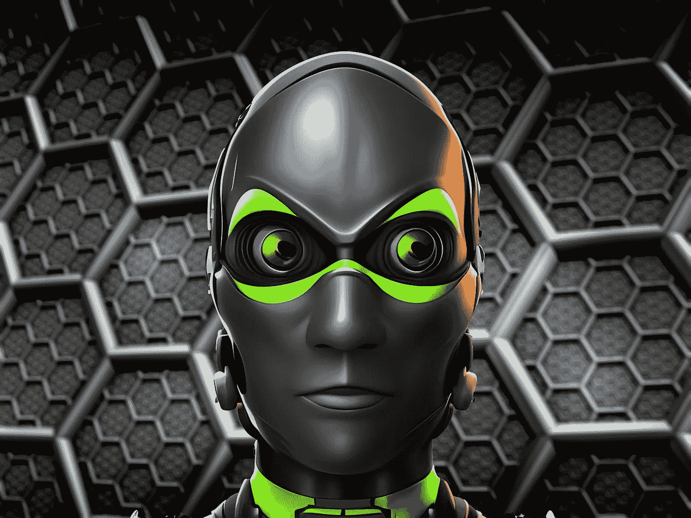

# 人工智能改变 NFT 空间的三大方式

> 原文：<https://medium.com/coinmonks/top-3-ways-artificial-intelligence-is-transforming-the-nft-space-933e603ee32?source=collection_archive---------31----------------------->

非功能性思维正在变成现实，而人工智能可能是 NFT 领域这场新兴革命的基础。通过尖端的用例和创新的解决方案，人工智能很有可能在数字艺术的世界中找到了一个新家。

虽然整个行业需要几年时间才能真正感受到人工智能在 NFT 的影响，但早期迹象表明，人工智能可能会为 NFT 欺诈提供一个持久的解决方案。人工智能还可能引领一波新的计算机生成数字艺术。

在这篇文章中，我讨论了人工智能被应用到不可替代的令牌中的三种方式。让我们开始吧。

# 人工智能和 NFT 欺诈检测

近年来，欺诈、诈骗和剽窃在 NFT 领域一直处于最高水平。故事比比皆是，从假冒 NFT 藏品的故事，到艺术家的模仿和彻头彻尾的 NFT 盗窃。事实上， [Opensea](https://opensea.io/) (全球最大的 NFT 市场)不得不在 2022 年初公开承认[平台上超过 80%](https://builtin.com/design-ux/NFT-art-theft#:~:text=Earlier%20this%20year%20OpenSea%2C%20one,%2C%20fake%20collections%20and%20spam.%E2%80%9D) 的所有艺术品都是被盗的。

NFT 盗窃案对艺术品的原主人和整个 NFT 空间有着直接的影响。首先，盗窃直接侵犯了艺术家的知识产权。第二，被盗艺术品剥夺了艺术家从艺术品销售和二级市场获得的有形收入。整体而言，NFT 欺诈描绘了 NFT 空间作为一个整体的坏形象。这也可能成为负面宣传的一个来源，并成为那些想加入这个空间的艺术家的一个主要障碍。

人工智能提供了解决这个问题的方法。人工智能可以被部署为 NFT 市场上的欺诈检测工具。它们将被整合到平台中，以筛选所有新的艺术收藏。通过这种方式，伪造或被盗的艺术品很容易被发现，欺诈者也会受到应有的惩罚。

虽然这种形式的整合仍处于初级阶段，[airright](https://airight.io/)是一个 NFT 平台，它为人工智能和 NFT 如何被用于有意义的效果设定了步伐。该平台兼具 NFT 市场和人工智能真实性平台的双重功能。Airight 有一个集成的、分散的 oracle 系统，可以扫描新的 NFT 以确认其真实性。

# 智能和智能 NFT 的出现

虽然 NFT 可以采用各种数字形式，如图像、视频、gif 和音频，但人工智能可以进一步将图像转换为 NFT。这个新兴的概念现在被称为 iNFT。

本质上，iNFTs 是通过将深度学习和机器学习算法注入到现有的 NFT 中来实现的。这个过程是通过将 DL 和 ML 算法嵌入到 NFT 的现有智能合约代码中来实现的。

然后，NFT 被注入定制的个性特征，这使它不同于其他类似的艺术。一旦这个 NFT 栩栩如生，它可以进一步训练，以掌握特定的特征和技能。

虽然这种描述听起来很超前，但它已经被一个名为 [Alethea AI](https://alethea.ai/) 的专注于 NFT 的人工智能项目带入了生活。该协议简化了将常规 NFT 转换成 iNFTs 的过程。在 Alethea 上，NFT 可以通过将个性豆荚注入 NFT 智能合约而变得智能。此外，NFT 可以随着时间的推移进行训练，以学习新的属性并达到更高的智能水平。

# 计算机生成艺术的先驱

生成艺术在 NFT 非常流行。事实上，众所周知，大多数大型 NFT 收藏馆都使用数字艺术平台为他们的收藏创作各种艺术作品。虽然这是众所周知的，一个新的领域在 NFT 艺术创作开始出现。在这个领域，艺术家只需要提供元素和进行描述，而人工智能的任务是创建原始的计算机生成的图像。

在基于人工智能的生成式 NFTs 中，艺术家只需要描述他们在艺术中想要的元素。人工智能通过不同的组合和元素来创造艺术，以创造不同的结果。

虽然有些人可能认为人工智能生成的艺术是懒惰的工作，但值得一提的是，人工智能有能力探索人类自然不会探索的不同维度和组合。这为背景和谐但效果对比鲜明的新系列开辟了道路。艾将探索色彩的细节和属性的深度，创造一个真正独特的 NFT 系列。

# 结果

在不可替代的令牌和人工智能的交叉点上，有很多值得探索的地方。目前，这种探索还处于起步阶段，但早期迹象表明，将人工智能引入 NFT 可能是数字艺术发展的一个重要里程碑

> 交易新手？试试[密码交易机器人](/coinmonks/crypto-trading-bot-c2ffce8acb2a)或者[复制交易](/coinmonks/top-10-crypto-copy-trading-platforms-for-beginners-d0c37c7d698c)