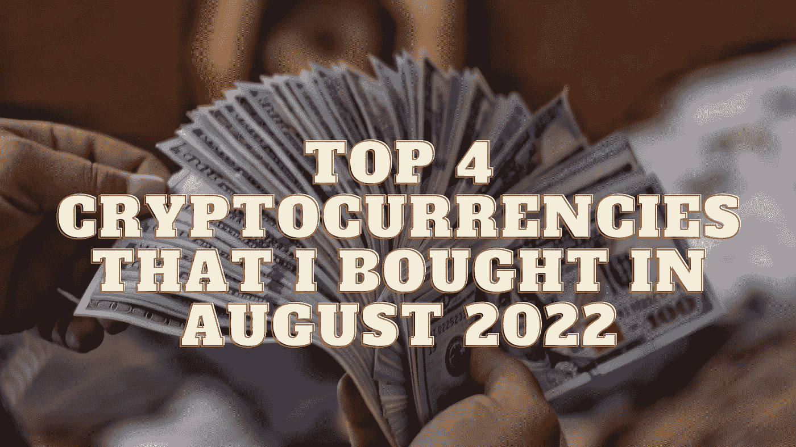

# 我在 2022 年 8 月购买的前 4 种加密货币

> 原文：<https://medium.com/coinmonks/top-4-cryptocurrencies-that-i-bought-in-august-2022-b5d05da9ff72?source=collection_archive---------33----------------------->

Source photo Unsplash.com

# 以太坊

目前，合并是以太坊(ETH-USD)新闻周期中讨论的主要话题。到目前为止，工作证明是以太坊共识机制所依赖的协议。简而言之，矿工在 ETH 密码和处理能力方面得到补偿，以换取验证交易数据的权利。选举成功是积极的…