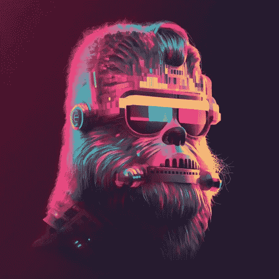

# 2023 年五大人工智能趋势🚀

> 原文：<https://medium.com/coinmonks/top-5-a-i-trends-for-2023-fccd7a755a31?source=collection_archive---------9----------------------->

> 如果您在 2023 年 1 月 15 日之前订阅了该时事通讯，您将有机会赢得 1/30 来自🦧的免费 NFT
> 
> [订阅时事通讯！](https://multilayeredmarketing.beehiiv.com/subscribe)📰

2023 年代表着人工智能(AI)未来时间轴的中点。这是一个预测分析和大规模计算结合在一起创造智能机器的时代，这些机器可以像人类一样对环境做出响应。人工智能正变得越来越普遍，几乎应用于生活的每个方面，从医疗保健到银行到教育。因此，人工智能专家预测，这项令人兴奋的技术将继续改变世界，并在未来几年变得越来越普遍。以下是 2023 年最重要的五个人工智能预测。

## 1.人工智能驱动的自动化

2023 年最大的人工智能趋势之一将是人工智能驱动的自动化。这指的是能够独立处理特定任务的机器，不需要人类的直接监督。自动化技术正迅速成为现代工作场所不可或缺的一部分，随着人工智能系统变得越来越复杂，能够管理更大更复杂的任务，这一趋势只会继续下去。随着人工智能驱动的自动化越来越普遍，它将对劳动力产生巨大影响，让企业在降低成本的同时简化流程、提高效率。

## 2.智能助理

2023 年另一个重要的人工智能趋势将是智能助理的激增。这些是数字助理，如[亚马逊的 Alexa](https://alexa.amazon.com/spa/index.html#cards) 、[苹果的 Siri](https://www.apple.com/siri/) 或[谷歌的助理](https://assistant.google.com/intl/en/)，它们使用自然语言处理(NLP)和机器学习(ML)来理解和响应用户请求。随着人工智能的不断发展，这些助理将越来越有能力承担更复杂的任务，从管理我们的时间表和回复电子邮件到订购杂货和预订机票。这可能会导致这样一个世界:无数的任务可以在没有任何人类干预的情况下完成。

## 3.医疗保健人工智能

人工智能也越来越多地应用于医疗保健领域。到 2023 年，人工智能将在医疗和诊断中发挥更大的作用。例如，人工智能医疗诊断系统正被用于更快更准确地检测某些疾病，并生成个性化的治疗计划。与此同时，机器人手臂和无人机正在开发中，可用于精确的医疗干预。随着技术的不断进步，我们可以预计，到 2023 年，所有这些人工智能驱动的操作将变得越来越普遍。

## 4.人工智能驱动的车辆

在 2023 年，自动和半自动车辆将变得越来越普遍。智能汽车将在很大程度上依赖人工智能技术来帮助它们在道路上机动，并适应不断变化的条件。这是通过计算机视觉、人工智能驱动的决策系统以及其他各种传感器和技术实现的。到 2023 年，人工智能汽车将有助于减少交通事故的死亡人数，并提高运输服务的效率。

## 5.人工智能生成的内容

到 2023 年，人工智能将能够以更大的规模和更好的质量产生内容和创造性工作。人工智能算法已经被用于音乐、电影甚至绘画等领域，以制作原创艺术和其他内容。这之所以成为可能，是因为机器能够对特定的作品产生深刻的理解，并从中“学习”。随着人工智能技术的进步，这种趋势将继续下去，并变得越来越复杂，从而使人工智能产生更令人印象深刻的结果。

总的来说，2023 年将是人工智能技术发展的关键一年。从人工智能自动化到智能助理，从医疗保健人工智能到人工智能驱动的汽车，人工智能将变得更加普遍，并以多种方式影响我们的生活。看到人工智能在未来几年如何继续改变世界将是令人兴奋的！

> [WOKEYS](https://twitter.com/TheWokeys) 来了！！！

_ _ _ _ _ _ _ _ _ _ _ _ _ _ _ _ _ _ _ _ _ _ _ _ _ _ _ _ _ _
_ _ _ _ _ _ _ _ _ _ _ _ _ _ _ _ _ _ _ _ _ _ _ _ _

**永远小心！！！⚠️**

> *这一点我怎么强调都不为过！保持高度警惕，留意你点击的每一个链接、你做的每一笔交易和你接触的每一个人，因为这个领域骗子很多，即使是最好看的项目也会被撤下。*
> 
> 点击所有链接之前要再三检查，确保它们是你要找的官方链接。此外，在给自己或他人发送任何有价值的东西之前，要再三检查所有的钱包地址。

[*推特*](https://www.twitter.com/metadadsxyz)[*不和*](https://discord.gg/mchzhDCwhF)[*YouTube*](https://www.youtube.com/channel/UC7pbtSBs9nRJHK6coMhCR8g)[*抖音*](https://www.tiktok.com/@thedudescrypto)[*insta gram*](https://www.instagram.com/metadadsxyz)[*Spotify 播客*](https://open.spotify.com/episode/5U8vXE9HDAsGbSbebw9p62?si=2rZIigw-Tw2pCxjxmkbYzQ)

> 请通过发送 Polygon Matic 到这个 Eth 地址或 Eth Tokens 来支持我和我的家庭🙏🏼
> 
> ***0xb 53 b 3978333 e 11 c 382 ab 619 f 02 f 469 A8 c 70750 af***
> 
> *或*
> 
> ***买点 Merch！*** [*https://wokeyverse.gumroad.com/l/wokeyverse1*](https://wokeyverse.gumroad.com/l/wokeyverse1)[*https://www . red bubble . com/I/sticker/Mick-And-Rory-Adventure-Time-2-by-多层/131503580。ejug 5*](https://www.redbubble.com/i/sticker/Mick-And-Rory-Adventure-Time-2-by-MultiLayered/131503580.EJUG5)
> 
> *_ _ _ _ _ _ _ _ _ _ _ _ _ _ _ _ _ _ _ _ _ _ _ _ _ _ _ _ _ _ _ _ _ _ _ _ _ _ _ _ _ _ _ _ _ _ _ _*

> 如果您在 2023 年 1 月 15 日之前订阅时事通讯，您将有机会赢得来自 wokeys nft 项目的 1/30 免费 NFT
> 
> [订阅简讯！](https://multilayeredmarketing.beehiiv.com/subscribe)📰

# 干杯，
泰

[链接树](https://linktr.ee/multilayeredmarketing)

**我的一些其他博文:** [web 3 十大作家](/coinmonks/top-10-web3-writers-ca995689c17f) [web 3 五大败笔](/coinmonks/5-downfalls-of-web3-cd5dc8ade4fd)
[5 + 5 不欢而散的战术](/coinmonks/5-tips-for-a-better-discord-nft-crypto-edition-ff9b039d0359)
[Crypto 101:初学者指南](/coinmonks/crypto-101-a-beginners-guide-345d440bd163)
[NFT 五大最佳实践(营销&](/coinmonks/top-5-nft-best-practices-marketing-and-community-growth-7025e26eb50c)
[web 3 基础知识](/coinmonks/web3-basics-252121357f33)
[可供 NFT 选择的实用案例【t2t](/coinmonks/alternative-nft-crypto-real-life-use-cases-b7c0b08d99ef)

> 交易新手？尝试[加密交易机器人](/coinmonks/crypto-trading-bot-c2ffce8acb2a)或[复制交易](/coinmonks/top-10-crypto-copy-trading-platforms-for-beginners-d0c37c7d698c)
> 
> 加入 Coinmonks [电报频道](https://t.me/coincodecap)和 [Youtube 频道](https://www.youtube.com/c/coinmonks/videos)获取每日[加密新闻](http://coincodecap.com/)

## 另外，阅读

*   [复制交易](/coinmonks/top-10-crypto-copy-trading-platforms-for-beginners-d0c37c7d698c) | [加密税务软件](/coinmonks/crypto-tax-software-ed4b4810e338)
*   [网格交易](https://coincodecap.com/grid-trading) | [加密硬件钱包](/coinmonks/the-best-cryptocurrency-hardware-wallets-of-2020-e28b1c124069)
*   [密码电报信号](/coinmonks/top-3-telegram-channels-for-crypto-traders-in-2021-8385f4411ff4) | [密码交易机器人](/coinmonks/crypto-trading-bot-c2ffce8acb2a)
*   [最佳加密交易所](/coinmonks/crypto-exchange-dd2f9d6f3769) | [印度最佳加密交易所](/coinmonks/bitcoin-exchange-in-india-7f1fe79715c9)