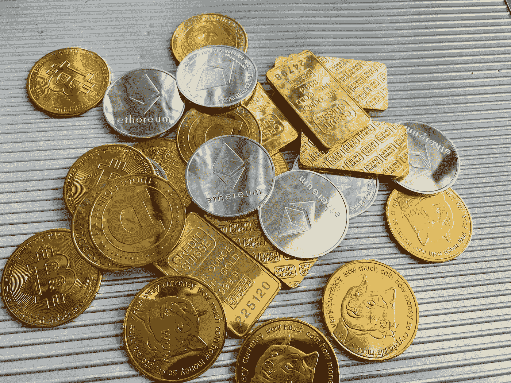

# 您在 2023 年投资组合中必须拥有的前 5 种备用硬币

> 原文：<https://medium.com/coinmonks/top-5-altcoins-that-you-must-have-in-portfolio-2023-66179e9fefce?source=collection_archive---------26----------------------->

Source photo Unsplash.com

# 以太坊

以太坊的可访问性和不稳定的价格波动使其成为我们 2023 年最佳购买加密货币名单的第一名。在这种情况下，“可获得”是指它在几乎所有主要的加密货币交易所交易，而“波动性”是指价格快速上涨和下跌的趋势。