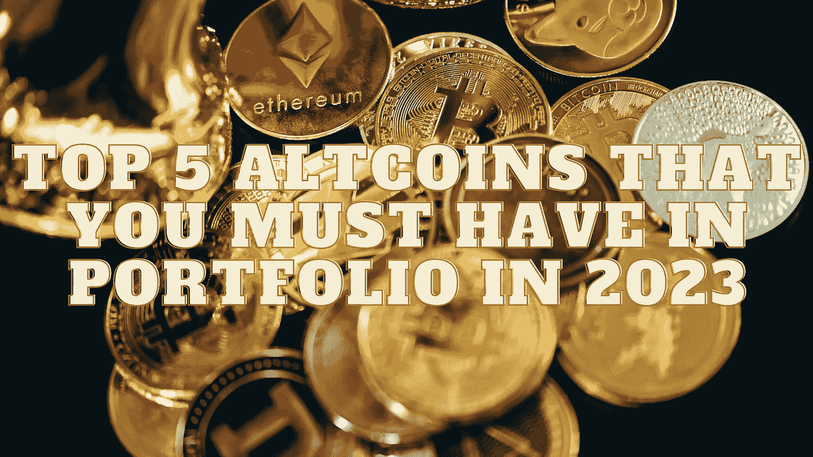

# 2023 年你的投资组合中必须拥有的前 5 种替代硬币

> 原文：<https://medium.com/coinmonks/top-5-altcoins-that-you-must-have-in-portfolio-in-2023-8ad67a07e0f0?source=collection_archive---------8----------------------->

Source photo Unsplash.com

# 卡尔达诺

就市值而言，卡尔达诺是最不被看好的大 altcoin。尽管是最安全的区块链之一，也是率先使用 PoS 共识流程的智能合约平台，但价格相对适中。根据我们的专家，这是因为货币流通缓慢，缺乏动力。另一方面…