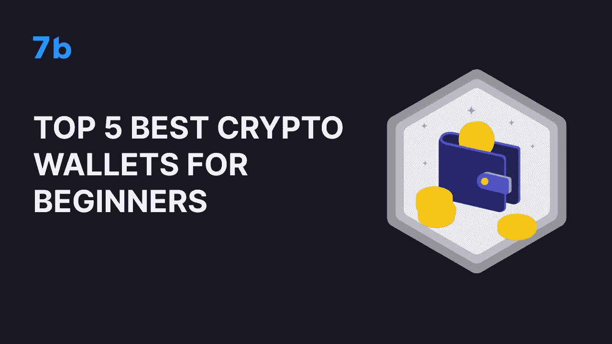

# 五大最佳新手加密钱包

> 原文：<https://medium.com/coinmonks/top-5-best-crypto-wallets-for-beginners-2c8473de17df?source=collection_archive---------34----------------------->

如果你想开始你的加密之旅，那么一个多功能的加密钱包可能正适合你。不同的加密钱包有不同的特点和好处，他们都有自己的优势。开始投资加密并不容易，考虑到加密钱包和应用程序的数量，选择正确的平台可能更难。

选择最佳加密钱包的过程可能会非常混乱，所以在这篇文章中，我们将带您浏览所有目前可供初学者使用的顶级钱包，以便您可以做出自己明智的决定。

# 那么，你对加密钱包有什么期望呢？

一个加密钱包是一个通用的工具，允许你存储，购买和出售，交换和交易你的密码，而不需要不断地在多个平台之间切换。

你的加密钱包应该很容易访问，但只有你。它应该是方便的，易于使用和安全的，尤其是如果你刚刚开始使用 crypto。同时要有合理的交易费用。

记住所有这些，以下是一些最佳选择:

# 7b

嗯，你不能责怪我们把我们的应用放在第一位，记住我们在这方面付出了多少努力:) [7b 加密交易钱包](http://sevenb.io/?utm_source=medium)是一个由行业领导者和加密巨头币安保护的一体化解决方案。我们发布 7b 来证明这个大胆的想法，任何人，任何地方，都应该能够轻松安全地进入密码世界:交换，交易，存储和监控他们的密码。

我们提供英镑，美元，欧元，澳大利亚元，加拿大元，俄罗斯卢布和印度卢比的法定支持。这让您可以从 400 多种加密货币中自由选择，打造自己的钱包。

每笔交易仅收取 0.1%的低交易费，这将有助于您获得加密资产的最大利润。

为方便用户创建 7b 允许提取高达 2 BTC(或任何其他货币)每天没有 KYC。

# 比特币基地

对于那些希望与菲亚特交换、交易和购买密码的人来说，比特币基地是最受欢迎的解决方案之一。比特币基地的用户可以访问保管安全选项，使其易于使用。比特币基地平台支持多种加密货币，包括比特币、比特币现金、以太坊、以太坊经典、莱特币、BAT、USDT 和 ZRX。

尽管比特币基地平台的界面友好且易于操作，但当用户想将资金转移出交易所时，它会收取取款费。另外，做好高额交易费的准备。

# eToro

eTory 是多功能交易平台，交易加密加差价为 1%。平台上活跃着一个用户社区，你可以关注特定的硬币新闻源。与其他加密爱好者交流真的可以帮助你深入到加密的世界。

尽管该平台仅提供约 60 枚硬币，但对于想学习基本交易策略的加密货币新手来说，它可能很有用。加密货币选择有限可能是 eToro 的最大劣势。另一个是支持—仅向 eToro 俱乐部会员提供聊天和电话支持。

# 币安

无需介绍的钱包——币安，业界领先的加密平台。“币安是全球领先的区块链生态系统，其产品套件包括最大的数字资产交易所。我们的使命是成为加密领域的基础设施服务提供商。”—创作者声称。

币安的佣金率是最低的之一，仅为 0.10%。你可以从 App Store 或 Google Play 商店下载该应用程序，它很容易使用，设计也很好。

# 罗宾汉

对于初学加密的用户来说，RobinHood 是一个很好的选择，它提供了一个简单的界面，可以访问股票和加密货币。交易员可以使用该应用程序交易股票、期权、交易所交易基金(ETF)和加密货币。然而，我们对罗宾汉的安全性有一个很大的疑问。Robinhood 收到了来自证券交易委员会的多次投诉、诉讼和公众对其一些做法的愤怒。

总而言之…

市场上有多种加密钱包，在选择一种时，你应该记住你到底为什么需要它。完美的钱包应该结合你认为最重要的功能。无论你是打算尝试交易策略，还是仅仅想购买并持有 crypto。无论你有什么目的，开始在加密将尽可能顺利与 7b 加密交易钱包。试试 7b，secure 和[匿名密码交换](http://sevenb.io/?utm_source=medium)，享受低密码交易费用和无 KYC 的密码交换。

> 交易新手？试试[密码交易机器人](/coinmonks/crypto-trading-bot-c2ffce8acb2a)或者[复制交易](/coinmonks/top-10-crypto-copy-trading-platforms-for-beginners-d0c37c7d698c)