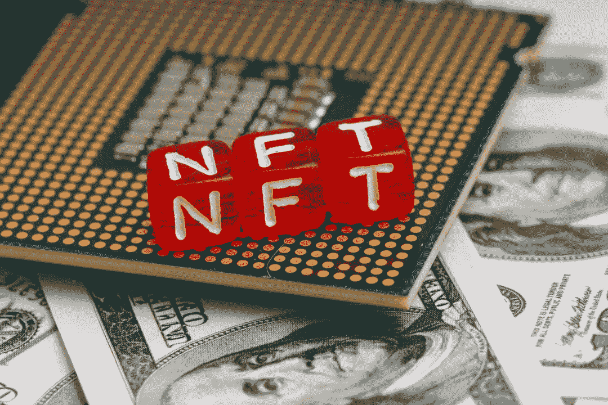

# 关于 NFTs 的五大常见误解

> 原文：<https://medium.com/coinmonks/top-5-common-misconceptions-about-nfts-b4faff40c267?source=collection_archive---------18----------------------->

被称为 NFT 的不可替代代币逐渐成为一个家喻户晓的名字。越受欢迎，人们对它和它如何工作的误解和错误就越多。[NFT](https://36crypto.com/nftnon-fungible-token/)并不像看起来那么复杂，它们值得投资。

在这篇文章中，我将重点介绍**人们对 NFTs** 的 5 个常见误解，并进一步澄清这些误解。许多数字收藏品的交易量非常大。

根据 CryptoBriefing 的数据，2021 年， [NFT 市场 Opensea](https://36crypto.com/how-to-buy-your-first-nft-on-opensea-a-beginners-guide/) 的交易量增长了[646 倍](https://cryptobriefing.com/opensea-saw-a-646x-increase-in-trading-volume-in-2021/)。2022 年最昂贵的 NFT 包括合并(9180 万美元)、前 5000 天(6930 万美元)和时钟(5270 万美元)。

你已经可以看到人们在购买这些存在于区块链上的[加密资产](https://36crypto.com/nftnon-fungible-token/)上花费的金额。根据来自[非卖品和 L'Atelier](https://nonfungible.com/blog/nft-yearly-report-2020) 的报告，NFT 的交易额在 2020 年增长了两倍，达到 2 . 5 亿美元。

这些花费在购买单件商品上的巨额资金在人们中间留下了猜测和误解，尤其是新手对它们在市场上的成本和价值。以下是我听到的一些关于该现象的错误。

*   非功能性测试很复杂
*   NFT 只适用于艺术
*   NFT 是一项糟糕的投资
*   非功能性测试没有实际价值
*   NFTs 自动意味着对作品的所有权

# 1.非功能性测试很复杂

如前所述，NFT 是代表数字作品所有权的[不可互换的加密资产](https://36crypto.com/nftnon-fungible-token/)。其中包含数字资产的所有权记录。

它们的价值来自于它们的稀有性，对于收藏家来说，这保护了他们的投资，因为只有一件原作可得，而且可以追溯到最初的创作者。

我们可以以克里斯·托雷斯大约 10 年前创作的 **Nyan Cat GIF** 为例。当他在一个基金会上展示一个独特版本的艺术品出售时，一场竞价战开始了。一位收藏家最终花了 58 万美元买下了它。

有了这笔资产，收藏者可以放心，他拥有 NFT 的独特版本。每一个 NFT 都是独一无二的资产，因此它的价值来源于它的独特性。

尽管 NFTs 听起来很复杂，但考虑到错误和推测，它并不复杂。你可以把它想象成一场博物馆拍卖会，收藏家们在那里购买独一无二的艺术品(比如达芬奇的蒙娜丽莎)。最终为其买单的收藏家拥有该艺术品独一无二的原始复制品。

# 2.NFT 只适用于艺术

这是人们对非功能性测试最常见的错误和误解。这可以追溯到现在花在数字艺术上的钱。根据 [Pixelplex](https://pixelplex.io/blog/nft-in-art/) 上的这篇文章，NFT 艺术是仅次于收藏类非艺术类的第二大热门类别。

除了艺术，其他 NFT 奖项还包括:

*   可收藏的物品/交易卡。
*   活动门票。
*   音乐和媒体。
*   游戏。
*   重大运动时刻。
*   虚拟时尚。
*   真实世界的资产。

游戏和音乐等类别最近开始流行起来。加息和通胀可能会导致投资者为一件艺术品支付高价。有史以来最昂贵的 NFT 游戏之一是《龙——密码猫》。最贵的一个卖了 600ETH，在我写这篇文章的时候，它值 812，526 美元。

# 3.NFT 是一项糟糕的投资

这不是新的误解。从很久以前，甚至在发明 NFTs 之前，人们就一直认为艺术是一项糟糕的投资，而且不容易转换成现金，这并不完全正确。

在艺术界，虽然一些作品的价格大幅上涨，但其他作品的价格却呈下降趋势。同样的情况也适用于非功能性纺织品，价格和价值有升有降。

投资和购买 NFT 艺术品的最佳方式是投资那些原创的、有明确产地和历史的作品。就像加密货币一样，并不是每一种 [NFT 资产](https://36crypto.com/nftnon-fungible-token/)都会随着时间而升值。目标是识别来源明确的优质资产，因为这些资产不太可能贬值。

一个好的收藏中的一些作品可能会随着时间的推移而升值，而另一些则会保持其价值。

**看看这些** [**6 种常见的 NFT 骗局**](https://36crypto.com/common-nft-scams-and-8-ways-to-avoid-them/) **以及如何避免它们。**

# [在这里阅读完整的帖子](https://36crypto.com/top-5-common-mistakes-about-nfts/)

**你喜欢阅读我们定期带给你的这类内容吗？如果是，请点击“鼓掌”按钮，增加其他人看到这个帖子并了解它的机会。**

**你可以鼓掌 50 次。你还在等什么？马上按下那个按钮。感谢您的阅读。**

*原载于 2022 年 9 月 21 日*[*https://36crypto.com*](https://36crypto.com/top-5-common-mistakes-about-nfts/)*。*

> 交易新手？尝试[加密交易机器人](/coinmonks/crypto-trading-bot-c2ffce8acb2a)或[复制交易](/coinmonks/top-10-crypto-copy-trading-platforms-for-beginners-d0c37c7d698c)