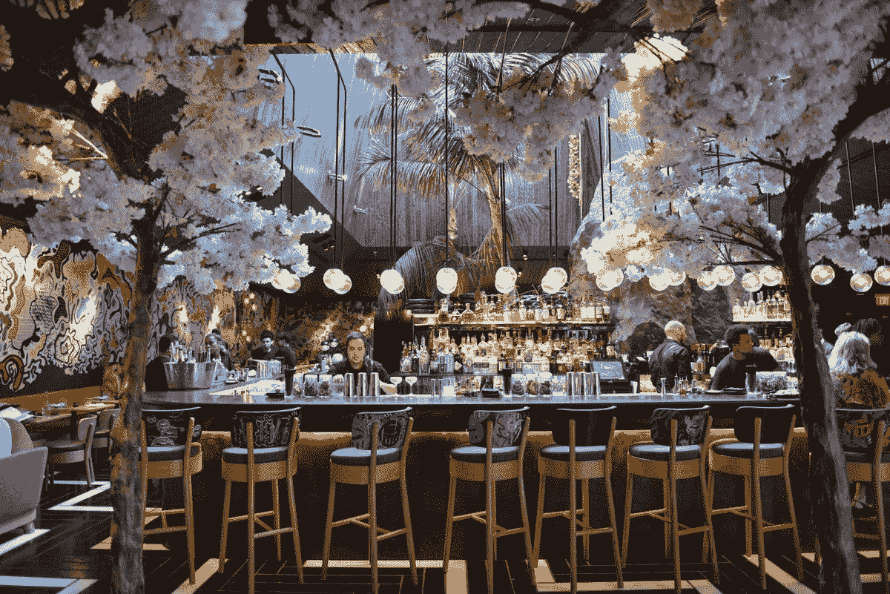

# 今天你应该探索的五大加密和 NFT 餐厅

> 原文：<https://medium.com/coinmonks/top-5-crypto-and-nft-restaurants-you-should-explore-today-7ae9f8204909?source=collection_archive---------38----------------------->

在周围最好的餐馆品尝最美味的食物是每个美食爱好者的快乐。除了对美食的明显喜爱之外，在一家顶级餐厅用餐还有其他额外的好处，或者你可以称之为款待。这可能是品尝一些最好的葡萄酒，甚至是专门为你准备的美味佳肴的能力。你还需要记住，服务和提供服务的方式是另一个因素，它可以让你对美食体验的记忆物有所值。

简而言之，没有什么能比以最高水平的热情服务来享用一顿大餐更好的了。

在这篇文章中，我讨论了一些餐厅是如何将美食体验提升到一个全新的水平，让游客能够通过 NFT 所有权加入一个专属俱乐部。你已经知道我的意思了，它是关于通过 NFTs 提供美食体验的顶级餐厅。

让我们开始吧！

# 飞鱼俱乐部

飞鱼俱乐部(FlyFish club)称自己是第一家向持有者提供专属服务的 NFT 餐厅。本质上，它是一个餐饮俱乐部，会员可以在区块链购买。作为该俱乐部的成员，您应该准备好探索由繁华的鸡尾酒廊、高档餐厅、私密的 omakase 房间和户外空间组成的专属待遇，所有这些都位于纽约市的中心。

# 皮亚迈阿密

[Piya miami](https://piyamiami.com/) 餐厅与飞鱼俱乐部类似，因为只有 NFT 持有者才能进入餐厅。Piya 由泰国餐馆老板、厨师 Bee 和加拿大商人 Simon Librati 所有。Piya 旨在为用户提供三合一的体验，游客将被允许进入泰国风味的餐厅、omakase 餐厅和参加私人活动。

# Crypto 街餐厅

位于科罗拉多州[清水滩的这家餐厅](https://www.cryptostreetrestaurant.com/menu)找到了一种引入加密货币的创造性方法。除了让游客可以用加密货币支付之外，这家餐厅还以加密货币命名了所有的菜肴。所以，准备好订购你的第一个柴犬披萨吧，或者它可能只是一个比特币汉堡。

# 威利食品餐厅

柴犬与当地一家名为 Welly's 的意大利餐厅合作，使这一切成为可能。这家餐厅位于那不勒斯，现在已经进行了改造，以反映柴犬的影响。柴犬表示，它选择这家餐厅而不是受欢迎的快餐店，因为它旨在提供健康的食物，而不是纯粹的快餐。游客还可以用柴犬的本地货币 SHIB 支付餐费。

# Doge 汉堡

这家[虚拟快餐店](https://dogeburger.co/)的灵感来自于流行的加密货币 Dogecoin，正如所料，该餐厅现在可以在迪拜和阿联酋各地送货，同时接受流行的加密货币，包括 Doge、BTC、SHIB 等。

# 结论

有趣的是，各行业正在寻找创造性的方法来利用非功能性技术。现在是吃东西的时候了，有意思，桌子上有很多选择。

> 交易新手？试试[密码交易机器人](/coinmonks/crypto-trading-bot-c2ffce8acb2a)或[复制交易](/coinmonks/top-10-crypto-copy-trading-platforms-for-beginners-d0c37c7d698c)