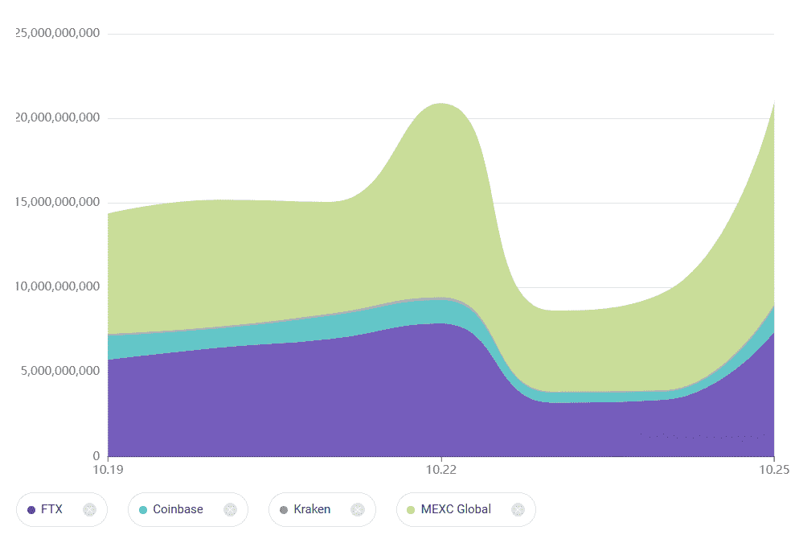
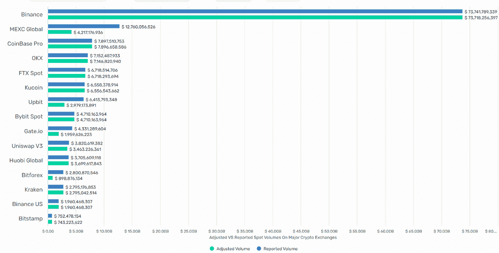
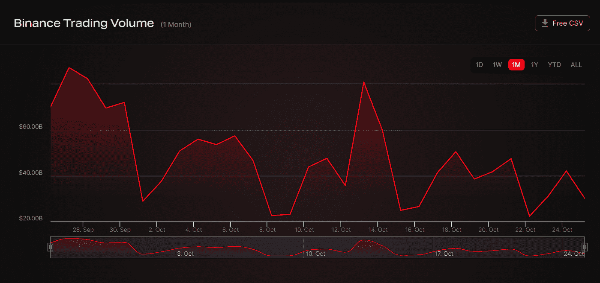
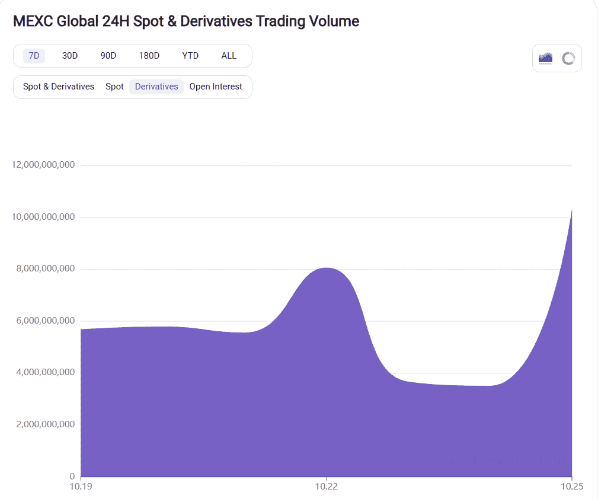
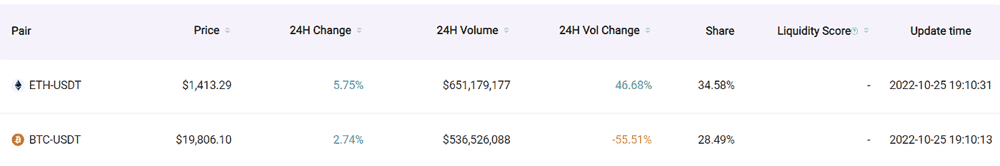
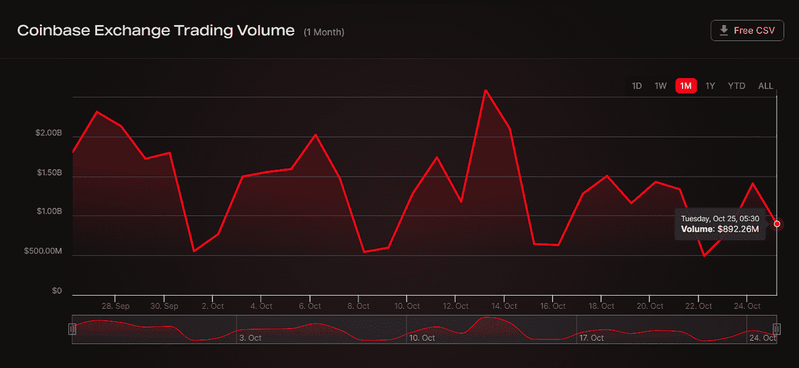
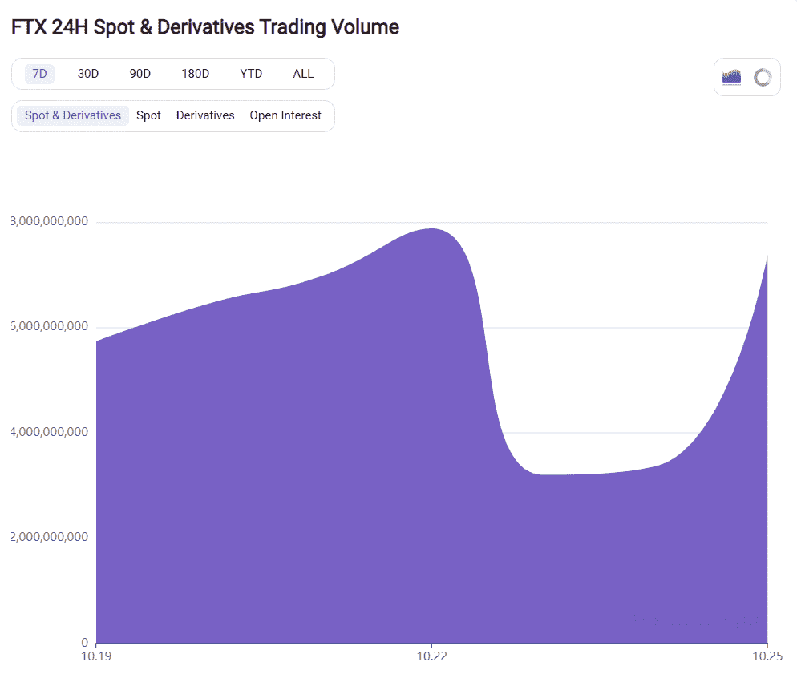
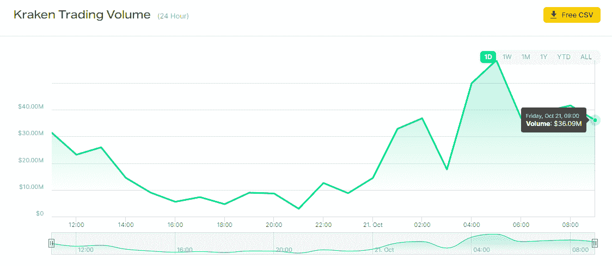

# 基于流动性和交易量的前五大加密交易所

> 原文：<https://medium.com/coinmonks/top-5-crypto-exchange-based-on-liquidity-and-trading-volume-3f0d550b8e36?source=collection_archive---------6----------------------->

虽然加密交易所需要高交易量来保持营业，但它们也需要保持高流动性，以吸引交易量更高的专业交易员。

对于加密交易者来说，交易量同样重要；更高的交易量意味着你的订单会相对更快地完成，价格更低，费用也可能更低。

此外，这也意味着价格可能会尽可能接近市场均衡。

> *加入我们的* [***电报***](https://t.me/coincodecap) *，获得免费加密交易信号。*

# 关于现货、期货和衍生品交易量的数据

尽管目前的市场条件更适合长期期货交易者，但一些交易所的月度交易量仍有所上升。

例如，根据来自 [TokenInsight](https://tokeninsight.com/en/exchanges) 的数据，[MEXC Global crypto exchange](https://coincodecap.com/mexc-global-review)在过去一周观察到其现货和衍生品交易量急剧上升。表明大量资金流向墨西哥石油公司的交易商的动向，因此流动性增加。

此外，CryptoRank 的下图显示了过去七天(撰写本文时)主要加密交易所的现货交易量。尽管币安获得了市场上大部分的现货交易量，但墨西哥石油公司、比特币基地石油公司、 [OKX](https://coincodecap.com/go/OKEX) 和 FTX 石油公司设法进入了前 5 名。

此外，MEXC Global 的交易量几乎是 FTX 或其它交易所的两倍。

# 主要加密交易所报告的现货交易量与调整后的现货交易量

由于较高的交易量对应于加密交易所的较高流动性，这与更好的可用市场利率和更快的结算相关，让我们看看现货和衍生品交易量最高的前 5 家加密交易所。

# 1.[币安](https://coincodecap.com/go/binance)

就全球用户和交易量而言，币安是最大的加密交易所。此外，该交易所每周交易量超过 730 亿美元。

根据经济学的数据，币安占总加密量的 27%,并且在最后一天执行了超过 285 亿笔交易，占交易的 100%。

币安拥有超过 1448 个交易对，其中 BTC/USDT 和瑞士联邦理工学院/USDT 是最受欢迎的。

此外，根据 Nomics 的数据，尽管就交易量而言，币安是最大的集中式加密交易所，但整个 10 月份的交易量都在下降。

> **也可阅读:** [**最佳免费 16 款密码交易机器人**](/coinmonks/crypto-trading-bot-c2ffce8acb2a)

# 2. [MEXC Global](https://coincodecap.com/go/mxc)

MEXC 在全球拥有超过 1000 万用户，是一家市场领先、用户友好的加密货币交易所，为交易点、杠杆交易所交易基金(ETF)、永久期货、NFT 指数和许多其他产品提供一站式服务。

此外，鉴于自上一轮牛市以来期货市场非常受欢迎，很明显，衍生品交易量更大的加密交易所将是专业交易者的首选。

根据 TokenInsight 的数据，在过去四天里，MEXC 的衍生品交易量增长了近 3 倍。此外，在 MEXC 的总交易量中，约 18%来自现货市场，其余来自期货或衍生品市场。

墨西哥湾交易所的 USDT 联邦理工学院和 BTC-USDT 交易所加在一起，就拥有超过 12 亿美元的交易量，这也是最受欢迎的交易对。

# 3.[比特币基地](https://coincodecap.com/go/coinbase)

用户可以在这个位于美国的加密货币交易和投资平台上轻松购买、出售、交换和存储加密货币。该平台支持基本交易、数字钱包提款和 PayPal 提款，对初学者来说非常友好。此外，比特币基地专业版为更有经验的交易者提供更专业的交易执行和更低的费用。

比特币基地过去 24 小时的交易量为 14.3 亿美元。他们有 540 个市场，BTC/美元、瑞士联邦理工学院/美元和 USDT/美元是最受欢迎的市场(交易对)。根据 Nomics 的数据，比特币基地占市场总交易量的 1%，最后一天执行了 2，759，640 笔交易。

比特币基地在现货市场上有超过 541 对黄金，日均交易量约为 13 亿美元，占全球现货交易量的 35%。

# 4. [FTX](https://coincodecap.com/go/ftx)

FTX 是一个“由交易者提供，为交易者服务”的加密交易所，拥有超过一百万的注册用户。此外，它是增长最快的加密交易所之一，为其用户提供大量服务。

该平台提供超过 703 个市场，BTC/美元、瑞士联邦理工学院/美元和 BTC/美元是交易最多的货币对。

此外，根据 TokenInsight 的数据，FTX 的总交易量超过 100 亿美元，其中现货市场占 15%，其余来自衍生品市场。

又念:[什么是杠杆代币](https://coincodecap-com.webpkgcache.com/doc/-/s/coincodecap.com/leveraged-token)？

# 5.[北海巨妖](https://coincodecap.com/go/kraken)

北海巨妖是一个中央加密货币交易所，拥有超过 622 个市场，包括 USDT/欧元、USDT/美元和 BTC/美元，是美国最著名的交易所之一。

10 月 21 日，该交易所称其成交量超过 3600 万美元。BTC-USDT 为现货对分配了 3.1%的市场份额，每个 TokenInsight 的交易量超过 800 万。

过去 24 小时，平均成交量和现货成交量均为 4.9 亿。

北海巨妖的 24 小时成交量估计为 5.61 亿美元，过去 24 小时的变化为 49.18%。USDT/欧元是最活跃的交易对，24 小时交易量超过 1.18 亿美元。

# 结论

币安提供市场上最多的服务，同时也是世界上交易量最大的加密交易所。但是，对于新手交易者来说，也是相当的不知所措；因此，采用替代方案将是最佳选择。

MEXC Global 可以说是币安的最佳替代者，因为就现货和衍生品交易总量而言，它仅排在第二位。此外，MEXC 交易所并不缺少集中式加密交易所提供的任何基本功能。

 [## 2022 年 11 个最佳免费交易应用和平台

### 复制交易、社交交易、镜像交易——大多数时候都是一样的。随便你怎么称呼它。

medium.com](/coinmonks/top-10-crypto-copy-trading-platforms-for-beginners-d0c37c7d698c)  [## 2022 年印度 6 大加密交易应用

### 购买比特币的最佳加密应用

medium.com](/coinmonks/bitcoin-exchange-in-india-7f1fe79715c9)  [## 最佳加密交易所| 2021 年十大加密货币交易所

### 哪一个是最好的加密交换？在本文中，我们将根据多种加密货币列出 10 大加密货币交易所

medium.com](/coinmonks/crypto-exchange-dd2f9d6f3769)