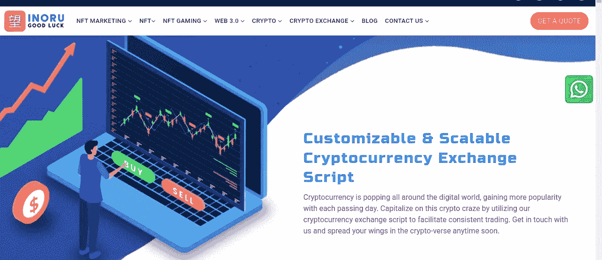

# 2022-23 年前五大加密交易所开发公司

> 原文：<https://medium.com/coinmonks/top-5-crypto-exchange-development-companies-2022-23-912ffb43a7dd?source=collection_archive---------8----------------------->

货币交易所帮助人们以分散的方式交易不同种类的硬币。它们是一扇敞开的大门，以一种简单的方式交易不同的硬币。然而，像这样的平台应该在公司的帮助下塑造，这些公司与有创造力的头脑一起工作，可以为企业家提供一种新的方式。所以，现在是时候决定哪家公司能帮你提供一个平台，让能交易的玩家在最高水平上收获财富。为了帮助你，这里有一个加密货币交易所开发公司的列表。

> ***加密货币交易所:迈向基于 Web3 的未来的好方法！***

## **能够在隐秘的海洋中掀起浪潮的顶级公司**

## [**CES**](https://bit.ly/3uIFUPF)

**CES**

来自 CES 的平台提供了广泛的定制，使您的产品脱颖而出，并有助于快速开发、设置和推出您自己的加密货币兑换业务。该业务利用尖端技术创建交易平台，并擅长开发加密货币交易所的软件。该企业将帮助您确定加密货币的价值，同时考虑以太坊区块链的优势、可与以太坊区块链相媲美的高级安全性、令人印象深刻的交易速度和成本效益等因素。因此，选择 CES 将你的期望雕刻成一个充满财富的交易平台是很困难的。

## [**AppDupe**](https://bit.ly/3Bs4EiY)

**AppDupe**

通过将其他资产(主要是法定货币和数字货币)交换为加密货币，加密货币交易所充当加密交易的技术驱动经纪人。与传统货币不同，加密货币是与区块链相关的数字所有权形式。每次有加密销售，加密货币单位将被发送到买家的钱包地址。买卖双方的“接触点”是交易平台。AppDupe 开发加密货币交易所的战略围绕着坚持高安全性标准，因为它是一家区块链特有的公司。他们擅长使用尖端技术来提供定制的解决方案。为了满足客户的需求，他们部署了经过精心挑选的区块链开发人员。

## [**INORU**](https://bit.ly/3FmzFWt)

**INORU**

加密货币变得越来越受欢迎，在数字世界中遍地开花。通过使用 INORU 的加密货币交换解决方案实现可靠的交易，从加密货币热潮中获利。它利用尖端技术为您的业务需求打造合适的平台。作为顶级交易所开发商，INORU 为各种加密货币交易所平台提供一站式服务，包括 P2P 交易所、币安等可定制交易所和比特币基地等受控交易所。抓住它的服务，飞向密码世界。

## [**Maticz**](https://maticz.com/cryptocurrency-exchange-software-development)

**MATICZ**

Maticz 是一家知名的加密货币交易所开发公司，与业内最优秀的交易所开发人员合作，提供顶级的加密货币交易所开发服务。它有创造有利可图的加密货币项目的记录，并为来自世界各地的客户推出了 50 多个平台。其区块链专家评估客户的需求，并通过利用尖端的区块链技术创建一个安全和可扩展的加密交换平台来创建白标解决方案。因此，使用 Maticz 为您的交易者创建并推出一个可靠、安全且易于使用的无障碍加密货币交易平台。

## [Bitdeal](https://www.bitdeal.net/cryptocurrency-exchange-script)

**BITDEAL**

加密货币行业的先驱 Bitdeal 为立即推出加密货币交易所提供可靠的加密货币交易所解决方案。它的开发人员擅长开发高度可扩展的加密交换平台，可以轻松进入加密市场。根据您的需求，它还创建和实现加密货币交换功能和附加功能。作为加密交换开发服务的提供商，它通过集成高安全性标准和各种支付选项来提供可靠的区块链解决方案。因此，是时候获得它的服务，以稳定船移动通过加密风暴。

## **包装完毕！**

加密货币交易所有一个习惯，让人们以一种轻松的方式兑换硬币。然而，为了成为一名加密玩家，你必须建立一个能够成功交易的平台。所以，找一个可靠的平台服务提供商，采取一个适合你的行动。这些上市公司拥有最优秀的员工，可以让你在未来几年成为企业家。所以，你可以选择上面列表中的任何一个。你可以说出你的需求，这些公司的专家会想出一个计划，把观众推向你的平台。

> 交易新手？试试[加密交易机器人](/coinmonks/crypto-trading-bot-c2ffce8acb2a)或者[复制交易](/coinmonks/top-10-crypto-copy-trading-platforms-for-beginners-d0c37c7d698c)