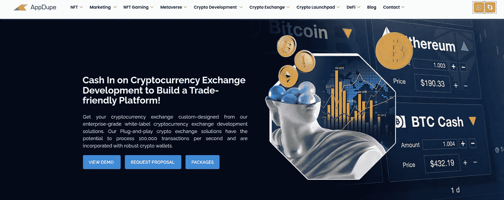
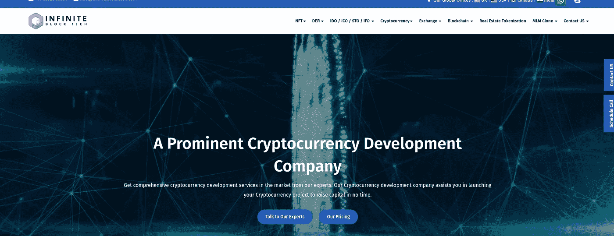
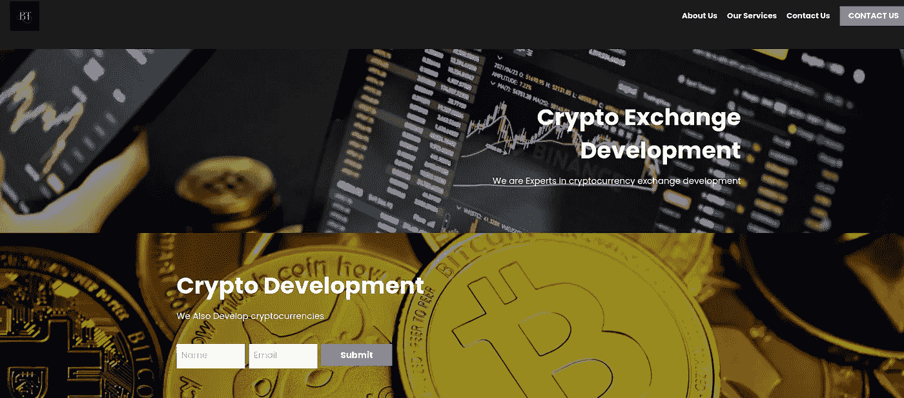
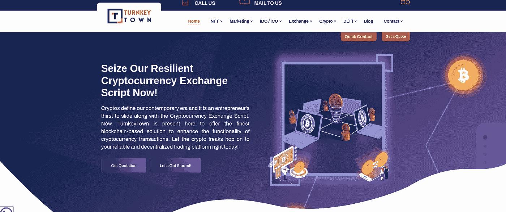

# 2023 年前五大加密交易所开发公司

> 原文：<https://medium.com/coinmonks/top-5-crypto-exchange-development-companies-2022-399967e199aa?source=collection_archive---------22----------------------->

Image designed by [Alex peter](/@alexxpeter)

> 加密货币为用户以各种方式利用它们创造了极其多样的空间。了解区块链技术的人知道它成功的潜力有多大。目前，在各种交易平台上有超过 1600 种加密货币上市。但这不是终点；还有更多加密货币有待在交易所平台上市。这就产生了对密码交换平台的巨大需求。这个博客涵盖了顶级加密交换开发公司，这样用户可以很容易地选择合适的开发公司来构建他们的交换平台。

在我们到达那里之前，让我们简单看一下[加密货币交易所](/geekculture/cryptocurrency-exchange-development-a-comprehensive-guide-56285280b668)和使用的主要加密交易所类型。

# 加密货币交易所

加密货币交易平台允许人们交易加密货币，以换取法定货币或其他数字货币。这些加密交换可以通过两种方式完成:

## 集中式交换:

在目前的加密世界中，大多数交换都是通过集中式交换来完成的。在这个平台中，存在一个中央权威机构或中介来授权或验证论坛上的交易。

[**加密货币业务思路**](/coinmonks/top-business-ideas-to-start-your-cryptocurrency-startups-199aa132da90)>>>>>>>

## 分散交换:

这种交换方式并不常见，但在加密领域正被规范化。在分散式交换平台中，不存在中央机构或中介，并且允许以非托管方式进行对等加密交换。这确保了买方和卖方可以安全和匿名地交易加密资产。分散的交换消除了黑客等欺诈活动的机会，并为加密交易创造了一个安全的空间。

# 2023 年领先的加密交换开发公司

> 选择正确的加密交换平台开发公司非常重要，因为它会影响交换平台的结果。为了选择合适的公司，人们可以根据公司的成长、多年的经验、演示工作、客户、价格、预先制作的软件程序等来选择。为了减轻用户寻找合适公司的努力，以下是 2023 年领先的交换平台开发公司。

## [Appdupe](https://bit.ly/3EmVFRm)

[Appdupe](https://www.appdupe.com/cryptocurrency-exchange-script)

Appdupe 是领先的加密交换平台开发公司之一。他们提供顶级的 [**密码交换开发服务**](https://bit.ly/3EmVFRm) 。他们的密码交换平台确保了快速顺利的密码交易。

他们的加密交换平台开发服务包括白标、集中式、分散式加密交换开发服务包括白标、集中式、分散式、分散式和混合式交换开发、P2P 交换开发等。雇佣 AppDupe 进行交换平台开发，可以让用户获得一个有抱负且富裕的交换平台。

它们的独特之处在于其独有的安全功能，如监狱登录、防 DDoS、HTTP 认证、SSRF 攻击保护等。此外，合并的功能，如强大的交易引擎，多个支付网关，多种货币支持等。是 AppDupe 与众不同的地方。

## [无限街区科技](http://bit.ly/3xVktwi)

[Infinite Block Tech](https://www.infiniteblocktech.com/cryptocurrency-development-company)

您可以选择 Infinite 获得一个高度可定制的加密交换平台，支持多种货币支付和多种语言兼容。他们的开发服务包括集中式和分散式加密交易所开发、币安式交易所开发、白标加密货币交易所等。

使它们与众不同的是它们在 exchange 平台中增强了安全措施，包括多个防火墙，提供了一个高度安全的平台。此外，他们的准时交货和可爱的技术援助是使他们与众不同的属性。

## [区块链 App 工厂](http://bit.ly/3Y6T3y8)

[Blockchain App Factory](https://www.blockchainappfactory.com/cryptocurrency-development)

这家领先的交换平台开发公司为革新加密交换平台开发提供定制解决方案和值得信赖的服务。他们的顶级交易所平台开发服务包括白标比特币交易所软件、白标加密货币交易所开发、集中式和分散式交易所开发、衍生品交易所开发、一页式交易所开发等。

它们的独特之处在于其显著的安全特性，包括托管系统、CSRF 保护等。，其 100%可扩展且强健的 exchange 解决方案使其独一无二。

## [交钥匙城](http://bit.ly/3Yby0KO)

[TurnkeyTown](https://www.turnkeytown.com/cryptocurrency-exchange-script)

他们的用户友好的交换平台与先进的智能合约和 AMM 创建了一个解决加密交易平台。他们的交换平台开发服务包括集中式和分散式交换开发、P2P 交换开发、托管交换开发、不可渗透令牌交换开发等。

使它们与众不同的是它们不可否认的迷人的图形用户界面，广泛的白标加密交换解决方案，以及多样化的加密交易平台开发，这些都是使它们成为最好的属性。

## 技术加载器

[Technoloader](https://www.technoloader.com/cryptocurrency-exchange-software-development)

这是一家总部位于印度的公司，为 exchange 平台提供一流的开发服务。他们提供各种基于区块链技术的服务，并且已经在加密领域工作了很长时间。

他们专门开发具有高端安全性的集中式和分散式交换平台。他们的服务还包括白标加密交换开发、P2P 加密交换开发、从零开始的加密交换软件开发、类似币安的加密交换开发等。

# 结论

了解领先的 [**密码交易所发展**](https://bit.ly/3EmVFRm) **公司**便于用户挑选适合自己的公司。对于一个人来说，拥有关于交换平台的技术知识并不一定重要。这就是开发公司用他们杰出的技术支持来帮助用户的地方。选择了解和分析用户对 exchange 平台的需求和要求的公司是正确的选择。找一个值得信赖的、有技术的公司来开发密码交换平台。

# 常见问题(FAQ)

## 1.什么是加密交换？它是如何工作的？

加密交易所是一个用户可以购买、出售和交易各种加密货币的平台。加密交易所的工作原理是通过订单簿匹配买家和卖家，订单簿是特定加密货币的公开买卖订单列表。当买卖双方就价格达成一致时，交易所执行交易并收取交易费用。

## 2.加密交换的主要特征是什么？

加密交易所的主要功能包括用户友好的界面、高级别的安全措施(如双因素身份验证)、多种支付方式、快速交易处理以及对多种加密货币的支持。

## 3.我如何选择正确的加密交换开发公司？

当选择一家加密交换开发公司时，寻找一个在该领域有经验、有成功项目的良好记录并在行业中有良好声誉的团队是很重要的。您还应该考虑成本、可伸缩性和客户支持等因素。

## 4.启动加密交易所的法律要求是什么？

启动加密交易所的法律要求因国家和地区而异。一般来说，您需要遵守当地的金融服务和汇款法规，以及数据隐私法。咨询法律专家以确保你遵守所有适用的法律法规是很重要的。

## 5.我如何推广我的加密交换并吸引用户？

为了推广您的加密交换并吸引用户，您可以使用各种营销策略，如社交媒体广告、内容营销、影响者营销和搜索引擎优化。拥有强大的品牌形象、清晰的信息传递和有竞争力的价格非常重要，这样才能让你从其他交易所中脱颖而出，吸引用户。提供出色的客户支持和推荐项目等激励措施也有助于吸引和留住用户。