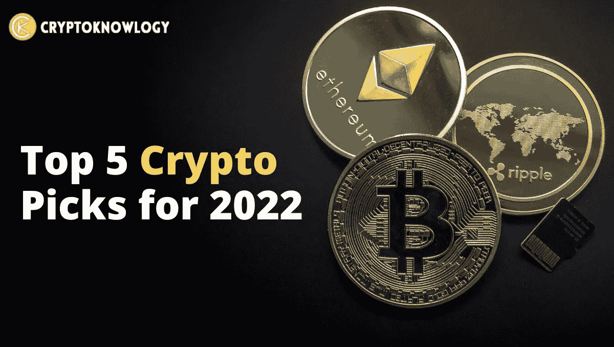
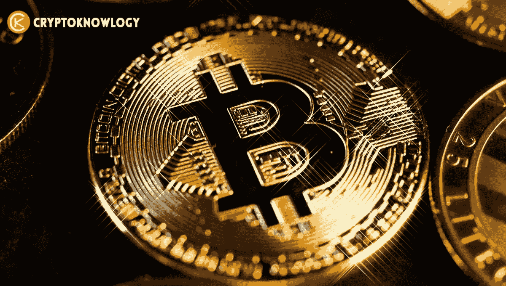
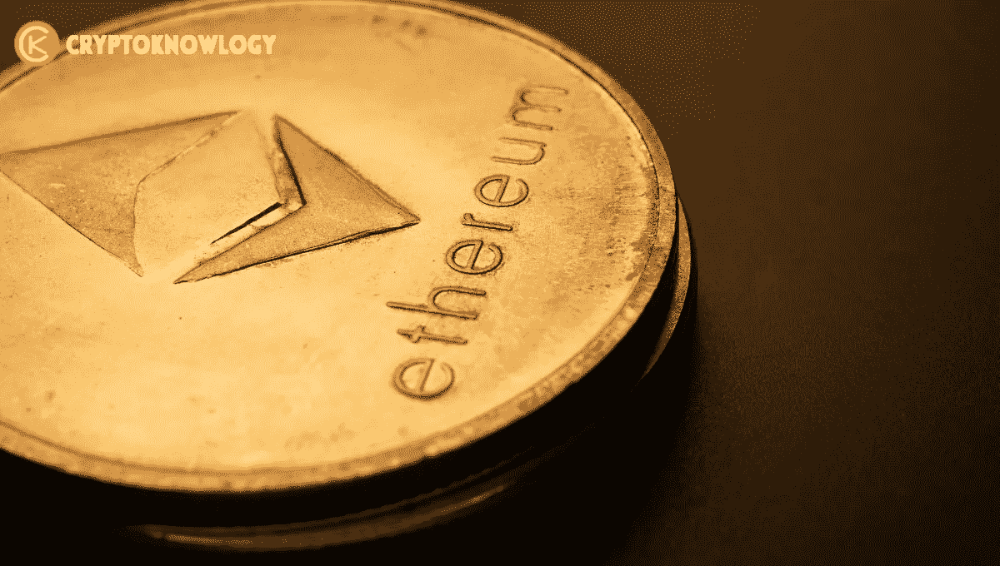

# 2022 年五大加密选择

> 原文：<https://medium.com/coinmonks/top-5-crypto-picks-for-2022-cbc177ead5c2?source=collection_archive---------14----------------------->

[加密货币](https://cryptoknowlogy.com/)是[数字货币](https://cryptoknowlogy.com/euro-cbdc-is-coming/)，它不受**中央集权**系统的控制，比如政府。相反，它建立在最广泛使用的[区块链技术](https://cryptoknowlogy.com/what-is-blockchain-and-how-does-it-work/)之上。随着数字货币在华尔街的使用不断增加，更多的机会变得可用。目前，市场上有超过 20，000 种[加密货币](https://cryptoknowlogy.com/different-types-of-cryptocurrency/)。

**加密货币**可用于购物，但大多数人将其视为长期投资。包括与美元挂钩的**稳定货币**在内的各种加密货币最近大幅下跌，这说明了不稳定的加密货币让投资这些货币变得多么危险。在你投资之前，重要的是要了解你要进入的是什么。

一个新的“**加密冬天**”可能即将冲击加密货币市场。然而，在之前的每一次熊市之后，加密货币都比以前更加强劲。

因此，敢于冒险的投资者应该寻找机会，做出明智的判断，在市场下跌时买入。

在本指南中，我将向你展示 2022 年最值得购买的五种新型加密货币。

# 比特币(BTC):

**比特币(BTC)** 是第一种加密货币，由一个名叫**中本聪**的人于 2009 年开发。BTC 在区块链上运行，这是一个记录交易的账本，由成千上万台计算机组成的网络共享，就像大多数其他加密货币一样。

[比特币](https://bitcoin.org/en/)保持安全，防范欺诈者，因为分布式分类账的增加必须通过解决密码难题来验证，这一过程被称为**工作证明**。

比特币是一项明智的投资，因为目前很多公司都接受它作为支付手段。例如， **Visa** 接受比特币交易。此外，在加密货币消失四年后，Stripe 现在将允许用户接受比特币支付。甚至更大的银行也开始将比特币交易纳入其服务。

特斯拉只短暂地拿走了比特币，但如果它的开采变得更加环保，它可能会再次这样做。

# 以太坊(ETH):

在加密货币领域，你最有可能记住的第二个名字是[以太坊](https://cryptoknowlogy.com/what-is-ethereum/)。货币**以太**经常在系统中用于各种任务，但以太坊的智能合约功能有助于它的流行。

以太(ETH)作为[以太坊](https://cryptoknowlogy.com/ethereum-merge-explained/)网络上的一种交通工具，受到希望在以太坊平台上创建和运行应用的开发者以及希望使用以太获得其他数字货币的投资者的追捧。

它的推出可能比其他一些加密货币晚一点，但由于其尖端技术，它的表现优于所有其他加密货币。它是目前受欢迎程度最高的区块链，也是仅次于比特币的第二大加密货币。

一旦被称为“[合并](https://cryptoknowlogy.com/ethereum-merge-explained/)”的升级被完全实现，它有可能进一步发展。这一变化将推动以太坊走向基于利害关系证明的共识，这将减少硬币的数量，使采矿变得无用。更新计划在 2022 年第三或第四季度进行。

# 系绳(USDT):

第一批也是最知名的 stablecoins 之一， [Tether (USDT)](https://cryptoknowlogy.com/what-are-altcoins/) 是一种加密货币，旨在将其市值与货币或其他外部参考点联系起来，以减少波动性。大多数数字货币，包括像比特币这样的流行货币，都经常经历极度波动的时期。

Tether 和其他 stablecoins 旨在降低这种波动性，以吸引可能会犹豫不决的消费者。系绳的成本与美元的价值直接相关。该机制允许用户更快更容易地将资金从其他加密货币转移回美元，而不是实际转换成法定货币。

对其他硬币的剧烈波动持怀疑态度的投资者选择 Tether，因为据说它的价值比其他加密货币更稳定。

# 币安·科恩(BNB):

世界上最大的加密货币交易所之一，**币安**，为其用户提供使用**币安币**加密货币进行交易和支付费用的能力。

自 2017 年首次亮相以来，币安币已经发展起来，现在它的功能不仅仅是允许在币安的交易平台上进行交易。现在，它可以用于交易、处理支付，甚至制定旅行计划。此外，它可以交易或转换成其他加密货币，如以太坊或比特币。

从事大量交易的投资者应该知道，最近，**币安**暂停了各个网络的存取款，包括**多边形**和**索拉纳**，以便执行更新。空投奖励——基于消费者存款百分比的奖励——没有受到最近发生在 4 月 8 日的奖励的影响。

最初，币安硬币是一个位于区块链的以太坊 **ERC-20 硬币**。它最终推出了自己的 mainnet。网络采用 PoS 共识模型。

# 波尔卡多特(点):

一个名为 **Polkadot (DOT)** 的特殊区块链兼容协议于 2016 年建立，用于链接多个网络。它还使 parachains 或平行区块链能够以安全的方式进行交易和交换数据。Polkadot 安全性允许开发人员创建他们自己的区块链。

波尔卡多特由加文·伍德创造，他也是以太坊的首席建筑师。关于 **DOT** 令人兴奋的是总供应量没有严格封顶。取而代之的是，一个新的令牌不断地被送出。

基板区块链建筑框架用于创建波尔卡多特的中继链。Polkadot 被称为 libp2p，它为对等应用程序整合了可适应的跨平台网络框架。

Polkadot 的另一个众所周知的特性是它能够让用户下注点令牌，这将对他们的贡献进行奖励。

每次用户投注点令牌时，它们都被用来验证和挖掘区块链，有助于网络的安全和维护，同时也为他们的努力赢得奖励。这些用例中的每一个都会导致点标记的价值上升。

# 结论:

由于加密货币市场的波动性，那些投机这些数字资产的人不应冒险投入超过他们承受能力的资金。加密货币资产在 2022 年经历了剧烈的波动。自 2021 年 11 月市场屡创新高以来，一直在下跌。另外，新手交易可能有风险，因为他们可能会遇到经验丰富的对手。

当您选择加密货币是否是最适合您的投资时，请记住以下一些其他注意事项:

*   交易完成的速度
*   进行交易的成本
*   使用您的加密货币进行标准交易和银行转账的可能性

请记住，如果你只是试图投资，而不是进行任何网络交易，加密货币不是一个快速致富的计划。相反，你应该把它视为一项长期投资。

*最后，如果你喜欢我们在* [***【密码学】***](https://cryptoknowlogy.com/) *这里所做的，请在你自己的对* [*加密货币*](https://cryptoknowlogy.com/why-cryptocurrency-is-so-volatile/) *感兴趣的奇妙人类社区中给我们大声喊出来。*

> 交易新手？尝试[加密交易机器人](/coinmonks/crypto-trading-bot-c2ffce8acb2a)或[复制交易](/coinmonks/top-10-crypto-copy-trading-platforms-for-beginners-d0c37c7d698c)