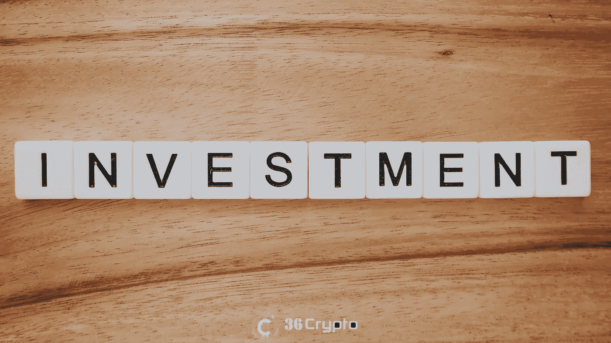
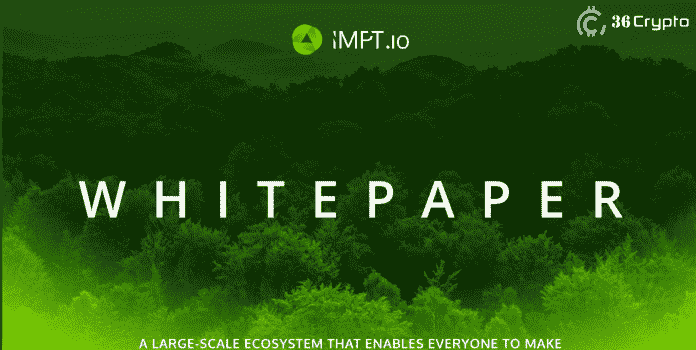
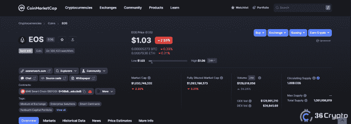

# 2022 年 10 月投资的 5 大低市值加密公司–36 个加密公司

> 原文：<https://medium.com/coinmonks/top-5-crypto-with-low-cap-to-invest-in-for-october-2022-36crypto-bad08e081d12?source=collection_archive---------0----------------------->

低市值加密货币通常在经历某种戏剧性的增长并最终吸引人们的注意力之前就开始被低估。投资者已经转向低市值硬币作为购买的最佳选择，尤其是在市场崩溃的时候，也被称为[熊市](https://36crypto.com/how-to-make-profit-in-a-crypto-bear-market/)。

毫无疑问， [**加密货币市场**](https://36crypto.com/understanding-crypto-market-cap-how-is-it-calculated/) 在过去几年里经历了巨大的增长，它吸引了人们的很多注意力，尤其是那些正在寻找额外的在线赚钱方式的新手。

参与和[投资加密货币](https://36crypto.com/5-steps-to-invest-in-cryptocurrency-a-beginners-guide/)有几种方式，其中包括 Hodling 和日内交易。虽然日内交易可能因为市场波动而具有很高的风险，但另一方面，霍德林已被证明是一种更无风险和高利润的方法。

如果你不熟悉 Hodling(发音为 Holding)是什么，它只是一种长期购买和保存加密货币的方法，而不在乎市场状况。在这种情况下，你以便宜的价格买入，持有一段时间，当你看到良好的增长，并从最初购买硬币的金额中获利时，就卖出。

10 月对加密市场来说不是一个很好的月份，尽管我们仍然对年底充满希望，特别是在最近完成的[以太坊合并](https://36crypto.com/understanding-the-ethereum-merge-in-simple-term/)之后，它从[工作验证机制](https://36crypto.com/what-is-ethereum-2-0/)转移到[股权验证](https://36crypto.com/what-is-ethereum-2-0/)。

虽然我们希望出现积极的转变，但最好将重点转移到这些低市值的加密货币上，在预期的牛市到来之前购买它们并将其添加到您的投资组合中。

查看我们的[9 月份买入的低市值股票清单](https://36crypto.com/5-low-market-cap-cryptocurrency-to-invest-in-september/)并与此清单进行比较。

# 什么是低市值加密货币？

一般来说，如果加密货币的估值低于 20 亿美元，就被称为低市值货币。还有其他类别的市值，包括大盘股，中盘股和小盘股。为了[更好地了解密码市值](https://36crypto.com/understanding-crypto-market-cap-how-is-it-calculated/)，查看 [**这篇文章**](https://36crypto.com/understanding-crypto-market-cap-how-is-it-calculated/) 。

有一个计算加密货币市值的公式。它的计算方法是将流通中的硬币数量乘以每枚硬币的价格。把公式放在一起，我们有:

## 总流通供应量 x 单价=加密市值

在决定 2022 年 10 月购买哪种低市值加密货币之前，了解这一计算很重要。不要浪费太多时间，让我们进入讨论的主题。

# 2022 年 10 月买入的 5 种低市值加密货币

那么，市场上有哪些你能买到的最好的低市值加密货币呢？虽然有无数被低估的密码，但我们没有特定的顺序排列前 5 名。

# 1.IMPT (IMPT)。市值 150 万美元

IMPT 的使命是提供简单、负担得起和有效的机制，使每个社会成员都能应对气候变化，并投资于地球。这是一个令人兴奋的项目，甚至在预售阶段就已经吸引了大量投资。

它的预售目前正在进行中，在开始 48 小时后，它已经筹集了超过 50 万美元。在不到 24 小时内，它筹集了超过 15 万美元的资金，这表明了人们对这个项目的兴趣程度。

根据其[白皮书](https://www.impt.io/assets/documents/WHITEPAPER.pdf)，其目标是帮助个人和组织产生积极影响，同时成为碳中和或碳负。它试图通过用户抵消他们的碳足迹来减少气候造成的危机。这是一个值得关注的令人兴奋的项目。

用户在平台上购物以赚取代币，这些代币随后可以转换成碳信用额。投资者喜欢买入有真实用例及公用事业的项目。这当然是一个很好的购买 dip 的密码。

IMPT 的一个非常与众不同的特点是，它允许个人和组织衡量他们对环境的影响。IMPT 是建立在以太坊区块链之上的，这使得它非常高效和可扩展，尤其是在[以太坊合并升级](https://36crypto.com/what-is-ethereum-2-0/)之后。

该项目目前处于预售的第一阶段，将持续到售罄或 11 月 25 日，以先到者为准。6 亿个代币以每个 0.018 美元的价格出售。查看更多关于他们的[白皮书](https://www.impt.io/assets/documents/WHITEPAPER.pdf)。

# 2.EOS (EOS)。市值 10 亿美元

**光电系统**或简称 EOS 是一个分散的操作系统，它基于区块链技术。dApps 开发人员发现这个项目很有趣，因为它使他们能够通过系统访问所有需要的资源。

该项目于 2018 年由丹·拉里默(Dan Larimer)发起，并在其 **ICO(首次发行硬币)**中筹集了约 41 亿美元。EOS 已经脱离了最初的开发者 Block.one，现在由“羚羊”提供支持

羚羊是在 2022 年初由 Telos WAX、UX 网络和 EOS 合作形成的。它就是[开源的区块链技术](https://36crypto.com/blockchain-definition-what-is-blockchain-technology-and-how-does-it-work/)。此后，EOS 的价格大幅上涨。这应该是你这个月要注意的低市值硬币的清单。

根据来自 [CoinMarketCap](https://coinmarketcap.com/currencies/eos/) 的实时数据，截至撰写本文时，EOS 的价格为 1.03 美元，**的市值为 10 亿美元。**

# [此处继续阅读](https://36crypto.com/5-best-cryptocurrencies-with-low-market-cap-to-buy-in-october-2022/)

# 最后的想法

低市值加密货币是一种有风险但非常好的投资，因为其价值往往会随着时间的推移而大幅增加。属于这一类别的硬币可能不像其他大型加密货币那样受欢迎，但尽早购买这些项目的投资者将获得更好的长期回报。

市场上有许多低市值的加密货币可供购买，但我们的前 5 名包括 IMPT、ApeCoin、Lucky Block、EOS 和 Compound。在我们预期下一轮牛市的时候，尽早将这些项目加入你的投资组合是一个好主意。

免责声明:这不是财务建议。我们总是建议你在选择投资任何加密货币之前做好自己的研究。加密货币是不稳定的，如果没有适当的信息，你可能会失去所有的储蓄。

**附属链接**

您可以在这里购买以上列出的加密货币:【https://bit.ly/3UhqqNl】T4，获得 100 USDT 返现券。

你喜欢阅读我们带给你的内容吗？如果是，请点击“**拍手**按钮，增加其他人看到这个帖子并了解它的机会。

你最多可以鼓掌 50 次。你还在等什么？马上按下那个按钮。感谢您的阅读。

*原载于 2022 年 10 月 19 日*[*https://36crypto.com*](https://36crypto.com/5-best-cryptocurrencies-with-low-market-cap-to-buy-in-october-2022/)*。*

> 交易新手？尝试[加密交易机器人](/coinmonks/crypto-trading-bot-c2ffce8acb2a)或[复制交易](/coinmonks/top-10-crypto-copy-trading-platforms-for-beginners-d0c37c7d698c)