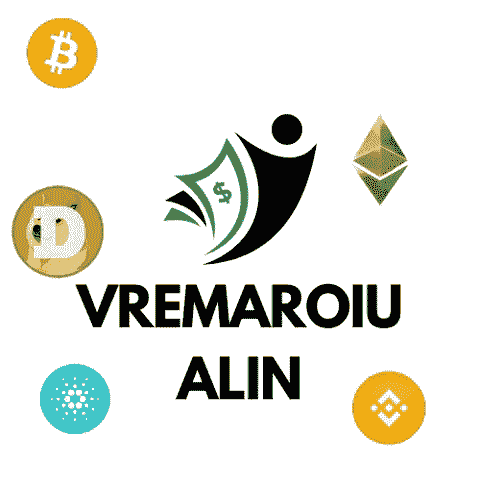

# 我投资组合中的前 5 种加密货币

> 原文：<https://medium.com/coinmonks/top-5-cryptocurrencies-that-i-have-in-my-portfolio-34234f62d538?source=collection_archive---------22----------------------->

# 币安硬币(BNB)

基于币安硬币的使用，币安生态系统包括促进其采用的激励措施。最近，由于币安交易所越来越受欢迎，BNB 的价值大幅上升。

在币安智能链的生态系统中，大量项目正在开发中，它也是…