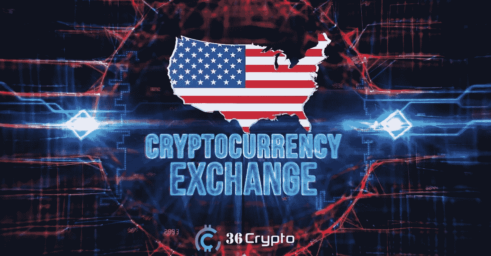
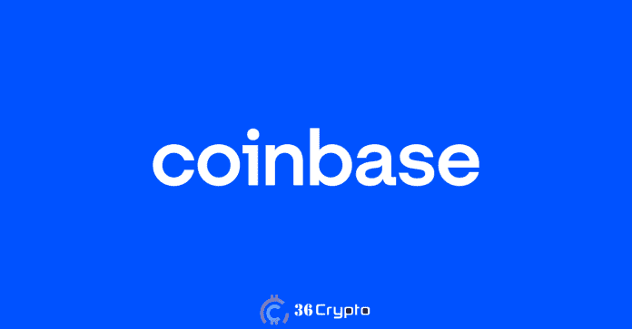
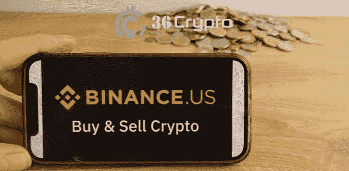

# 美国五大加密货币交易所(2022 年 10 月)— 36Crypto

> 原文：<https://medium.com/coinmonks/top-5-cryptocurrency-exchanges-for-traders-in-the-united-states-october-2022-36crypto-3c3b0fc91ef0?source=collection_archive---------5----------------------->

市面上有相当多的[加密货币交易所](https://36crypto.com/what-is-a-cryptocurrency-exchange/)，每一个都提供独特的功能。美国仍然是加密货币行业的最佳参与者之一，每天都有大量用户表达兴趣。

[加密货币交易所](https://36crypto.com/what-is-a-cryptocurrency-exchange/)为您提供涉足加密货币领域所需的平台和必要工具。无论你的目的是交易还是投资(买入和卖出)，都有适合你需要的交易所。

它们的功能类似于在线经纪公司；为您提供一个交易加密货币的市场，如[比特币](https://36crypto.com/what-is-bitcoin-and-why-is-it-valuable/)、[以太坊](https://36crypto.com/what-is-ethereum-and-how-is-it-different-from-bitcoin/)、[币安币](https://36crypto.com/what-is-bnb-binance-coin-and-what-is-it-used-for/)、多边形币、Dogecoin 以及市场上其他顶级货币。

没有适当的研究，你可能会发现很难满足于一个适合你的交换。有对初学者友好的加密交换，也有对用户友好的加密交换，也有对初学者不太友好但也对用户友好的加密交换。

作为一个初学者，选择适合你的目的的正确的加密交易可能是一件困难的事情，尤其是因为你是加密领域的新手。在选择一个之前，有几件事情需要注意，这些事情将在下面的一个章节中介绍。

如果你仍然不熟悉什么是加密货币交易所，我将在下面给出一个简要的描述，以及一个相关的链接，引导你到我以前的帖子，在那里你可以了解更多。

# 加密货币交易所到底是什么？

简单地说，加密货币交易所是一个在线平台，也称为市场，你可以在这里交易加密货币。你可以通过多种方式在交易所购买密码，如借记卡/信用卡、直接银行转账、电汇、Paypal，也可以通过 P2P 交易。

加密交易所通常在其平台上充当加密货币买家和卖家之间的中间人。交易所还会在其平台上显示加密货币的实时价格。

加密货币交易所还配备了内置钱包，您可以在其中保存您的数字资产，并且如果您愿意，您还可以将它们转换为稳定的货币，然后将它们提取到外部钱包中。

在你开始使用它们之前，你需要首先[建立一个加密货币兑换账户](https://36crypto.com/set-up-your-cryptocurrency-exchange-account-in-just-few-steps-a-beginners-guide/)，这可以通过以下简单的步骤完成。

想了解更多关于[什么是加密货币交易所](https://36crypto.com/what-is-a-cryptocurrency-exchange/)？阅读 [**本帖**](https://36crypto.com/what-is-a-cryptocurrency-exchange/) 。

# 在美国选择加密货币交易所之前需要考虑什么

许多国家都围绕着加密交换的使用制定了一些法规，美国也有一些要求，这已经不是什么新闻了。有些国家加密货币是合法的，而有些国家已经禁止使用加密货币，比如中国。

具有讽刺意味的是，许多禁止使用加密货币的国家仍然是拥有最多加密货币用户的国家。所以，如果你在美国，在你选择定居哪一个之前，你必须注意这些事情；

*   法规遵循
*   贸易限额
*   支持的加密货币
*   安全性
*   法定货币可用性
*   身份要求

**1。法规合规性:**在你注册使用一个交易平台之前，你应该确保它符合美国制定的加密货币法规。

**2。交易限额:**交易限额是每天可以购买或交易的加密货币的数量。美国的一些交易所对这些交易设置了限制。

**3。支持的加密货币:**如果你想交易一种特定的加密货币，最好去加密货币交易所看看他们是否有这种货币。**市场上有数千种加密货币**，但是一个加密交易所只能支持其中的一部分。与主要的国际交易所相比，一些位于美国**的加密货币交易所**不支持多种加密货币。

**4。安全:加密交换已经成为黑客的主要目标。有报道称，过去有几家交易所成为黑客攻击的受害者，攻击者带走了价值数百万美元的加密货币。在与他们签约之前，检查你打算进行的交易的安全历史，并确保他们有好的措施是很重要的。**

**5。法定货币可用性:**并非所有的加密货币交易所都支持法定货币，这反过来可以最大限度地减少使用法定货币创建账户所需的数据数量。如果你计划用加密货币交易美元，那么你应该确保注册一个支持美元的交易所。

**6。身份要求:**许多位于美国的加密货币交易所在您注册时会要求额外的身份证明。你需要知道他们每一个人需要什么，这样你才能确定什么是你愿意付出的。

# 美国有哪些最好的加密货币交易所？

正如我们之前所说，并非所有的加密货币交易所都获得了在美国运营的许可。然而，有很多可用的加密货币，但我们已经列出了我们的**五大加密货币交易所，您可以在美国境内进行交易**。

# 1.比特币基地

比特币基地成立于 2012 年 5 月。它是一家经营加密货币交易所的美国上市公司。比特币基地通常是最适合初学者的加密货币交易所之一。它也是早期交易所之一。比特币基地是美国最受欢迎、最成功、也可以说是最好的加密货币交易所之一。

无论是经验丰富的交易者还是新手，比特币基地都是非常好的选择。在该平台上，用户可以在界面之间进行切换。你可以使用简化版的交易控制，也可以切换到比特币基地专业版的更高级的功能。

https://www.coinbase.com/的网站上有比特币基地平台，安卓和 iOS 用户也可以使用他们的移动应用程序。比特币基地有超过 150 种受支持的加密货币，并提供超过 450 种加密对加密交易。它在包括美国在内的 100 多个国家也有销售。

他们的安全记录是一流的，因为他们过去从未遭受过任何已知的黑客攻击。比特币基地持有的所有基金都由联邦存款保险委员会(FDIC)承保。

## 一些特征

**身份要求**:注册时，美国用户将被要求提供任何有效的政府颁发的身份证，以及一张自拍照片。

**交易限额**:美国居民每天可以交易无限量的加密货币，但每天有 25000 美元的取款限额。

**美元法定货币可用性** : **比特币基地允许以美元**和其他几种法定货币存款。

费用:比特币基地的交易费用相当可观。收取者费用在 0.05%-0.25%之间，制作人费用在 0%-0.15%之间。

**可用加密货币**:比特币基地支持多种加密货币，包括比特币、以太坊、Dogecoin、Cardano、美元币(USDC)、莱特币等流行货币。

阅读更多关于我们深入的[比特币基地评论](https://36crypto.com/coinbase-review-2022/)。

# 2.币安。美国

币安是世界上最受欢迎和使用最广泛的加密货币交易平台之一。这是交易量最大的交易所。2019 年，币安推出了币安。符合美国密码交换法规的美国平台。

币安美国平台和全球币安交易所平台的用户界面相似，主要区别在于各自支持的加密货币数量。https://www.binance.us/[网站提供了币安美国平台的网页版本，安卓和 iOS 用户也可以使用他们的移动应用程序。](https://www.binance.us/)

全球币安交易所平台比美国版本支持更多的加密货币。币安美国平台是专业交易者和寻求更专业交易工具的投资者的理想交易平台。

## 一些特征

**身份要求**:美国币安还要求注册时提供政府颁发的身份证和自拍照片来验证您的帐户。

**交易限额**:美国居民有一个累进存款和取款限额计划。最初，币安美国用户最多可以存入和提取 5000 美元，随着后续交易的进行，这一金额将增加到 30000 美元。

**美元法定货币可用性:**币安美国平台支持美元存款和取款。

**费用**:交易量较大的交易商受益于币安美国平台，费用较低。一般来说，币安美国提供 0.1%的现货交易费，0.5%的即时买入/卖出费。

**可用的加密货币:**如前所述，与全球交易所相比，币安美国平台上可用的加密货币数量有限。支持的加密货币包括比特币、以太坊、币安币(BNB)、Ripple、USDT 等。

阅读更多关于我们深入的[币安评论](https://36crypto.com/binance-review-for-2022/)。

# [此处继续阅读](https://36crypto.com/5-best-cryptocurrency-exchanges-in-the-united-states-october-2022/)

# 结论

美国的加密货币法规使得美国居民交易者能够获得在其他国家无法获得的某些利益和证券。

在为美国客户选择**最佳加密货币交易所**时，选择一家符合您所在州规定的交易所非常重要。

*免责声明:这不是财务建议。本文中表达的观点和意见仅属于帖子作者。建议您在投资任何数字资产之前进行尽职调查并进行自己的研究。*

你喜欢阅读我们带给你的内容吗？如果是，请点击“**拍手**按钮，增加其他人看到此贴并了解此贴的机会。

你最多可以鼓掌 50 次。你还在等什么？马上按下那个按钮。感谢您的阅读。

*原载于 2022 年 10 月 21 日 https://36crypto.com**T21*[。](https://36crypto.com/5-best-cryptocurrency-exchanges-in-the-united-states-october-2022/)

> 交易新手？尝试[加密交易机器人](/coinmonks/crypto-trading-bot-c2ffce8acb2a)或[复制交易](/coinmonks/top-10-crypto-copy-trading-platforms-for-beginners-d0c37c7d698c)