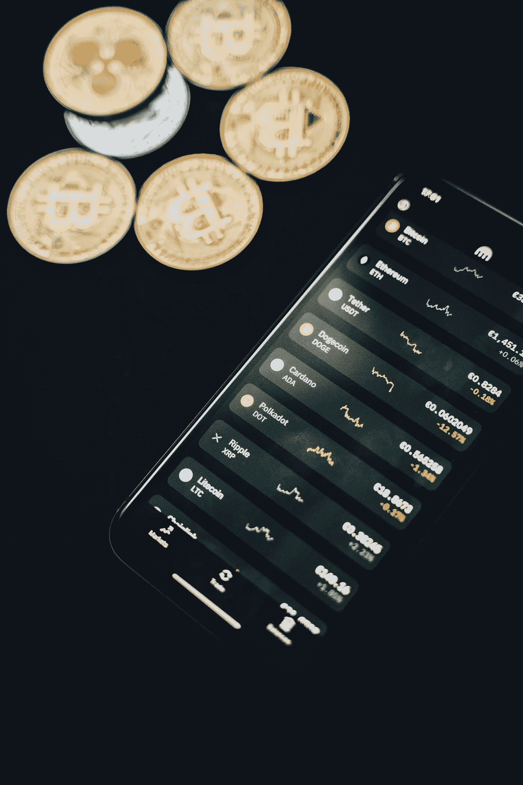

# 我的投资组合中排名前五的密码，11 月 19 日更新

> 原文：<https://medium.com/coinmonks/top-5-cryptos-from-my-portfolio-6648cb0655fb?source=collection_archive---------15----------------------->

Source photo [Coins scattered near smartphone with financial charts on screen · Free Stock Photo (pexels.com)](https://www.pexels.com/photo/coins-scattered-near-smartphone-with-financial-charts-on-screen-6771985/)

# 比特币(BTC)

尽管比特币是一种老牌的加密货币，但它仍然是世界上最知名的数字货币之一。自 2013 年首次飙升以来，该指数一直在上升，其间只有几次短暂下跌。

作为第一种加密货币和整个区块链产业的催化剂，加密…