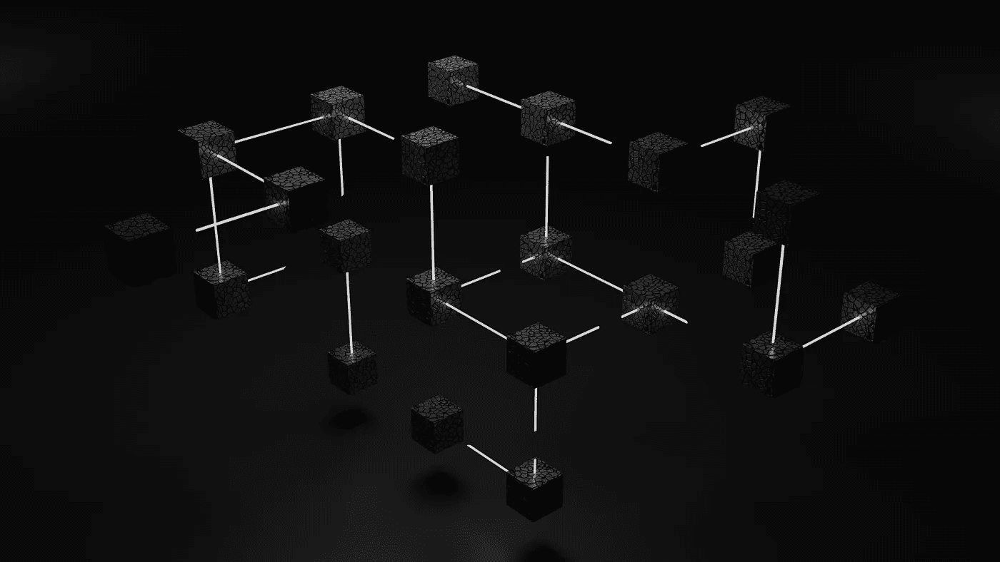

# 区块链行业的五大网络安全威胁

> 原文：<https://medium.com/coinmonks/top-5-cybersecurity-threats-in-the-blockchain-industry-380ec056fb76?source=collection_archive---------15----------------------->

Blockchain 技术有可能革新广泛的行业，从金融和供应链管理到投票系统和身份验证。

> 复制顶级交易者的交易机器人。试试 [FREE](https://coincodecap.com/go/pionex-coinmonks) 。

然而，新技术带来了新的挑战，区块链工业也不例外。本文将探讨当今区块链行业面临的五大网络安全威胁。

在我们了解一些威胁之前，让我们了解一些区块链黑客攻击以及它们是如何发生的。

1.  **Gox 山黑客**

Mt. Gox 曾是世界上最大的比特币交易所，处理 70%以上的比特币交易。2014 年 2 月，该交易所宣布，由于黑客攻击，它损失了 85 万比特币，价值约 4.5 亿美元。

安全分析师后来发现，黑客攻击已经发生了几年，攻击者窃取了少量比特币，直到他们积累了大量比特币。

黑客是如何发生的确切细节仍然需要完全理解。但是，需要注意的是，攻击者可能利用了 exchange 系统中的漏洞，或者通过恶意软件获得了访问权限。

*   **刀客**

分权自治组织(DAO)是一份建立在区块链埃瑟伦博物馆基础上的聪明合同，该博物馆作为一个分权风险资本基金运作。

2016 年 6 月，一名攻击者利用 DAO 代码中的一个漏洞，窃取了约 360 万 ETH，价值约 5000 万美元。

攻击者利用的漏洞是由于 DAO 的智能契约处理拆分函数调用的方式中的一个缺陷造成的。

攻击者可以反复调用 split 函数，耗尽 DAO 的资金。

*   **硬币核对黑客**

Coincheck 是一家日本密码货币交易所，于 2018 年 1 月遭到黑客攻击，导致价值约 5.3 亿美元的 NEM 代币被盗。

黑客攻击是由于未经授权进入交易所的热门钱包，其中包含大量的密码货币。

该交易所被迫暂停所有提款和交易，同时努力保护其系统安全并调查袭击事件。

需要到位的不充分的安全措施导致了对热门钱包的黑客攻击。

*   **平价钱包黑客**

2017 年 7 月，一名黑客利用平价钱包(一种受欢迎的 Ethereum 钱包)中的漏洞，窃取了价值约 3000 万美元的 ETH。

该漏洞是由于钱包的多重签名合同中的一个缺陷造成的，该缺陷允许攻击者访问钱包中的资金。

黑客攻击影响了几个使用平价钱包存储资金的知名项目和组织，包括波尔卡多和无边缘赌场。

*   **隐视黑客**

Cryptopia 是一家总部位于新西兰的加密货币交易所，于 2019 年 1 月遭到黑客攻击，导致价值约 1600 万美元的加密货币被盗。

黑客攻击的具体细节仍然需要充分了解。尽管如此，重要的是要注意攻击者可能已经通过恶意软件或利用交易所系统中的漏洞获得了对交易所系统的访问。

黑客攻击给该交易所造成了重大损失，迫使其暂停所有交易和提款，同时保护其系统并调查攻击。它最终在 2019 年 5 月申请破产。

*   **51%的攻击**

区块链网络安全面临的最大威胁之一是 51%的攻击可能性。在一次 51%的攻击中，一群矿工控制了一个特定区块链网络上一半以上的采矿权。有了这种级别的控制，他们就可以逆转交易，双倍消费硬币，并扰乱网络的正常运作。

一个备受瞩目的 51%攻击的例子发生在 2019 年 1 月的以太坊经典区块链。一群攻击者获得了该网络 51%的开采权的控制权，并利用它窃取了价值近 100 万美元的加密货币。

*   **智能合约漏洞**

智能合同是自动执行的合同，买卖双方之间的协议条款直接写入代码行。

虽然它们提供了许多好处，如提高效率和便利复杂交易的能力，但它们也带来了新的漏洞。

2017 年，一名黑客利用以太坊区块链智能合约代码中的漏洞，窃取了价值超过 5000 万美元的加密货币。

自那以后，发现了许多其他智能合约漏洞，突出表明在区块链上部署智能合约之前需要仔细的代码审查和测试。

*   **网络钓鱼攻击**

网络钓鱼攻击是网络安全领域的常见威胁，区块链行业也不例外。

在网络钓鱼攻击中，黑客使用虚假的网站、电子邮件或其他形式的通信来欺骗用户透露敏感信息，如登录凭据或私钥。

区块链行业一个备受瞩目的网络钓鱼攻击例子发生在 2018 年，当时一名黑客冒充一家受欢迎的加密货币交易所的联合创始人，向用户发送网络钓鱼电子邮件，诱骗他们透露自己的登录凭据。

结果，黑客窃取了价值超过 2300 万美元的加密货币。

*   **内部攻击**

内部攻击是任何组织安全的重大威胁，区块链行业也不例外。

这些攻击涉及员工或承包商，他们可以合法访问公司的系统，并有意或无意地将其用于自己的利益。

2019 年，一家网络安全公司发现，一家加密货币交易所的一名员工窃取客户资金已超过一年。

这名员工可以进入交易所的热钱包，里面有大量的加密货币，在被抓住之前可能带走了近 200 万美元。

*   **恶意软件**

恶意软件是一种旨在扰乱、破坏或未经授权访问计算机系统的软件。

在区块链行业，恶意软件可以针对参与加密货币交易的个人或组织，潜在地窃取资金或敏感信息。

2018 年，一种名为“ [CryptoShuffler](https://www.kaspersky.com/blog/cryptoshuffler-bitcoin-stealer/19976/) 的恶意软件针对加密货币用户。

该恶意软件拦截正在进行的加密货币交易，并将资金重定向到攻击者的钱包。

密码洗牌者可以在被发现之前窃取价值超过 2 万美元的加密货币。

随着区块链行业的持续发展，对这些和其他网络安全威胁保持警惕至关重要。

通过了解风险并采取防范措施，我们可以继续充分利用区块链技术的众多优势。

这可能包括实施强有力的安全措施，如双因素身份认证和安全密码实践，以及保持最新的安全最佳实践和更新。

此外，必须警惕任何可疑活动或通信，因为网络钓鱼攻击和其他形式的社会工程可能是一个重大威胁。

在输入敏感信息或完成交易之前，验证任何网站或电子邮件的真实性总是一个好主意。

最后，选择可靠和安全的平台来存储和使用加密货币至关重要，因为这些平台的安全性会显著影响您资产的整体安全。

虽然区块链行业提供了许多令人兴奋的机会，但保持对潜在网络安全威胁的认识并采取措施保护您自己和您的资产是至关重要的。

通过适当的预防措施，我们可以继续安全地利用区块链技术的诸多优势。

关注 [LearnHub 博客](https://blog.learnhub.africa/)获取更多类似的文章。

> 加入 Coinmonks [电报频道](https://t.me/coincodecap)和 [Youtube 频道](https://www.youtube.com/c/coinmonks/videos)了解加密交易和投资

# 另外，阅读

*   [币安 vs FTX](https://coincodecap.com/binance-vs-ftx) | [最佳(SOL)索拉纳钱包](https://coincodecap.com/solana-wallets)
*   [如何在 Uniswap 上交换加密？](https://coincodecap.com/swap-crypto-on-uniswap) | [A-Ads 审核](https://coincodecap.com/a-ads-review)
*   [加密货币储蓄账户](/coinmonks/cryptocurrency-savings-accounts-be3bc0feffbf) | [YoBit 评论](/coinmonks/yobit-review-175464162c62)
*   [Botsfolio vs nap bots vs Mudrex](/coinmonks/botsfolio-vs-napbots-vs-mudrex-c81344970c02)|[gate . io 交流回顾](/coinmonks/gate-io-exchange-review-61bf87b7078f)
*   [CoinFLEX 评论](https://coincodecap.com/coinflex-review) | [AEX 交易所评论](https://coincodecap.com/aex-exchange-review) | [UPbit 评论](https://coincodecap.com/upbit-review)