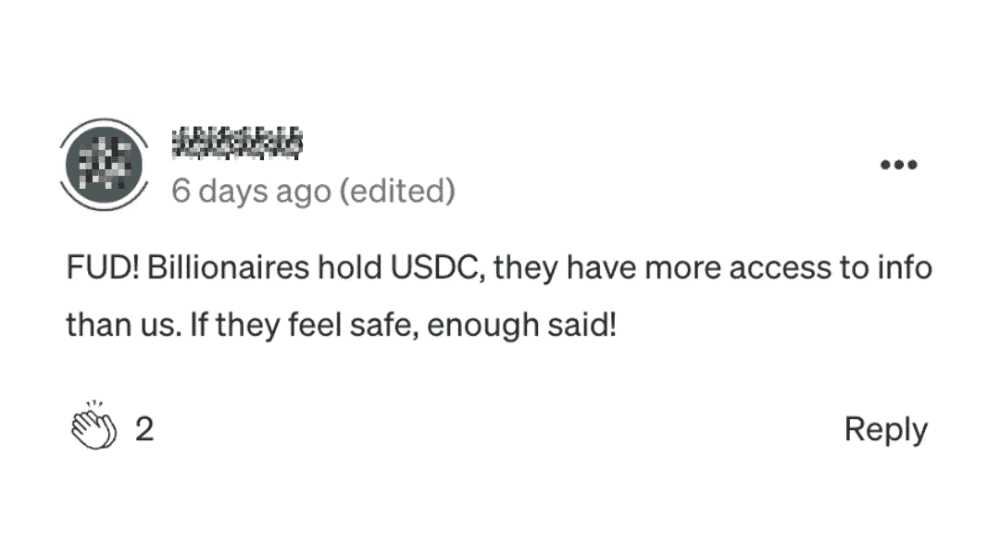
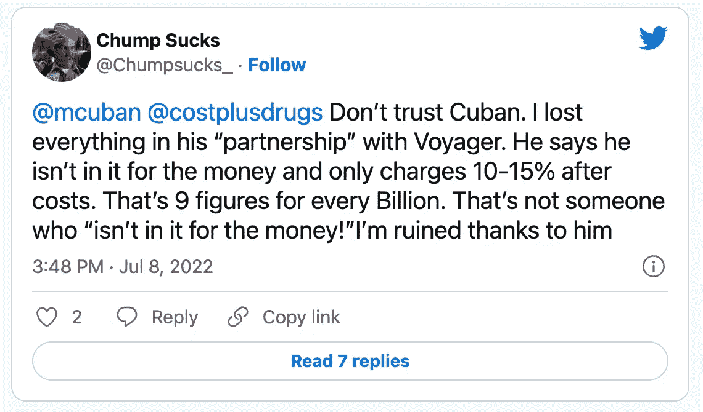
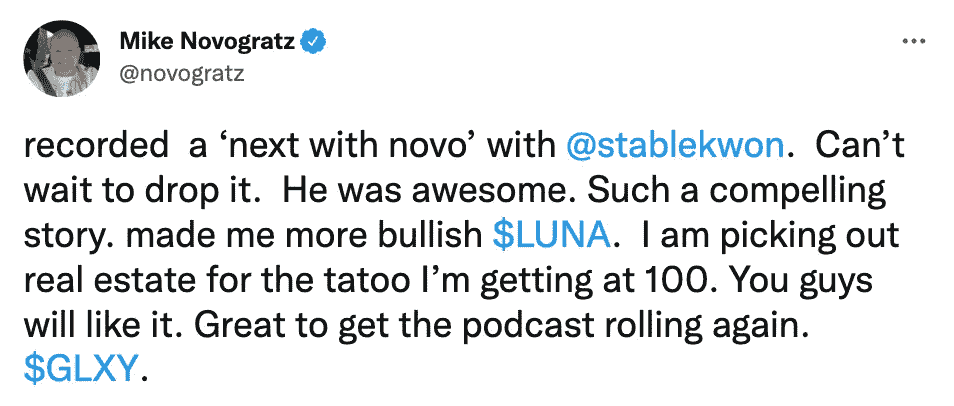
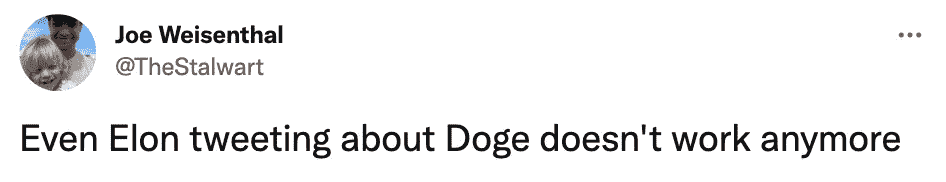

# 为什么你不应该接受亿万富翁的建议(或任何建议)的前 5 个例子

> 原文：<https://medium.com/coinmonks/top-5-examples-of-why-you-shouldnt-take-billionaire-advice-or-any-in-crypto-3adaa6177d6e?source=collection_archive---------24----------------------->

大约两周前，我们发表了一篇关于最近推特上的一个传言的文章，即 [USDC 可能处于崩溃的边缘](/coinmonks/is-usdc-on-the-brink-of-collapse-and-what-could-happen-if-this-is-true-ebcc2ba4cdf6)——在 UST 与美元脱钩并崩溃后，市场普遍担心其他稳定的货币根本不稳定。一位读者的评论引起了我的注意:

尽管我认为 USDC 脱钩的可能性很小——其他稳定的资本更有可能在此之前崩溃——但我绝不会盲目信任一个项目。许多投资者根据亿万富翁的建议做出投资决定，这里有五个很好的例子说明为什么你不应该这样做:

**1。马克·库班和航海家号**

2021 年 10 月，马克·库班的 NBA 球队[达拉斯小牛队与航海家](https://www.dallasnews.com/sports/mavericks/2021/10/27/mark-cuban-mavs-partner-with-voyager-cryptocurrency-platform-in-teams-first-international-deal/)合作——这将是两家公司之间为期五年的赞助合同。不到一年后，crypto 平台申请破产，因为它严重暴露于 3AC crypto 对冲基金。在他完成合伙交易后，许多人被驱使投资航海家，并受到很大影响。

**2。迈克·诺沃格拉茨和卢娜**

Galaxy Digital 是一家提供加密相关金融解决方案的公司，该公司的首席执行官是 Terra (LUNA)项目的布道者，甚至在 2022 年 1 月代币达到 100 美元时纹了一个纹身。

五个月后，UST 与美元脱钩，LUNA 倒闭，鉴于目前的市场状况(部分原因是对该公司缺乏信任), Galaxy Digital 在 5 月份出现了迄今为止 3 亿美元的亏损。现在，诺沃格拉茨说他为自己最大的加密错误感到羞愧。

> 交易新手？尝试[加密交易机器人](/coinmonks/crypto-trading-bot-c2ffce8acb2a)或[复制交易](/coinmonks/top-10-crypto-copy-trading-platforms-for-beginners-d0c37c7d698c)

**3。朱肃与三箭资本(3AC)**

三箭资本是一家价值 10 亿美元的对冲基金，最近因未能偿还债务而申请破产。3AC 的联合创始人朱苏是 LUNA token 的狂热支持者，他经常在自己的推文中表示看好这款 token。

在 3AC 公开面临风险后，朱苏的最后一条推特语气低调得多:“我们正在与相关方面沟通，并全力解决这个问题。”

**4。埃隆·马斯克和 Dogecoin**

Elon 因支持 Dogecoin 而闻名全球，他的每一个行动或他写的每一条推文都用来抬高 DOGE 的价格。在目前的市场情况下，大多数替代硬币至少下跌了 60%，包括 DOGE 在内，即使是 Elon 的影响似乎也无法推动价格上涨。

**5。巴里·希尔伯特和创世资本**

Genesis Capital 鲁莽地向 3AC 提供了一笔抵押不足的贷款，3AC 是导致市场最近经历动荡的主要公司之一。Genesis 得到了数字货币集团(DCG)的支持，这是一个由巴里·西尔伯特投资的加密基金。

有趣的是，一个看似没有风险的粗心行动导致了密码领域最大的破产案件之一。报告显示 [3AC 从 Genesis](https://decrypt.co/105416/bankrupt-three-arrows-capital-owes-3-5b-to-creditors-including-2-3b-to-genesis) 借了 23 亿美元(超过其债务的 67%)，后者现在是一家破产公司的贷款人。

**你能从这些案例中学到什么？**

即使是密码亿万富翁和专业交易者也会犯错，在大多数情况下，这是因为他们对自己的理论过于自信，以至于他们选择忽视最糟糕的情况，并且没有恰当地进行风险管理。

因此，你不应该简单地追随亿万富翁的做法，甚至是突然冒出来的 Twitter 匿名账户——你应该进行自己的尽职调查，并投资于你基于分析而有信心的东西。

这是一个简单但有价值的建议，如果不遵循，可能会让你失去所有的积蓄，就像最近发生在加密投资者身上的那样。

[*乔罗伯特*](https://joerobert.com/) *现任罗伯特风险投资公司首席执行官，拥有超过 20 年的资产管理经验。自创办以来，乔已经为投资者和合伙人创造了可预见的两位数回报。Joe 已经投资了股权和代币的种子轮，以及比特币、以太坊和其他顶级加密货币的投资组合。*

*如果您是合格投资者，并想了解更多关于我们产品的信息，请联系我们。*