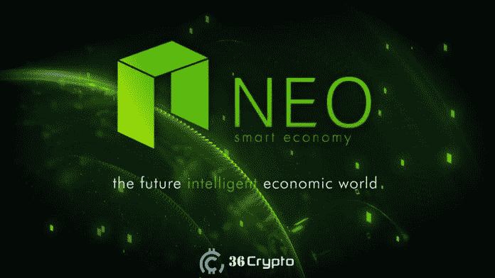

# 投资前 5 名低市值替代币(2022 年 11 月)

> 原文：<https://medium.com/coinmonks/top-5-low-cap-altcoins-to-invest-in-november-2022-f6653ad31c42?source=collection_archive---------2----------------------->

**低市值替代币是一个很好的投资选择，特别是因为比特币、以太坊和其他高市值加密货币正在经历价格下跌**。

在过去的一周里，加密市场经历了急剧的崩溃，比特币和以太坊的跌幅超过了 20%。在崩盘之前，比特币和以太坊价格一直相对稳定。

这场崩盘是由围绕位于巴哈马群岛的[加密货币交易所](https://36crypto.com/what-is-a-cryptocurrency-exchange/) FTX 的争议，以及币安宣布将收购 FTX 以拯救该公司后新投资者的怀疑和日益增长的情绪所引发的。币安后来在周三退出了导致 FTX 申请破产的交易。

随着负面消息的传播，比特币的价格两年来首次跌至 16000 美元，以太坊紧随其后，自 crypto 今年夏天崩溃以来首次跌至 1200 美元。

[加密货币](https://36crypto.com/what-is-cryptocurrency-the-beginners-map-to-understanding-how-cryptocurrency-works/)是易变资产，投资应在适当的研究和咨询后进行。投资加密货币可能会产生良好的回报，但同时也可能非常危险。

对于经验丰富的投资者来说，在价格爆炸之前找到好的低市值替代硬币进行投资是一个非常有利可图的策略。这些加密货币通常在其公共利益开始增长之前就被低估了。

在我们的上一篇文章中，我们谈到了 10 月份可以购买的最低限额的[最佳加密货币，其中我们提到了 IMPT 币、复利币(COMP)和 ApeCoin。点击](https://36crypto.com/5-best-cryptocurrencies-with-low-market-cap-to-buy-in-october-2022/)查看完整列表[。](https://36crypto.com/5-best-cryptocurrencies-with-low-market-cap-to-buy-in-october-2022/)

# 如何计算加密市值？

加密货币根据其市值分为三个不同的类别。这些市值非常重要，因为它们可以帮助你比较一种加密货币与另一种加密货币的价值。这一数字有助于投资者做出更明智的投资决策。

所有加密货币的市值分为三大类，即:大型、中型和小型加密货币。像[比特币](https://36crypto.com/what-is-bitcoin-and-why-is-it-valuable/)、[以太坊](https://36crypto.com/what-is-ethereum-and-how-is-it-different-from-bitcoin/)、[币安币](https://36crypto.com/what-is-bnb-binance-coin-and-what-is-it-used-for/)、[系绳 USDT](https://36crypto.com/what-is-tether-usdt/) 、 [USDC](https://36crypto.com/investing-in-cryptocurrency-what-is-usd-coin-usdc/) 等币都是[大盘股加密货币](https://36crypto.com/understanding-crypto-market-cap-how-is-it-calculated/)的例子。

计算加密货币的市值很容易，你用流通硬币的数量乘以每枚硬币的价格。

**流通硬币总额 x 单价=加密市值**

所以，让我们开始吧。

# 11 月份投资的 5 种最佳低市值替代币

请注意，加密货币可以从低市值开始，随着时间的推移，进一步发展成为中市值甚至高市值的加密货币。它们可能会在未来带来良好的增长机会。

虽然市场上有数以千计的替代硬币，但我列出了最好的 5 个非常好和有前途的潜力。

排名不分先后:

# 1.EOS (EOS)。市值 9.736 亿美元

EOSIO ( **电光系统)**由 Block.one 于 2018 年 1 月创建，专注于为用户提供一个去中心化的操作系统。这是一个基于区块链技术的操作系统。

2018 年，EOS 进行了一次 ICO(首次硬币发行)，筹集了超过 41 亿美元的加密资金。dApps 开发人员使用这个项目，因为它使他们能够通过系统访问所有需要的资源。

EOS 在面临一些挑战并重塑自身品牌后，最终离开了 Block.one。EOS 支持核心功能，使个人和企业能够以类似于基于 web 的应用程序的方式创建基于区块链的应用程序。

EOS 被一些人视为以太坊的竞争对手。它看起来比以太坊网络更大更快，每秒可以处理数百万笔交易，而以太坊网络每秒只能处理 10 笔交易。

生态系统有两个主要元素:EOS。IO 软件和 EOS 令牌。根据来自 [Coinmarketcap](https://coinmarketcap.com/currencies/eos/) 的实时数据，在撰写本文时， **EOS 的市值为 9.736 亿美元**。EOS 代币的售价为 0.9058 美元。

# 2.Dash 2 贸易(D2T)

Dash 2 交易在投资者中获得了真正的动力。Dash 2 Trade 于 2022 年由首席工艺官**杜科·范·罗森(Duco van Rossem)领导的团队成立，在预售后的 24 小时内筹集了 40 万美元，并在不到一个月的时间里获得了 350 万美元的早期投资和超过 600 万美元的投资。**

该平台建立在以太坊区块链的基础上，提供先进的加密货币交易工具，包括社会情绪分析、链上分析和技术图表。它为新手和专业交易者提供了多种交易见解。

根据[白皮书](https://dash2trade.com/assets/documents/Whitepaper.pdf)，该平台希望实现自动交易 API，以及价格提醒来帮助风险管理。除了从资产投资中获得利润，用户还可以从 Dash 2 交易平台中受益，这对于需要工具来改善技术分析的交易者来说非常重要。

其他好处包括，当有新的预售产品推出时，投资者可以收到提醒，从而以最低的价格提前进入市场。

D2T 是 Dash 2 交易平台的原生标志。拥有 ERC-20 令牌的用户可以参加交易比赛，也可以使用现有的工具来优化他们的技术分析。

代币的上市价格将被设定为接近其在分散和集中交易所上市时的价格。最终预售阶段价格将设定为**0.0635 美元**，并可能增长至**0.10 美元。**在 [Dash 2 交易平台](https://dash2trade.com/)了解更多信息。

# 3.尼欧(NEO)。市值 4.653 亿美元

NEO 最初于 2014 年作为 Antshares 推出，后来在 2017 年更名为 NEO。该平台最大限度地利用了区块链技术和智能合约。

这是一个开源的区块链平台，旨在将全球经济转变为智能经济。平台的原生令牌是 NEO。这种令牌的持有者在网络中拥有投票权和所有权。

根据 Coinmarketcap 的实时数据，**在撰写本文时，NEO 的市值为 4.653 亿美元**。每个代币的售价为 6.56 美元。此外，近地天体生态系统的第二个表征是气体。

NEO 令牌充当生态系统的治理令牌，而 GAS 是效用令牌。有了 GAS token，交易费用、dApps 购买和智能合约安装都可以支付。

## [在这里继续阅读](https://36crypto.com/top-5-low-cap-altcoins-to-invest-in-november-2022/)

# 结论

低市值替代币为巨大的增长潜力提供了机会，因此宜适当选择值得投资的股票。它们可能不像大型加密货币那样受欢迎，但利润潜力巨大。

在上面列出的加密货币中，我们在 11 月份投资的最佳低市值替代货币的首选是 Dash 2 Trade。这是一个全新的项目，刚刚推出，也有一个现实生活中的用例。战斗无限也是一个令人兴奋的项目，你可以选择投资。

**附属链接**

您可以在这里购买以上列出的加密货币:【https://bit.ly/3UhqqNl】T4，获得 100 USDT 返现券。

你喜欢阅读我们定期为你提供的内容吗？如果是，请点击“ ***拍手*** *”按钮，增加其他人看到这篇帖子并了解它的机会。*

*最多可以鼓掌 50 次。你还在等什么？马上按下那个按钮。感谢您的阅读。*

*原载于 2022 年 11 月 17 日*[*https://36crypto.com*](https://36crypto.com/top-5-low-cap-altcoins-to-invest-in-november-2022/)T22。

> 交易新手？尝试[加密交易机器人](/coinmonks/crypto-trading-bot-c2ffce8acb2a)或[复制交易](/coinmonks/top-10-crypto-copy-trading-platforms-for-beginners-d0c37c7d698c)