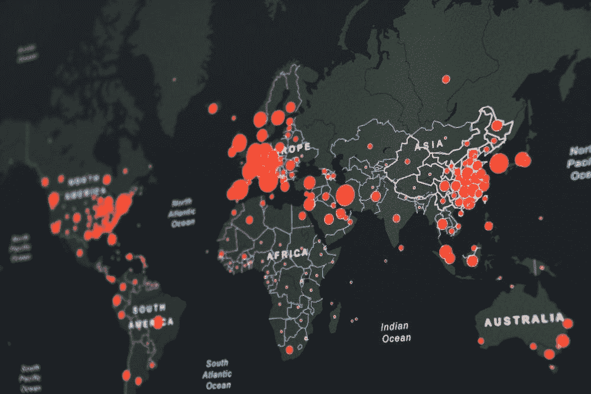

# 五大对加密最友好的国家

> 原文：<https://medium.com/coinmonks/top-5-most-crypto-friendly-countries-225b8d264972?source=collection_archive---------17----------------------->

随着越来越多的国家采用加密货币，加密货币在全球越来越受欢迎。这种增长趋势是由于加密货币的许多优势，例如它们的分散性、安全性和全球性。此外，加密货币可以用来购买商品和服务，就像任何其他货币一样。