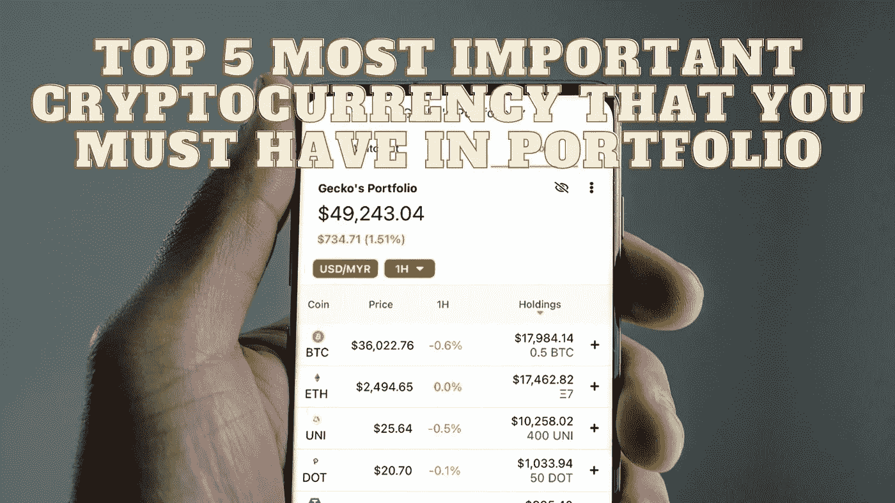

# 投资组合中最重要的五种加密货币

> 原文：<https://medium.com/coinmonks/top-5-most-important-cryptocurrency-that-you-must-have-in-portfolio-f3428dab697?source=collection_archive---------41----------------------->

Source photo Unsplash.com

# 卡尔达诺

Cardano 是一种具有类似前景的数字货币。由于其被认为低估，它是世界上交易最活跃和被广泛接受的加密货币之一。技术和基础研究都表明，硬币很便宜，ADA 的价格随时会上涨。