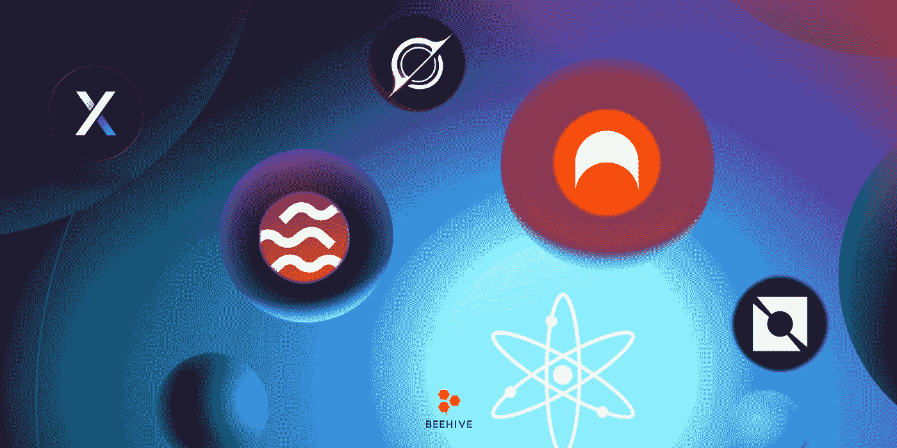
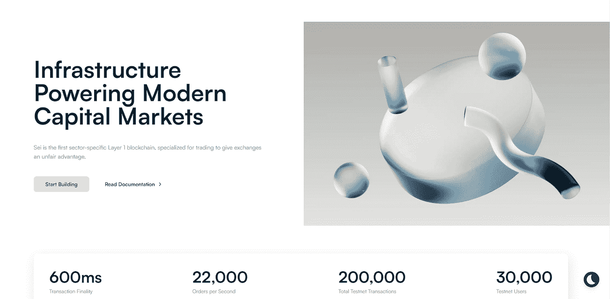
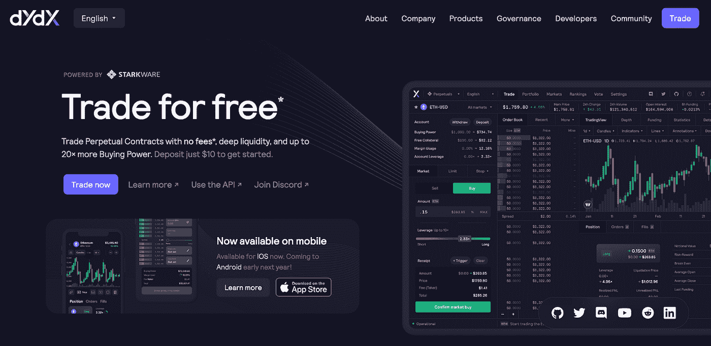
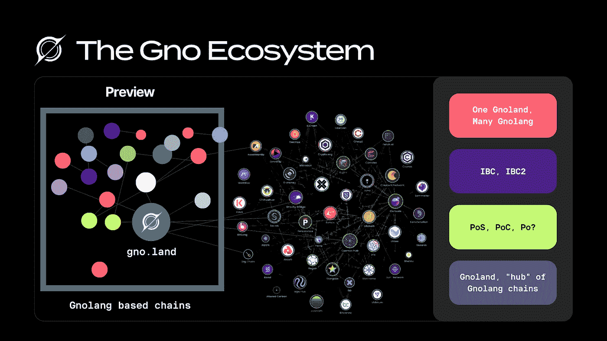
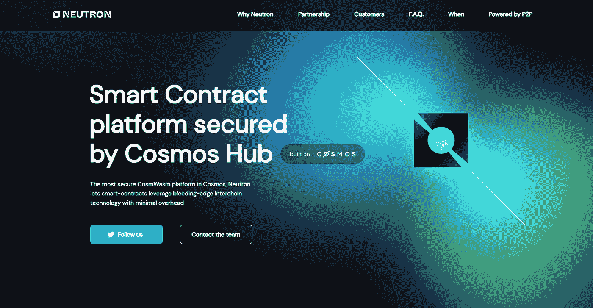
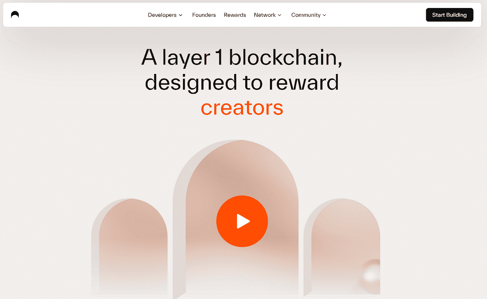

# 宇宙中最有前途的五大连锁店

> 原文：<https://medium.com/coinmonks/top-5-most-promising-chains-in-cosmos-9f1cb1f2dd65?source=collection_archive---------4----------------------->

宇宙是最奇妙的秘密生态系统之一。50 家 IBC 连锁店已经被连接起来。你猜怎么着？这仅仅是开始。我们的团队预测接下来的一年将会有数百家 IBC 连锁酒店。

作为研究实验室，我们一直在寻找新的链来为社区提供信息。今天，我们将讨论五个即将到来的宇宙链，它们将塑造宇宙的未来。

# 1/ Sei 网络

Sei 是第一个特定于行业并专注于贸易的第 1 层区块链，为交易所提供了不公平的优势。Sei 是一个独特的交易优化的 L1 宇宙链。为了让用户进行交易，它使用了一个订单簿。

Sei 可以仔细选择一组选项，作为第一个特定于部门的第 1 层，为分散式交换开辟新的设计空间。将订单匹配引擎整合到供应链本身是最重要的发展之一。Sei 的功能相当于一个去中心化的纳斯达克(NASDAQ ),使得新类别的金融工具得以出现，从复杂的期权和期货到现场体育博彩。

> 从顶级交易者那里复制交易机器人。免费试用。

为什么 Sei 建立在 Cosmos 之上？

*   可定制:允许 Sei 构建完整的端到端区块链流，例如在块的末尾聚合订单以唯一地解锁 Sei
*   模块化订单簿应用程序:Cosmos SDK 为团队提供了一个框架，用于在共识层和应用层进行协作，以及更新或替换堆栈中任何特定层的能力。

**更新消息**

1/multicincap 刚刚为 Sei 牵头了一轮 500 万美元的融资。

2/ Nitro Labs 的扩展解决方案将部署在 Sei 上，它将作为#Cosmos 和#Solana 社区的门户。

SeiNetwork 已经多次暗示要空投，所以一定要跟着他们，保持警惕。

项目社区:[链接](https://linktr.ee/seinetwork)

# 2/ DYDX

dYdX 是以太坊上占主导地位的订单簿交易所。YdX V4 的发布宣布了 dYdX 协议的完全去中心化，以及 Cosmos 的去中心化、可伸缩性和可定制性的特殊集成。

在 dYdX，团队支持有可能显著增强协议的根本性技术进步。Dydx 团队评估了现有和未来区块链技术的前景，然后决定 Cosmos 将使他们能够创建最有效的、完全分散的协议。

dYdX 将为 Cosmos 带来大量新用户。该协议的日交易量超过 10 亿美元。

项目社区:[网站](https://dydx.exchange/) | [推特](https://twitter.com/dYdX) | [不和](https://discord.com/invite/Tuze6tY)

# 3 GNO 土地

Gno.land 将作为所有 Gnolang 链的中心位置，目标是为创建其他链的合同提供库，以及奖励创建强大合同或库的个人。

Gnolang 是一种受 Golang 启发的语言，旨在成为 Web3 开发人员的良好起点，因为它的结构类似于用 Golang 开发应用程序，但用于构建智能合约。

Gnolang 设想 IBC 是智能合约的互联网，而不是应用链。

几个基本特征有助于该框架的优势:

*   自动文档
*   Web、TXs 和跨合同调用使用相同的 API。
*   带参数支持的内置无气体渲染

贡献证明是 Gno.land 如何保护链；你只能通过贡献来获得 Gnosh 令牌；所有的连锁费用将在 Gnosh 持有者、验证者、智能合同和库开发者之间收集和分配。

gnode 是一种自下而上的技术，用于管理 Dao 网络，这些 Dao 将用于管理 Gno 生态系统。Gnodes 与贡献证明有着千丝万缕的联系，它们的结构将支配不断扩张的 Gnolang 生态系统。

项目社区:[网站](https://gno.land/) | [推特](https://twitter.com/_gnoland) | [不和](https://discord.com/invite/tF2X8M6cVj)

# 4/中子

Neutron 扩展了 Defi 的设计空间，使智能合同可以跨链互操作。中子不同于宇宙链中的其他粒子。这是第一个使用链间安全性的通用链。

Neutron 是 Interchain DeFi 最安全的免许可智能合约平台，由 Tendermint 提供支持，使用 Cosmos SDK 构建。

中子使得智能合约的推出成为可能。Neutron 提供了与其他协议和应用程序链交互的工具。

中子是 P2P 培育出来的，是该领域的先驱，也是 Cosmos OG。

中子很可能会将一部分代币供给分发给它的支持者。

如果你投票赞成宇宙中心 72 号提案，你可能会受到青睐，这是最初产生中子的提案。

项目社区:[链接](https://linktr.ee/neutron.org)

# 5/拱门

Archway 正在构建一个基于# Cosmos 的 L1 智能合同平台，该平台利用一种独特的激励结构，根据开发者部署的合同使用情况来奖励他们。

Archway 的目标是创造平等。Archway 是该协议的一个内在特征，它根据开发商 dApps 的价值和效果来奖励开发商，而不是他们与首都的紧密联系或关系。

该网络最初由一个普通的利益证明(PoS)网络组成，该网络具有定制的铸造、CosmWasm、分配、标桩、集团和治理宇宙模块，这些模块控制拱门膨胀和奖励系统。

Archway 创建了一个基于 Cosmos SDK 的链，该链支持 WASM 智能合同的执行，并为使用部署的智能合同的开发者付费。

实现上述目标所需的功能:

*   对开发商的费用奖励
*   给最终用户的燃气回扣
*   智能合同溢价费用
*   通货膨胀奖励

**智能合约**

Archway 协议使用 CosmWasm、WebAssembly (Wasm)和 Rust。超过 40 种高级编程语言支持 Wasm，包括 C 和 C++、Python、Go、Rust、Java 和 PHP。

项目社区:[链接](https://linktr.ee/ArchwayHQ)

# 摘要

由于 ATOM 2.0 更新的巨大增强，Cosmos 生态系统将在未来一年中经历显著增长，这吸引了新的项目来构建 Cosmos。Sei 网络、Dydx、GNO 土地、中子和 Archway 是社区将感兴趣并分析投资的上述五个项目；尽管如此，本材料仅供参考，并不构成财务建议。Beehive Research 将分析和更新关于其他预期项目的社区。

🚀在[渗透处](https://wallet.keplr.app/chains/osmosis?modal=validator&chain=osmosis-1&validator_address=osmovaloper1pz8wre7clpym5cz9ufpt6nvcayvspqqh7yw4y7&referral=true) 🧪 | [埃夫莫斯](https://wallet.keplr.app/chains/evmos?modal=validator&chain=evmos_9001-2&validator_address=evmosvaloper1nfx47fqnqpcarqwt7qn4fk0llc57vvh3wgg35c&referral=true)用蜂箱支撑并打桩🚀| [医疗集团](https://www.mintscan.io/medibloc/validators/panaceavaloper1tppl0m9tqpy04vdmhxk7gya90zfftj94vkyn2t) | [里松](https://www.mintscan.io/rizon/validators/rizonvaloper1gyrrvup6x3g732uhxq9x0qd4lyjjcs62j0kdhf) | [马罗](https://t.me/beehive_maro) | [宝珠](https://staking.orbs.network/) ⭐️

**蜂巢研究**

[Linktree](https://linktr.ee/validatorbeehive)l[Global](https://t.me/Beehive_Global)l[Korea](https://t.me/ttcteamjna)l[Vietnam](https://t.me/Beehive_VN)l[Medium](/@beehive.validator)

> 加入 Coinmonks [电报频道](https://t.me/coincodecap)和 [Youtube 频道](https://www.youtube.com/c/coinmonks/videos)了解加密交易和投资

# 另外，阅读

*   [如何在 FTX 交易所交易期货](https://coincodecap.com/ftx-futures-trading) | [OKEx vs 币安](https://coincodecap.com/okex-vs-binance)
*   [CoinLoan 评论](https://coincodecap.com/coinloan-review) | [YouHodler 评论](/coinmonks/youhodler-4-easy-ways-to-make-money-98969b9689f2) | [BlockFi 评论](https://coincodecap.com/blockfi-review)
*   [XT.COM 评论](https://coincodecap.com/profittradingapp-for-binance)币安评论 |
*   [SmithBot 评论](https://coincodecap.com/smithbot-review) | [4 款最佳免费开源交易机器人](https://coincodecap.com/free-open-source-trading-bots)
*   [比特币基地僵尸程序](/coinmonks/coinbase-bots-ac6359e897f3) | [AscendEX 审查](/coinmonks/ascendex-review-53e829cf75fa) | [OKEx 交易僵尸程序](/coinmonks/okex-trading-bots-234920f61e60)