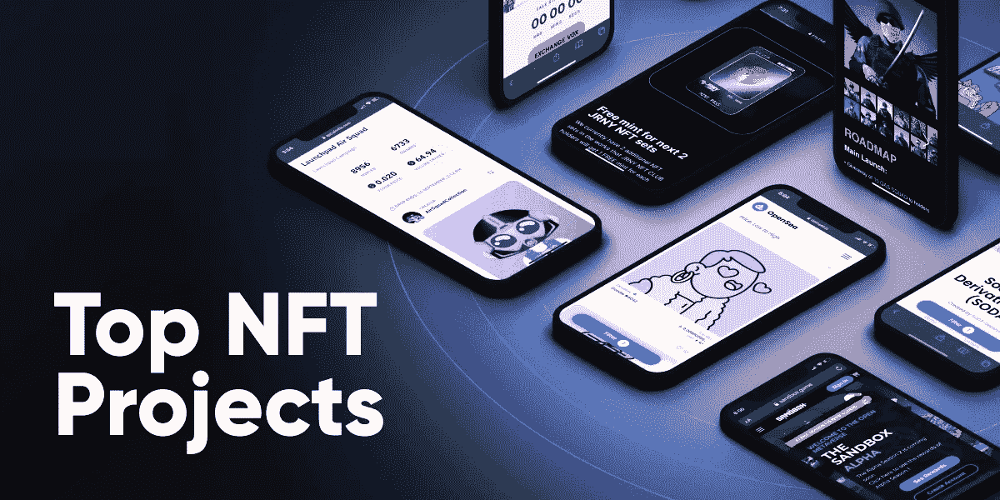
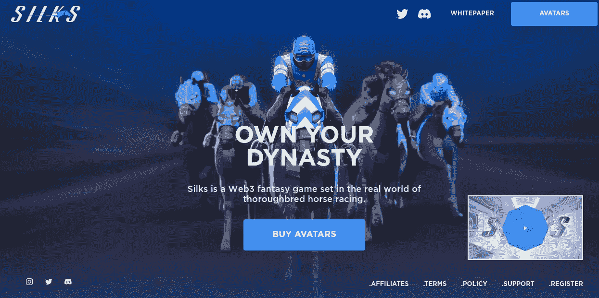
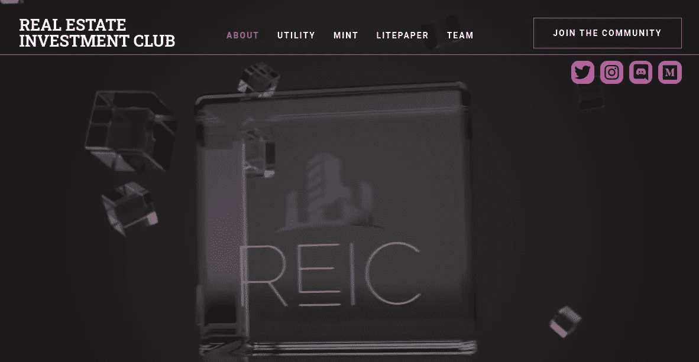
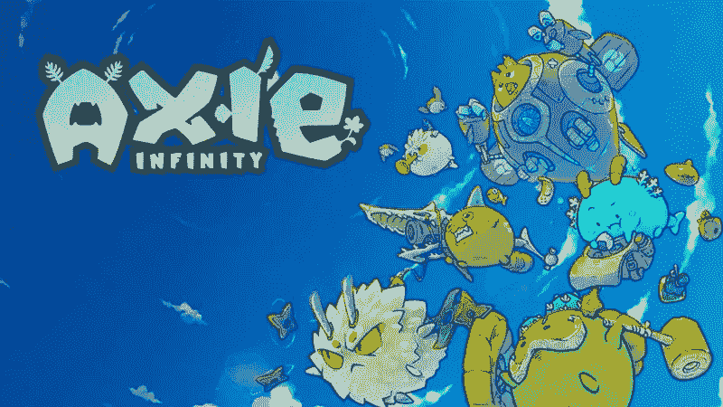
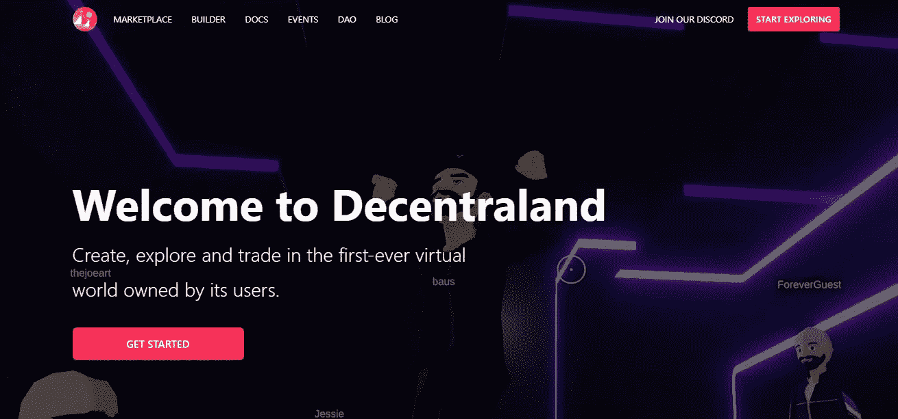
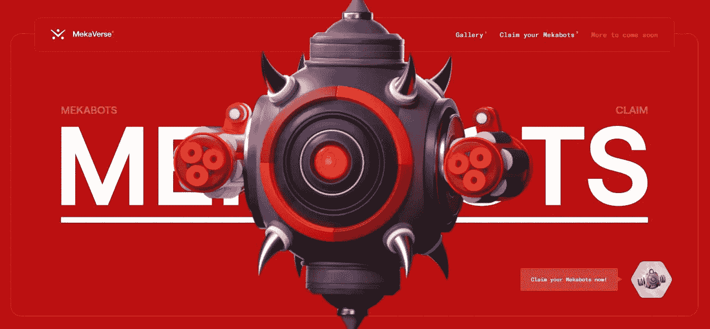

# 2022 年你可以考虑投资的 5 大最有前途的非技术产业

> 原文：<https://medium.com/coinmonks/top-5-most-promising-nfts-you-could-consider-investing-in-2022-93d610e4d631?source=collection_archive---------25----------------------->

金融服务业正迅速进入人们的生活，这也是他们被考虑创业的原因。市值增加了很多；随着流量的增加，非功能性交易也在增加，未来甚至可能达到数万亿。如果你准备好成为 NFT 空间的一部分，你可以 [**开始投资 NFTs** 。](https://bit.ly/3AzsgRt)

在当今世界，许多 NFT 项目正在蓬勃发展，现在是时候让你走上街头，开始投资 NFT 的项目，这些项目可能会给你的生活带来真正的价值。

## **2022 年最佳 NFT 项目**

NFT 空间的颜色已经比彩虹还多，而且每天都在增加。从经验丰富的数字艺术家到现实世界的画家，从程序员到像素艺术爱好者，每个人都想从 NFT 推动的利润馅饼中分得一杯羹。正因为如此，对于新手和经验丰富的加密货币用户来说，选择哪个不可替代令牌项目是值得的，这可能是一个挑战。

今天，我们为您挑选了最受欢迎的 NFT。这些 2022 年的顶级 NFT 将为您已经繁荣的加密货币投资组合做出巨大贡献，或者如果您是初学者，将成为理想的起点。

★ **帛**

★ **房地产投资俱乐部——元宇宙 NFT 集长寿与精彩于一身**

★ **轴无穷大**

★ **分散土地**

★ **MekaVerse**

> 现在我们对它们有了更好的了解，让我们来探究一下为什么这些非功能性食物是最好的选择。

## 👉 [**帛**](https://www.silks.io/)

纯种赛马是你拥有 NFT，交易它们，并在元宇宙丝绸项目中获得奖励的关键。这个项目最令人激动的方面是，每匹 NFT 丝绸马都与一匹真正的纯种赛马相连，当主人在实际比赛中取得成功甚至产生后代时，它会向主人支付奖励。幸运的是，对于全世界的赛马和 NFT 迷来说，丝绸是今年 NFT 最有趣的项目之一。其 [**即玩即赚(P2E)模式**](https://bit.ly/3R2DOUd) 不仅对传统的纯种赛马运动进行了游戏化和创新，还为用户提供了激动人心和潜在回报的拥有体验。你可以在市场上列出你的 NFT，让你变大。

## 👉 [**房地产投资俱乐部——元宇宙 NFT 集长寿与精彩于一身**](https://realestateinvestmentclub.io/)

如果你喜欢像侠盗猎车手和红色死亡救赎这样的游戏，你会对这个 NFT 项目感兴趣。GTA 和 Red Dead Redemption 的创造者组建了一个名为房地产投资俱乐部(Real Estate Investment Club)的元宇宙 NFT 生成性团体。然而，这个集合比它第一次出现时更复杂。除了艺术品的价值，它还是有用的。如果你还没有从项目的名字中猜出，NFT 是你进入一群特定人群的入场券。此外，化身将让您免费访问数字资产财产集团(DAPG)和 REIC 元城。此外，他们将在发展中的元宇宙扮演重要角色，这是一个现实和虚拟世界共存的平行宇宙。

## 👉[Axie 无穷大 ](https://axieinfinity.com/)

如果你喜欢在以太坊区块链上投资游戏，请超越 Axie Infinity。即使你的加密知识还没有完全达到标准，在这个虚拟世界中也很容易做到，因为用户可以拥有并繁殖“axes”——世界上具有独特特征的生物——使用交互式繁殖系统。你获得$AXS 的唯一方法是 Axie Infinity 的原生令牌。你可以和其他用户交换，并使用这种加密货币；交易发生在平滑的对等网络中。玩家在 Axie Infinity 中竞争，这是一款新颖的区块链游戏，使用他们的 Axie 来与其他玩家较量以获得奖励。获胜的玩家将获得$SLP，他们可以在主要的加密货币交易所将其兑换成以太坊或比特币。

## 👉 [**分散**](https://decentraland.org/)

人们正在寻找分散土地的投资机会，在那里用户可以建立自己的虚拟世界，购买土地所有权。令人印象深刻的是，该协会是作为一个独立的实体建立起来的，对治理事务拥有完全的控制权。

分散土地是一个分散的区块链虚拟现实平台，使用户能够创建和交换各种类型的数字资产，如晾衣绳和化妆品。它不再仅仅是为了游戏；这些土地可以作为贷款的担保，用于那些现在需要钱，但以后才能还清的任务(比如抵押贷款)。分散的土地有无限的潜力，这很有趣。最近的变化，比如切换到以太坊 2.0，将使用户和开发者在这个平台上构建新的去中心化应用来创造世界变得比以往任何时候都简单。

## 👉 [**梅卡诗句**](https://themekaverse.com/)

2022 年投资的另一个有趣的新加密货币资产是 MekaVerse 项目。它在动漫社区中已经有了支持者，并拥有 8888 件基于机动战士高达的作品。因此，这些非功能性食品很有可能很快销售一空。然而，自 2021 年末推出 MekaVerse 社区以来，它发展迅速。目前官方推特账户上有 268 000 多名追随者，这使该派别的追随者能够参加特别活动。

墨西哥湾越来越热了。我们可以预计，目前约为 2200 美元的 NFT 平均价格将继续上涨。Meka #6674 是最稀有和最有价值的 Meka 之一，最近售价超过 18000 美元。

## **结论**

NFT 的项目近年来引起了轰动，这可能是你一切的开始。如果你能投资 NFT 项目[**，那你将成为这个现代化世界的潮流引领者。这里会发生什么，在接下来的几年里也是一样，所以如果你投资一个，它会向前迈出一大步，给你一个成功未来的可能性。**](https://bit.ly/3AzsgRt)

> 交易新手？尝试[加密交易机器人](/coinmonks/crypto-trading-bot-c2ffce8acb2a)或[复制交易](/coinmonks/top-10-crypto-copy-trading-platforms-for-beginners-d0c37c7d698c)