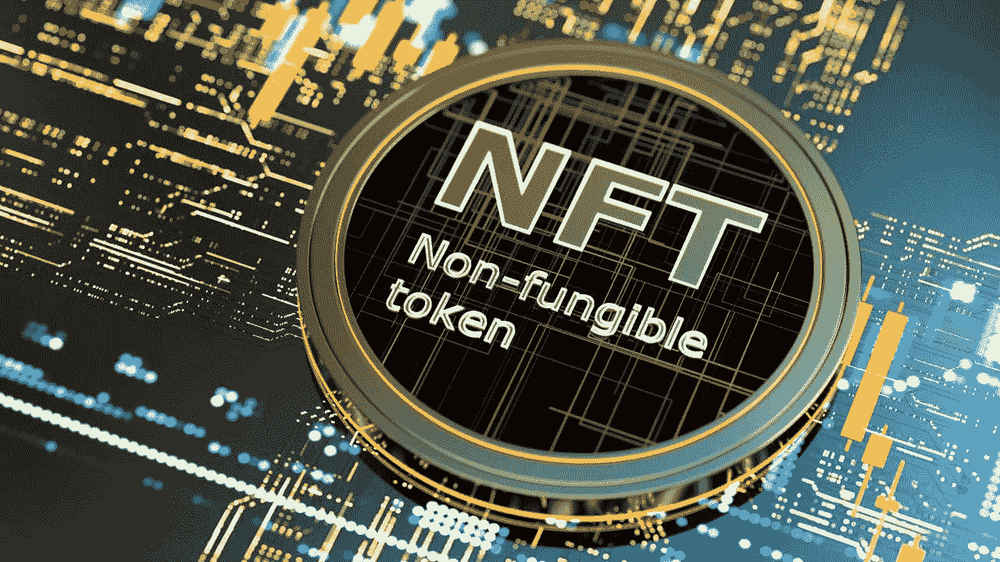
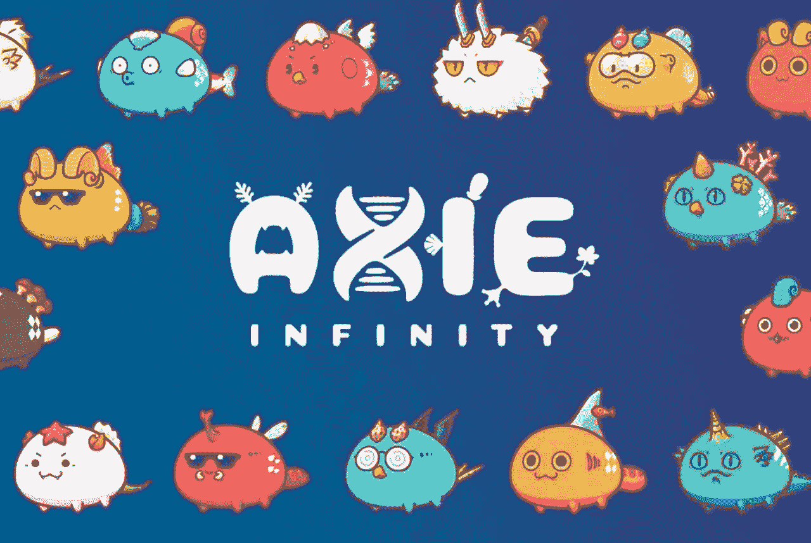
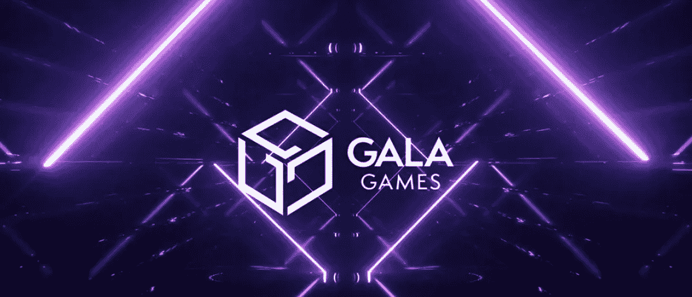
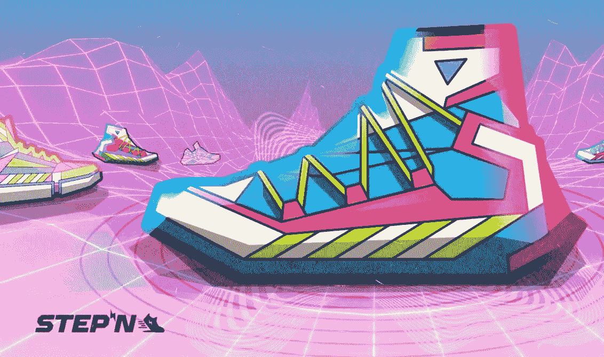

# 前五名 NFT 硬币

> 原文：<https://medium.com/coinmonks/top-5-nft-coins-ff07f9bd8f1?source=collection_archive---------7----------------------->

知道什么是最受欢迎的硬币 NFT 市场，那里有许多投资者和社区，将有利于投资时，在未来几年。首先，我不包括具有非功能性网络传输的网络(瑞士联邦理工学院、SOL、AVAX、BNB)。这些硬币是在项目基础上的 NFT 类别。

*   **分散地(法力)**

我在元宇宙部分也提到了 MANA，这是我想谈论的一个话题，因为它在项目的一个领域中包括了 NFT。他们在这一领域进行深入研究，对人物、服装和所有产品进行评价，这些产品在元宇宙可以作为 NFT 的物品通过。ATH 价值(5.90 美元)下降了 85%，这可能为长期投资者提供了一个良好的买入机会。即时价值 0.83 美元

*   **ApeCoin(猿)**

APE 是 2022 年最受欢迎的硬币之一，属于最受欢迎的 NFT 项目。ApeCoin 是一个分散式项目，灵感来自宇迦实验室的 Bored Ape 游艇俱乐部项目。如果你在思考 NFT 领域未来的延续，就不难预测 APE 会有怎样的潜力和进步。这枚硬币以 1 美元的价格进入主要交易所，在很短的时间内，不到一个月的时间内就上涨到了 39.40 美元 ATH。虽然它目前价值 4.31 美元，但它有一个庞大的社区，将很快弥合 89%的跌幅。

*   **Axie Infinity (AXS)**

事实上，虽然游戏是一个令牌，但它的功能是一个 NFT，具有不同的功能和优势。当一个大的新项目在游戏-Fi 趋势中到来时，我们将看到 AXS 的迅速崛起。它已经从 ATH 下跌了 91%,而且这种趋势很快就会回来。即时 14.03 美元

*   **联欢晚会游戏(GALA)**

Gala Games 是文本中的第二个游戏-Fi 令牌。它旨在通过让用户控制游戏来改变游戏行业。盛大游戏的主要目标是制作用户“真正想玩”的区块链游戏除了购买专门为游戏创建的 NFT，Gala Games 还使用自己的实用令牌 Gala。自 2019 年推出以来，Gala Games 游戏的月活跃用户达到 130 万，销售了 26，000 台 NFT。最昂贵的作品价值 300 万美元。即时价值 0.05248 美元

*   **STEPN (GMT)**

过去 3 个月最热门的项目和硬币。通过从 Play2Earn 切换到 Move2Earn，巨大的投入吸引了用户。用户购买 NFT 运动鞋，他们可以在走路、跑步或慢跑时用它来赚取游戏内的货币。

> 交易新手？尝试[加密交易机器人](/coinmonks/crypto-trading-bot-c2ffce8acb2a)或[复制交易](/coinmonks/top-10-crypto-copy-trading-platforms-for-beginners-d0c37c7d698c)

STEPN 旨在通过激励数百万用户遵循更健康的生活方式来彻底改变健身应用市场。该应用程序解决了几个问题，如“运动证明”——证明用户确实锻炼过——以及正常工作的 GPS 系统。此外，STEPN 在经济上激励用户，并计划引入社会奖励元素，并成功促进碳中和。虽然该项目最初是通过 SOLANA 网络进入的，但随着时间的推移，随着用户的增加，它试图吸引人们到不同的网络和网络，在那里他们可以赚得更多。之后，它首先进入了 BNB 网络，并将很快进入 ETH 网络。你边走边赚的代币商品及服务税图，在估价方面遵循了一条与项目硬币截然不同的道路。当前价值为 80.83 美元，ATH 价值为 4.11 美元(80.39%)
在投资时，将总体趋势作为基本面分析非常重要。之后，在从每个趋势中确定一个硬币，并检查和评估其项目后，我认为这一时期是开始投资的逻辑时间。再说好读书好投资:)