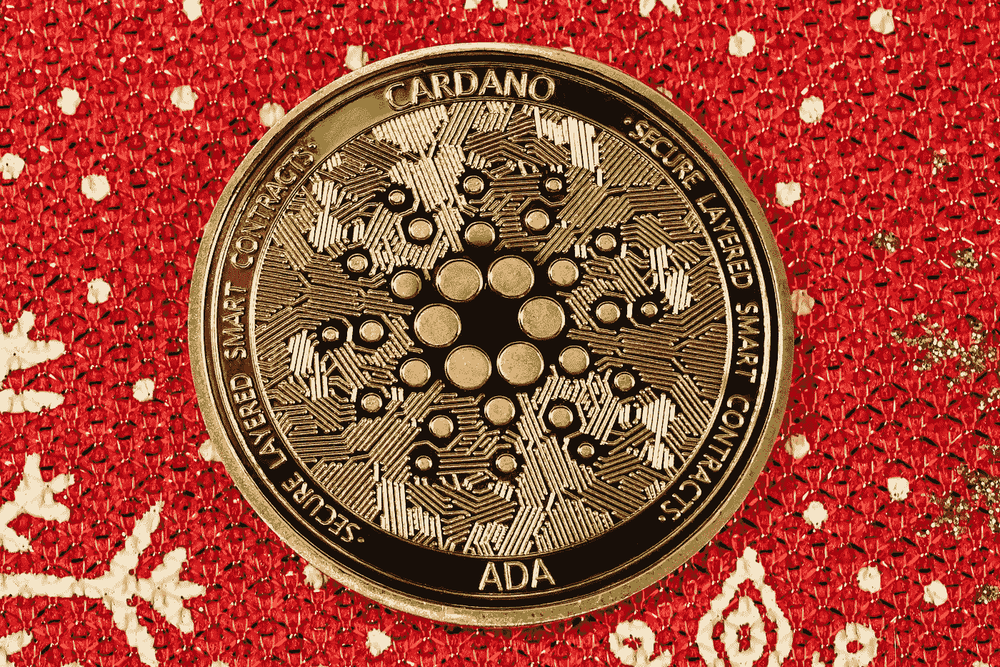

# 购买 Cardano (ADA)的五大理由

> 原文：<https://medium.com/coinmonks/top-5-reasons-to-buy-cardano-ada-846e2673f6d0?source=collection_archive---------15----------------------->

Source photo [Free Bitcoin Image on Unsplash](https://unsplash.com/photos/gBhnOVyTZqc)

Cardano (ADA)是一个开源的区块链平台，旨在为用户提供一个稳定的环境来开发和启动分布式应用。投资 Cardano (ADA)的十大理由包括:

1.Cardano 非常注重安全性，因为它基于一种名为 Ouroboros 的同行评审的利害关系证明(PoS)共识机制。这个算法是为了保护网络…