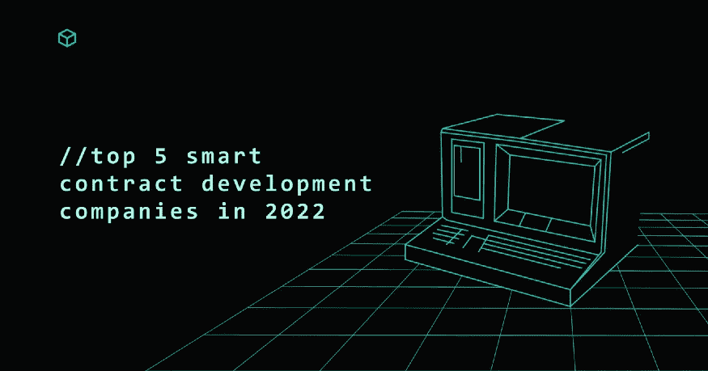
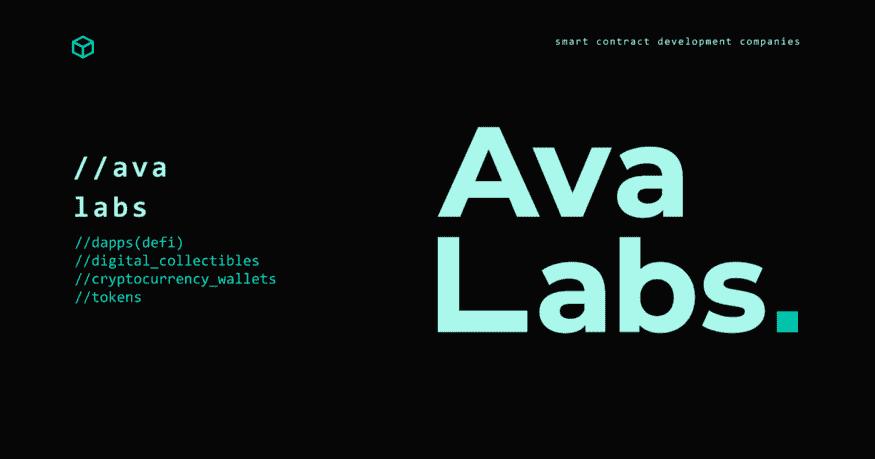
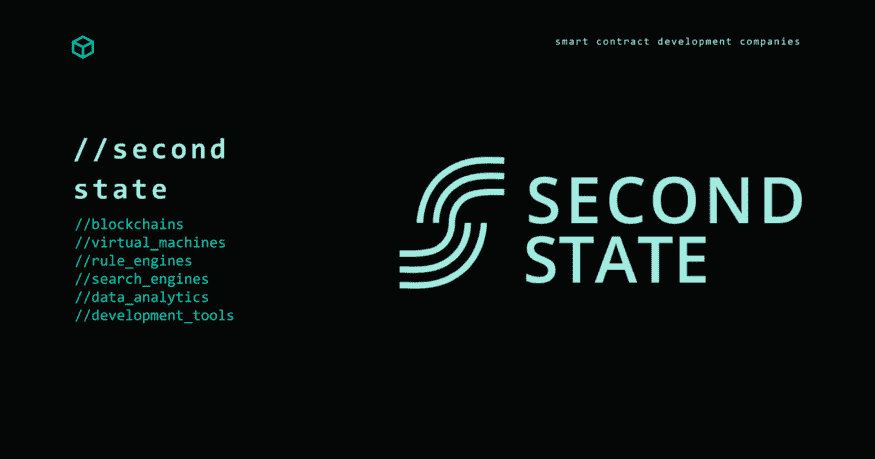

# 2022 年五大智能合同开发公司

> 原文：<https://medium.com/coinmonks/top-5-smart-contract-development-companies-in-2022-844033003e31?source=collection_archive---------46----------------------->

Top Smart Contract Development Companies

## 2022 年顶级智能合同开发公司综合列表

随着区块链技术的增长和发展，智能合同在许多公司的运营中变得越来越重要。随着对这些合同的需求增加，对专门开发这些合同的公司的需求也在增加。在本文中，我们将着眼于 2022 年的一些顶级智能合同开发公司，讨论他们的各种专业化以及为什么他们被认为是最好的。

> 从顶级交易者那里复制交易机器人。免费试用。

# 1.艾娃实验室

Avalabs.org

[艾娃实验室](https://www.avalabs.org/)是 Avalanche 智能合约开发平台和 Ryval(代币买卖市场)背后的团队。有了这些产品，公众可以进入一个没有区块链技术的投资领域。

借助 Avalanche，组织可以利用 Solidity 开发语言开发和启动智能合同应用程序。由于 Avalanche 虚拟机，该公司还开发了私有和公共区块链。

公司可以使用 Avalance 为分散式金融、数字收藏品、钱包、代币和其他区块链用例构建 dApps。他们也可以依靠艾娃实验室团队从零开始构建，或者作为开发伙伴。

# 2.第二状态

[Secondstate.io](https://www.secondstate.io/)

[Second State](https://www.secondstate.io/) 通过开发区块链智能合同，帮助企业实现业务决策和流程的自动化。

该公司的虚拟机采用了内部智能合同开发语言 Lity，这是 Solidity 编程语言的扩展。SSVM 为区块链提供分散智能合约，包括以太坊 2.0、以太坊经典、Polkadot / Web3、Oasis 和 CyberMiles。

该公司构建开源基础设施，包括区块链、虚拟机、规则引擎和搜索引擎。他们还提供数据分析服务和开发工具。

他们的智能合同开发服务将帮助公司在智能合同中建立正式的业务规则。除此之外，他们还使用这些合同实现了运营和核心业务的自动化。这些公司将更新这些规则，用户可以根据需要验证这些规则。

# 3.0xpragma

0xpragma.xyz

[0xpragma](https://www.0xpragma.xyz/) 专注于为 Web3 原生区块链项目提供高质量的营销和战略建议&分散技术，塑造全球商业和治理的未来。

该公司专注于一系列服务，包括区块链工程、智能合约、定量分析策略、营销和流动性管理。

他们的智能合约开发服务是从以知识为导向的角度出发的，对各种生态系统有着深刻的理解。这使他们能够帮助定位、产品市场匹配，并为合作伙伴创造可持续的长期增长。

# 4.SoluLab

Solulab.com

SoluLab 提供全面的开发服务，从区块链和移动开发到 web 开发和机器学习。他们还专门从事物联网开发、数据科学、DevOps、SaaS 开发和 IT 维护。

该公司专注于区块链开发，包括构建加密货币钱包、ICO 令牌和平台。他们还构建独立的区块链、交易所、安全令牌或 sto 以及其他产品。

他们的智能合约开发团队可以推出一个令牌化平台，如果您想要构建令牌，这个平台会很有帮助。这些令牌将可以在世界上的任何时间、任何地点访问，它们也可以帮助实现合规性。

# 5.紧急代码

Blockchain.evacodes.com

[EvaCodes](https://blockchain.evacodes.com/) 专门为各种区块链开发智能合约，包括以太坊、索拉纳、阿尔格兰德、Dfinity/Motoko、币安链等。他们的智能合约可以集成到其他基于区块链的产品和平台中，如 NFT 市场、NFTs、加密钱包、加密货币或代币。

他们在开发区块链项目方面有丰富的经验，包括 NFT 市场、智能合同、加密服务提供商等等。

# 聘请专家开发智能合同

本文提到的五家公司是 2022 年一些顶尖的智能合约开发公司。他们专注于最新的区块链服务和产品，并提供一系列的开发服务。无论你是想构建和发布你的令牌，还是开发一个分散的应用程序，这些公司都可以提供帮助。

> 加入 Coinmonks [电报频道](https://t.me/coincodecap)和 [Youtube 频道](https://www.youtube.com/c/coinmonks/videos)了解加密交易和投资

# 另外，阅读

*   [投资印度的最佳密码](https://coincodecap.com/best-crypto-to-invest-in-india-in-2021)|[WazirX P2P](https://coincodecap.com/wazirx-p2p)|[Hi Dollar Review](https://coincodecap.com/hi-dollar-review)
*   [加拿大最好的加密交易机器人](https://coincodecap.com/5-best-crypto-trading-bots-in-canada) | [库币评论](https://coincodecap.com/kucoin-review)
*   [用于 Huobi 的加密交易信号](https://coincodecap.com/huobi-crypto-trading-signals) | [HitBTC 审核](/coinmonks/hitbtc-review-c5143c5d53c2)
*   [TraderWagon 回顾](https://coincodecap.com/traderwagon-review) | [北海巨妖 vs 双子星 vs BitYard](https://coincodecap.com/kraken-vs-gemini-vs-bityard)
*   [如何在 FTX 交易所交易期货](https://coincodecap.com/ftx-futures-trading)