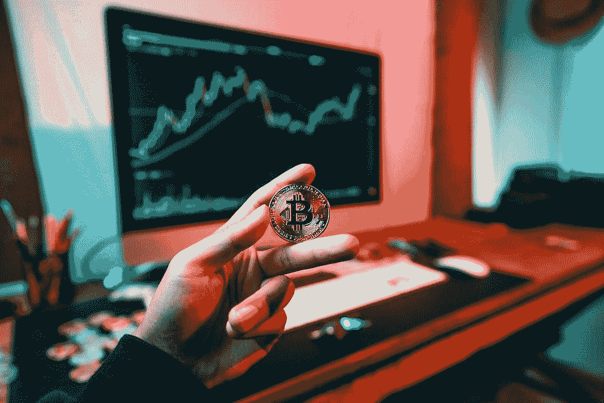

# 五大特殊比特币交易

> 原文：<https://medium.com/coinmonks/top-5-special-bitcoin-transactions-a0eb5c6b0d5b?source=collection_archive---------25----------------------->

比特币通常被认为是一种匿名的数字货币，但实际上，所有的比特币交易都是公开的。这意味着任何人都可以看到特定交易中涉及的地址，以及发送的比特币数量。

然而，一些比特币交易比其他交易大得多。在本文中，我们将了解五种特殊的比特币交易。这些交易范围从…