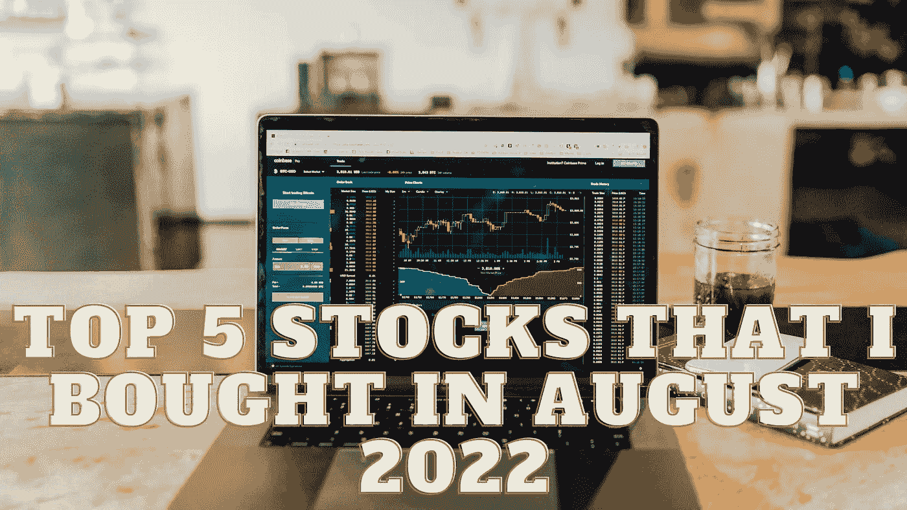

# 我在 2022 年 8 月买入的前 5 只股票

> 原文：<https://medium.com/coinmonks/top-5-stocks-that-i-bought-in-august-2022-25391aa58304?source=collection_archive---------32----------------------->

Source photo Unsplash.com

# 生物纳米基因组学

这张便宜的细价股票购买清单将从最受尊敬的公司名称开始，然后是最古怪的选择。对于任何关注生物技术新闻的人来说，生物纳米基因组学可能不是新闻。Bionano 是一家专注于纳米成像和分析的公司，近年来在临床方面取得了巨大进展。