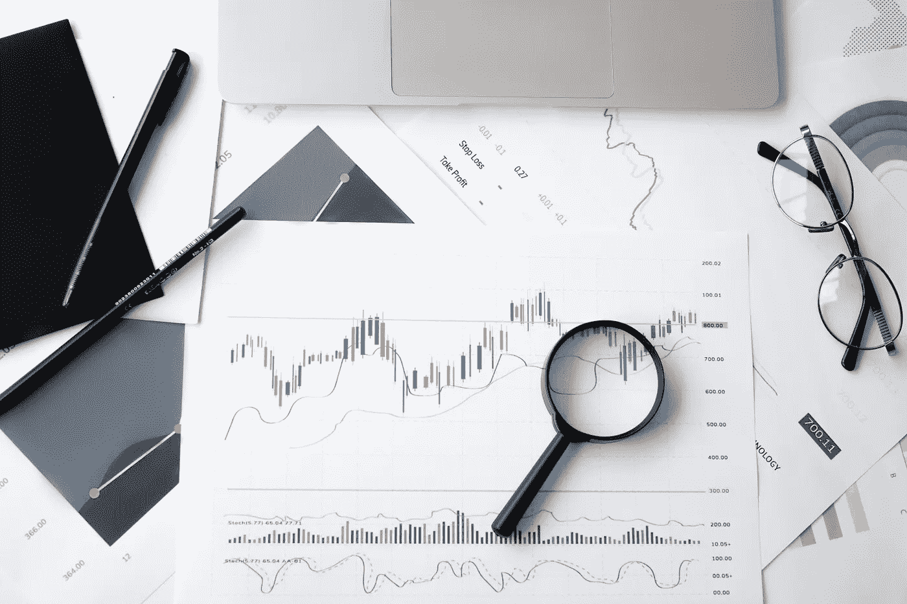

# 2022 年 12 月我认为是好投资的前 5 只股票

> 原文：<https://medium.com/coinmonks/top-5-stocks-that-i-think-are-a-good-investment-in-december-2022-1b58d343b8c7?source=collection_archive---------31----------------------->

Source photo [Magnifying Glass on Top of Document · Free Stock Photo (pexels.com)](https://www.pexels.com/photo/magnifying-glass-on-top-of-document-6801648/)

# 苹果公司(AAPL)

今年的市场低迷甚至影响到了消费电子行业巨头。2022 年，苹果(纳斯达克股票代码:AAPL)的股票迄今已下跌 20%。投资者不应该担心抛售，因为他们可能会在低价买入苹果股票时大赚一笔。