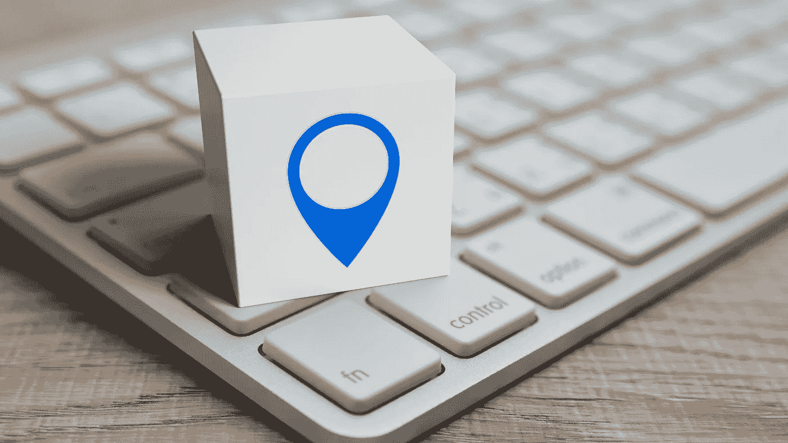

# 修复 Windows 11 上灰显的定位服务的五大方法

> 原文：<https://medium.com/coinmonks/top-5-ways-to-fix-location-services-grayed-out-on-windows-11-331dae1aaf10?source=collection_archive---------59----------------------->

你 Windows 11 电脑上的一堆应用依靠定位服务来确定你的位置。也就是说，您可以通过应用程序权限来控制哪些应用程序可以访问这些数据。然而，如果 Windows 11 不允许您切换位置服务，您可能需要解决它。

.

