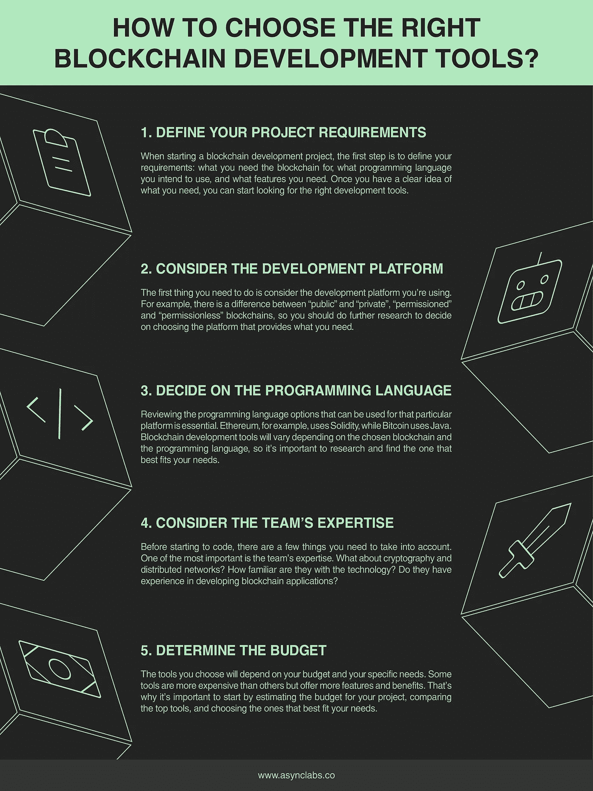

# 成功项目交付的 6 大区块链开发工具

> 原文：<https://medium.com/coinmonks/top-6-blockchain-development-tools-for-successful-project-delivery-69a779159f07?source=collection_archive---------31----------------------->

区块链开发工具用于创建区块链解决方案。

最流行的**区块链开发工具**健壮、可伸缩、安全，并且兼容不同的平台。

这些工具有助于使开发项目更加简单和高效，创建和部署合同，设置节点，以及管理您的网络。

# 最流行的区块链开发工具是什么？

虽然有许多不同的工具可供选择，但以下六个工具是最受欢迎和最有价值的**区块链开发**工具。

*   **Solidity:** 一种用于编写以太坊智能合约的编程语言。
*   **MetaMask:** 一个浏览器扩展，允许你在浏览器中运行以太坊应用。
*   **Truffle:** 一个开发框架，使得编写和测试智能契约变得容易。除了松露，开发商还经常使用当地的区块链来检验合同。
*   **Web3j:** 一个轻量级的 Android 和 Java 库，用于与以太坊客户端集成。用于集成 Web3 应用程序或 dApps 的测试和流行库也是 Web3.js 和 Ethers.js。
*   **Geth:** 以太坊客户端用来挖掘区块和创建契约。
*   **Mist:** 允许存放和使用乙醚的以太坊钱包。

# 哪种区块链开发工具最适合您的企业？

## 定义需求

开始区块链开发项目的第一步是明确定义你的需求。你到底需要区块链做什么？

记住一些事情，比如你想使用什么编程语言，你需要什么特性，它需要多么的用户友好等等。一旦你对此有了很好的理解，你就可以开始寻找合适的开发工具。

## 选择合适的开发平台

有公共的和私有的、有权限的和无权限的区块链可用，每种都有自己的优点和缺点。

一旦你选择了一个平台，你就可以寻找一个适合它的工具集。请记住，如果你不知道如何使用，即使是最好的工具也不会给你带来任何好处，所以请确保你身边有一个技术熟练的专业团队。

## 选择正确的编程语言

区块链开发的第一步是决定正确的编程语言。这将取决于您使用的区块链的类型。

比如以太坊用的是 Solidity，比特币用的是 Java。一旦选择了正确的编程语言，您就可以研究并找到最适合您需求的开发工具。

## 经验丰富的团队和预算

在开始为区块链项目编码之前，考虑团队的专业知识并确定预算是很重要的。团队开发区块链应用程序的经验将影响**项目的成功**。

估算项目预算将有助于您确定要使用的正确工具和服务。

想了解更多关于最新的**区块链开发工具**和技术吗？阅读我们关于[六大区块链开发工具](https://www.asynclabs.co/blog/blockchain-development/top-6-blockchain-development-tools-for-successful-project-delivery/?utm_source=medium&utm_medium=social&utm_campaign=news)的最新文章。

> 交易新手？尝试[加密交易机器人](/coinmonks/crypto-trading-bot-c2ffce8acb2a)或[复制交易](/coinmonks/top-10-crypto-copy-trading-platforms-for-beginners-d0c37c7d698c)