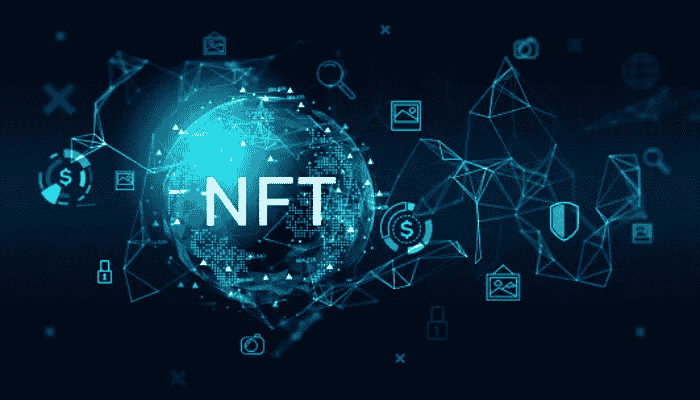
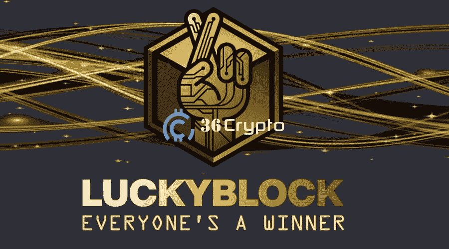
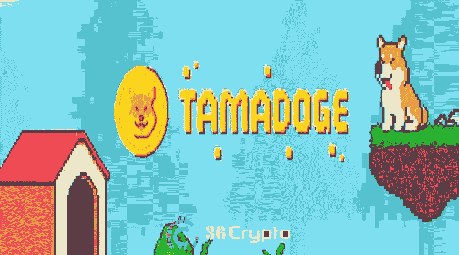
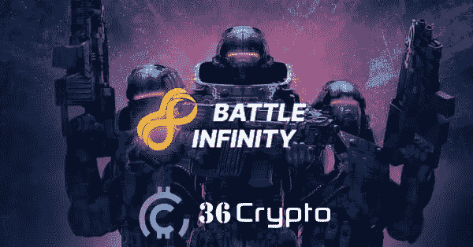

# 2022 年 10 月最便宜的 6 个 NFT 项目

> 原文：<https://medium.com/coinmonks/top-6-cheapest-nft-projects-to-buy-in-october-2022-8adc053ca772?source=collection_archive---------8----------------------->

被称为 NFT 的不可替代代币通常被认为是昂贵的项目，难以投资。情况并不总是这样，因为 2022 年 NFT 的廉价项目有所增加，在这篇文章中，我们将列出一些你应该留意的最便宜的项目。

围绕 NFTs 的议论丝毫没有减少。NFT 市场一直在持续增长，有很多项目正在涌现，你可能需要注意。有专家预测，2022 年将是区块链发展和采用的伟大一年，也是 NFT 革命的伟大一年。

如果您仍然不熟悉什么是 NFT，它们是在区块链上创建和存在的不可互换的加密资产，它们显示现实世界收藏的所有权，如艺术品、产权、房地产等。

你可以在 OpenSea、和其他 [NFT 市场](https://36crypto.com/top-nft-marketplaces-to-trade-nfts/)购买 NFT，只需遵循几个步骤。 [**投资 NFT 项目**](https://36crypto.com/top-5-common-mistakes-about-nfts/) 是一个简单的过程，这与人们对非金融交易的常见误解正好相反。在我们进入列表之前，让我简单介绍一下什么是 NFT 项目。

# 什么是 NFT 项目？

NFT 项目是一个独特的不可替换的令牌集合。正如我们之前已经确定的那样，NFT 是存储在区块链上的加密资产，带有现实世界项目的所有权证明。

NFT 的艺术是由个体艺术家在较小的规模上创作的，而 NFT 的项目则是由大型组织创作的。NFT 大多在 NFT 市场进行销售和交易，如 OpenSea、Raible、Magic Eden 和 Nifty Gateway，而另一方面，NFT 的项目在创建它们的组织的平台上销售。

我们知道，选择一个 NFT 项目进行投资可能是一个漫长且有时令人困惑的过程，尤其是对新手来说，在本帖中，我们整理了一份清单来帮助你更容易地做出选择。

# 2022 年 10 月 NFT 最便宜的 6 个项目

下面是我们快速挑选的最便宜的 NFT 投资项目，还将包括对这些项目的额外审查。排名不分先后:

# 1.幸运块(LBLOCK)。市值 780 万美元

幸运街区建立在区块链以太坊的基础上，是一个位于 NFT 的竞赛平台，为玩家提供每周 NFT 抽奖和密码。您可以通过购买在[幸运积木竞赛平台](https://luckyblock.com/)上铸造的 NFT 系列中的一个来参加各种奖励竞赛。

幸运积木比赛的参赛资格和奖励非常简单，只需遵循以下步骤:

**购买 NFTs** :持有幸运 Block LBLOCK 令牌时间越长，奖励越多。奖励在 LBLOCK 中赢取，它允许您参加符合条件的比赛。

**赚取奖励**:只要持有幸运街区 NFT，幸运街区平台上的所有 NFT 持有者都会获得奖励。

**赢得奖品**:当 NFT 系列销售一空时，就会选出一名合格的获胜者。每一个独特的收集幸运块 NFT 附带一个幸运块 NFT 比赛。

赢得的奖品包括豪华手表、PS5 游戏机、兰博基尼汽车和价值 100 万美元的房子。

LBLOCK 是该平台的原生加密货币，它有两个令牌版本，BEP-20 (V1)协议和新发布的 ERC-20 令牌(V2)。根据 CoinMarketCap 的数据， **V1 代币的价格为 0.0001928 美元，**V2 代币的交易价格为 0.0002318 美元。Lucky Block 的 [**市值**](https://36crypto.com/understanding-crypto-market-cap-how-is-it-calculated/) **为 780 万美元**。

# 2.塔马多吉(TAMA)。市值 5400 万美元

Tamadoge 是一个融合了 P2E 游戏和 NFTs 元素的项目。游戏将很快被整合到元宇宙中。它为其平台成员提供游戏内赚钱的机会。

Tamadoge 的开发者希望提供免税购买他们的令牌，因此 ERC-20 令牌也是可用的。

Tamadoge 宠物可以从 Tamadoge 内部 [NFT 市场](https://36crypto.com/top-nft-marketplaces-to-trade-nfts/)购买。玩家可以将这些成熟的宠物放入塔马多吉竞技场的战斗中，并获得一些 Dogepoints。

玩家饲养这些宠物，并通过购买 NFT 来喂养它们。宠物的成长决定了一个玩家在排行榜上的排名。

TAMA 是 Tamadoge 平台的本地标志。根据来自 [CryptoNews](https://cryptonews.com/) 的细节，Tamadoge 是 2022 年最好的预售之一。TAMA 股票在 OKX 上市后，其价值比预售价格上涨了近 20 倍。

如果你正在寻找一个投资前景更好的 [NFT 项目](https://36crypto.com/nftnon-fungible-token/)，那么 Tamadoge 可能是你的最佳选择。TAMA 今天的价格是**0.04788 美元**，市值****5400 万美元**。**

# **3.战斗无限(IBAT)。市值 730 万美元**

****

**Battle Infinity 在我们的[10 月份](https://36crypto.com/top-8-cryptocurrencies-to-invest-in-october-2022/)被列为投资的 8 大加密货币，所以它也被加入这个名单也就不足为奇了。这是一个基于孟买的游戏赚取项目。**

**Battle Infinity 为投资者提供了一个机会，让他们可以提前进入这个看起来可能是今年的项目。如果你是一个 NFT 爱好者，并且你一直在寻找一个更便宜的 play2earn 机会，因为市场上的那些太贵了，那么无限战争可能是你的最佳选择。**

**该项目分为六个不同的平台，并已通过 CoinSniper 的 KYC 验证。战斗无限是由 Suresh Joshi，Jagjeet Jena 和 Vinay Chhabra 创建的，是一个将幻想体育带入加密空间的项目。**

**六种不同的平台包括:**

*   **IBAT 超级联赛(梦幻体育联盟)**
*   **IBAT 战场(元宇宙世界)**
*   **IBAT 对战游戏(游戏平台)**
*   **IBAT 战斗股份(股份 IBAT 和其他密码)**
*   **IBAT 战争交换**
*   **IBAT 战场市场**

**BEP-20 $IBAT 代币是为战斗无限宇宙提供动力的本地加密货币，限量供应 100 亿。代币用于奖励玩家，使购买虚拟广告空间更容易，也作为赌注奖励。**

**根据来自 [CoinMarketCap](https://coinmarketcap.com/currencies/battle-infinity/) 的数据，《战斗无限》(IBAT)的价格为**0.002279 美元**，市值**73 亿美元**。**

# **[此处继续阅读](https://36crypto.com/6-cheapest-nft-projects-to-invest-in-october-2022/)**

**免责声明:这不是财务建议。在这篇文章中分享的观点和意见是文章作者的观点和意见，绝不是财务建议。在投资任何数字资产之前，我们总是建议您进行研究或咨询专家。**

**你喜欢阅读我们带给你的内容吗？如果是，请点击“**拍拍**按钮，增加其他人看到这个帖子并了解它的机会。**

**你最多可以鼓掌 50 次。你还在等什么？马上按下那个按钮。感谢您的阅读。**

**【https://36crypto.com】原载于 2022 年 10 月 7 日 30 日**。****

> ***交易新手？尝试[加密交易机器人](/coinmonks/crypto-trading-bot-c2ffce8acb2a)或[复制交易](/coinmonks/top-10-crypto-copy-trading-platforms-for-beginners-d0c37c7d698c)***