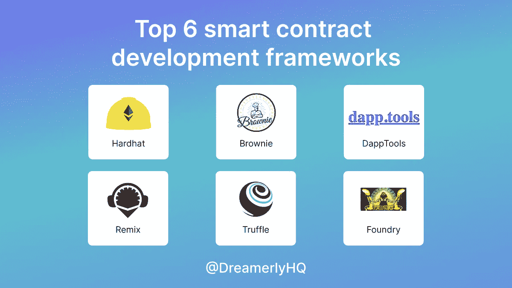
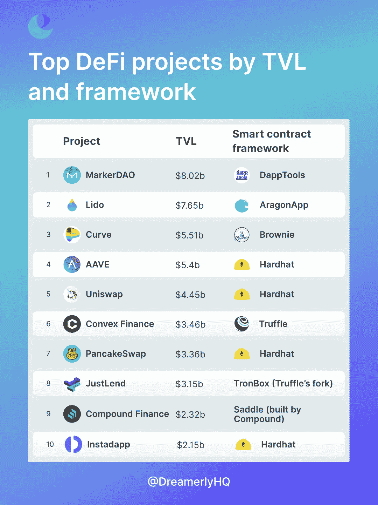
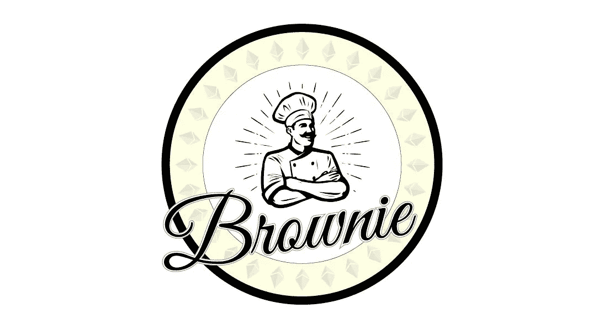
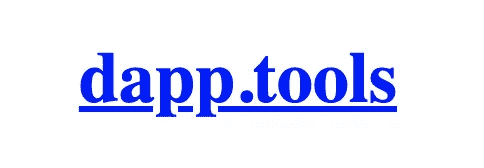
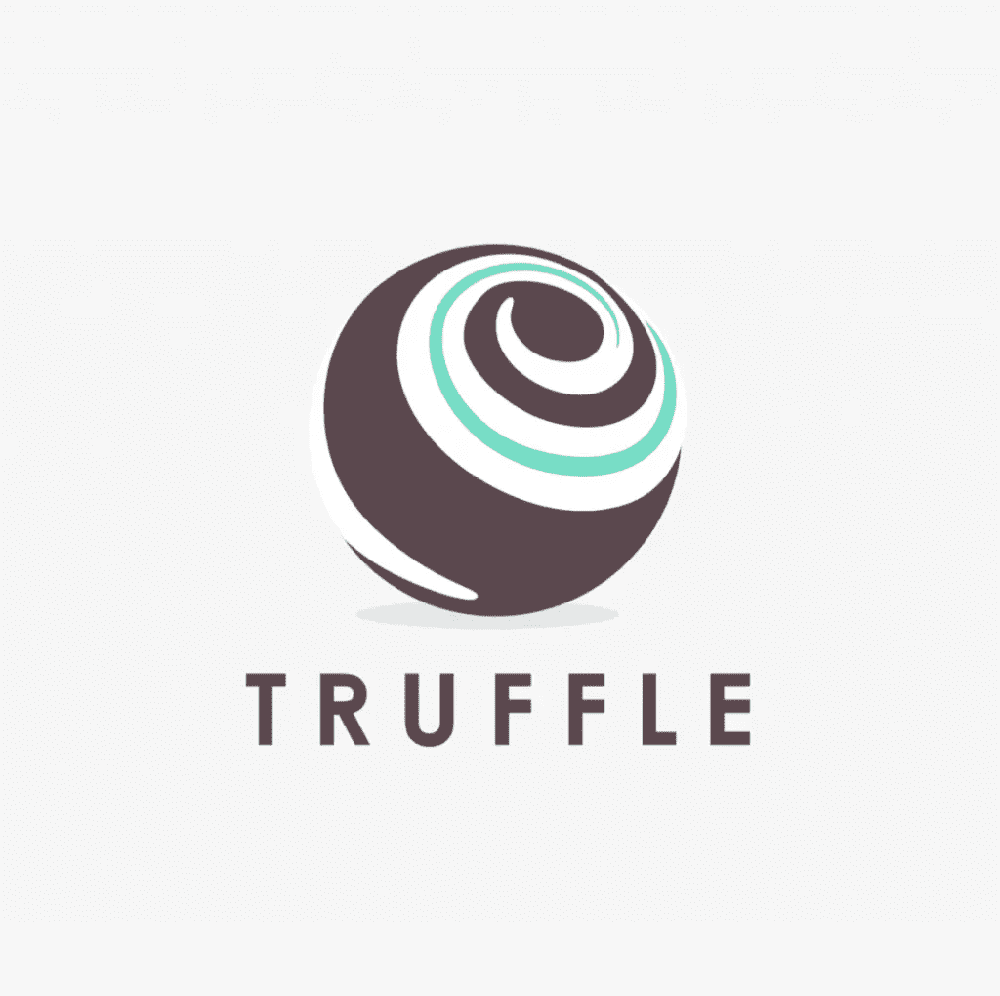
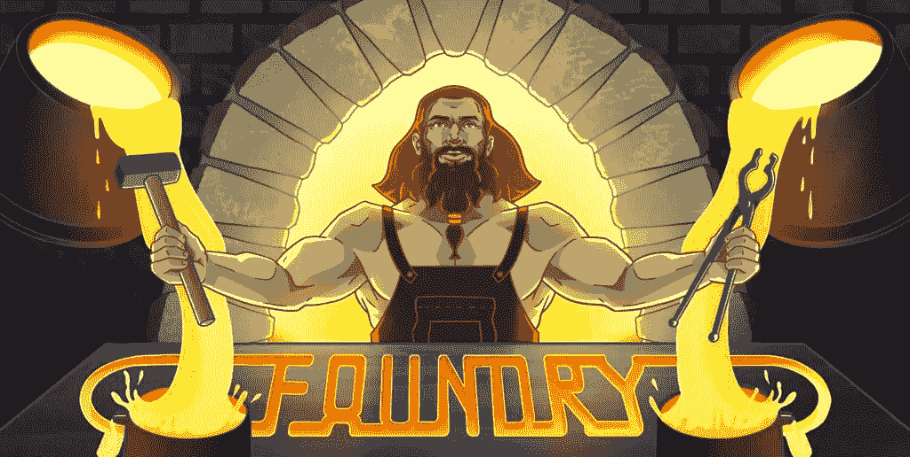

# 2022 年 web3 项目的 6 大智能合同框架

> 原文：<https://medium.com/coinmonks/top-6-smart-contract-frameworks-for-web3-projects-in-2022-1e9cd8ad4e95?source=collection_archive---------4----------------------->

Top 6 smart contract frameworks for web3 in 2022

在这个熊市期间，一些用户可能会离开，但建设者仍在建设。让我们探索一下每个 web3 开发者都应该知道的 6 大智能合约开发框架。

但首先，让我自我介绍一下:

**大家好，我是 Linh，Dreamerly(Twitter:**[**@ DreamerlyHQ**](https://twitter.com/DreamerlyHQ)**)的业务拓展。关注我们的 Twitter，了解更多关于 crypto 的最新消息。**

或者，你可以在我们的 Twitter 上阅读这篇文章:

智能合约框架是构建 web3 的基本工具。它们帮助开发人员快速有效地测试和部署智能合约。以下是十大 DeFi 项目及其使用的框架:

Top 10 DeFi projects and the frameworks they use

现在，让我们来看看每个 web3 开发者都应该知道的 6 大智能合约框架。

# 1/安全帽——超级巨星

Hardhat 是目前占主导地位的智能合约开发框架。

这是一个基于 Javascript 和 Solidity 的框架，可以让你的应用程序快速运行。

Hardhat 在后端使用 ethersjs，它自己的本地区块链进行测试。

为什么使用安全帽:

—测试速度非常快

—类型脚本支持

—广泛采用

—注重开发人员体验的团队

HardHat

**2/布朗尼——像蟒蛇一样强大**

Brownie 是一个基于 Python 的开源框架，构建在 [http://web3.py](https://t.co/f6KuxqRC6x) 之上。

它还支持可靠性& Vyper Brownie 的创建是因为许多 Python 工程师不喜欢 Javascript，想要一个基于 Python 的框架。

为什么使用布朗尼:

—最好的 Python 框架

—由顶级 DeFi 项目使用，如渴望金融和曲线金融

—区块链:Ganache/local、testnets、mainnet

—具有测试功能

—非常积极的维护和支持

—开源

Brownie

**3/ DappTools —简单设置**

DappTools 是一个用 Haskell 构建的以命令行为中心的框架(尽管使用它不需要了解 Haskell)。您可以使用 bash/zsh 之类的命令行/shell 工具，而不是使用 Python/Javascript 之类的高级编程语言。

为什么使用 DappTools:

—它附带了一套工具，如 dapp、seth、ethsign 和 hev。每个工具都是为智能合同开发的特定部分而设计的。

—由 MakerDAO 使用

—内置模糊测试

—无需学习 Javascript 或 Python

—最适合精益设置

DappTools’s logo. Not fancy at all, but the product is great.

**4/以太坊 Remix——以太坊智能合约的可视化工具**

Remix 更像是一个易于上手的可视化浏览器 IDE。混音也很灵活。您可以选择可靠性版本、编译和运行可靠性测试。想用 Javascript 代替？随便挑！

为什么使用以太坊混音:

—超级友好

—完全可扩展，因此如果您想添加功能，可以对其进行改进

—可以将您的本地磁盘连接到 remix，以运行您的版本控制回购中的代码

—如果您知道稳定性，就很容易上手

—自动化测试

Remix

**5/Truffle Suite—OG 框架**

Truffle 是一个基于 Javascript 的框架，带有 Ganache 和毛毛雨等工具。由于 Truffle 是第一个开发的智能合约框架，它对其他框架有很大的影响，许多框架都采用了 Truffle 的实践

为什么使用 Truffle 套件:

—使用最广泛的平台之一

—配备其他工具，如 Ganache 和毛毛雨

—具有内置的契约抽象，使 web3.js 易于使用

—具有本机调试器，具有单步执行/单步执行、断点等功能。

—开源且 100%免费！

Truffle

**6/Foundry——DappTools 之后的下一个明星**

铸造是写在铁锈上的。它像 DappTools 一样以命令行为中心，两个框架非常相似。

Foundry 速度快，功能强大，专注于在 Solidity 中构建测试，内置 fuzzing 和其他强大的工具。

为什么使用铸造厂:

—快速坚固性测试

—内置模糊测试

— Rust 变得越来越受欢迎

Foundry

**在 Twitter 上关注我们**[**@ DreamerlyHQ**](https://twitter.com/DreamerlyHQ)**获取有趣的见解和故事！**

> 交易新手？尝试[加密交易机器人](/coinmonks/crypto-trading-bot-c2ffce8acb2a)或[复制交易](/coinmonks/top-10-crypto-copy-trading-platforms-for-beginners-d0c37c7d698c)