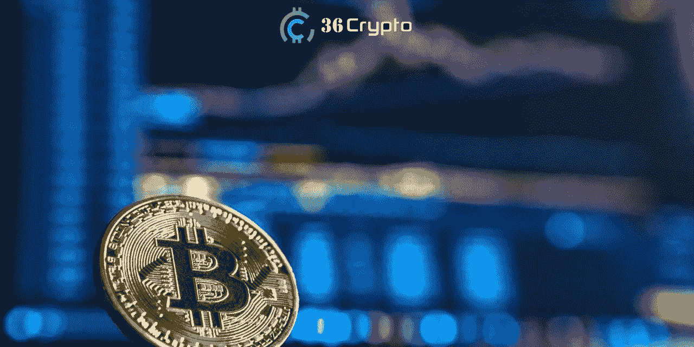
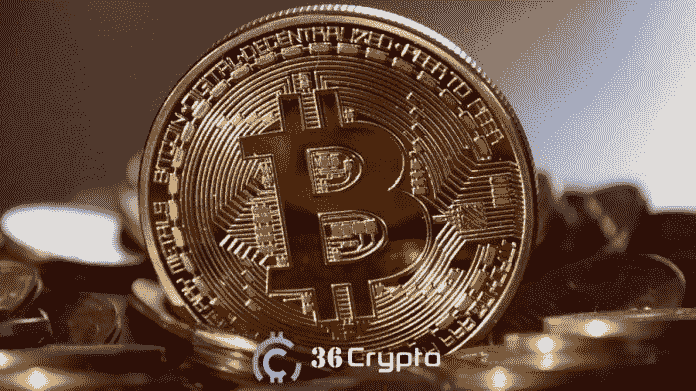
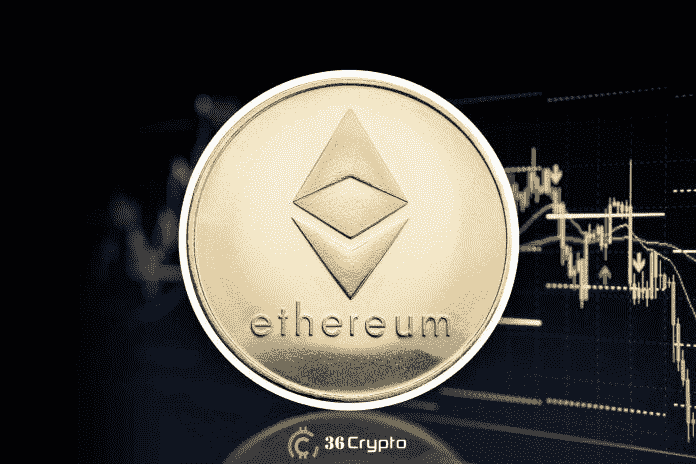

# 2022 年 11 月你应该投资的 7 大加密货币–36 crypto

> 原文：<https://medium.com/coinmonks/top-7-cryptocurrencies-you-should-invest-in-for-november-2022-36crypto-8f379e90a347?source=collection_archive---------3----------------------->

10 月份即将结束，为 11 月份购买最佳加密货币的想法将是下一个大问题。2022 年是加密货币市场特别缓慢的一年，但投资者仍然乐观并充满希望。

在我们 10 月的[顶级加密货币名单中，我们看到了氦网、Polkadot、Filecoin、Battle Infinity 等。如果你已经把这些硬币加入到你的投资组合中，那么你很有可能在下一轮牛市中获得丰厚的利润。](https://36crypto.com/top-8-cryptocurrencies-to-invest-in-october-2022/)

市场上有数千种加密货币可供选择，人们可能会发现很难选择潜力非常大的加密货币。选择错误的[数字资产来投资](https://36crypto.com/6-cheapest-nft-projects-to-invest-in-october-2022/)可能会导致你损失很大一部分投资，这就是为什么建议你在沉迷之前做好适当的调查。

有[不同的加密货币代币](https://36crypto.com/what-is-an-altcoin-investing-for-beginners/)也称为替代币，有各种不同的使用情况。要了解更多关于不同类型的代用币，[查看这篇文章](https://36crypto.com/what-is-an-altcoin-investing-for-beginners/)。加密货币行业在不断变化，市场仍然高度波动，所以如果你不是一个熟练的交易者，那么你应该考虑分散你的投资组合，长期持有你的代币，因为它有更高的利润潜力。

# 为什么您应该多样化您的加密货币投资组合

正如我之前提到的，市场上有数千种加密货币。来自 [CoinMarketCap](https://coinmarketcap.com/) 的数据显示，市场上有超过 5000 种加密货币上市，可供选择的种类很多。

分散投资组合有助于降低风险，也让你有机会参与下一个上市的热门加密货币。加密货币是一种波动性大、风险高的投资，投资其中一种货币的风险更高。

因为多样化是最好的，我的 11 月份最佳加密货币名单将包括市场上不同类别的硬币，波动性较小的硬币和易于购买和交易的硬币。

# 加密货币有哪些不同类型？

市场上的加密货币令牌可以根据其用途分为不同的类型。然而，一些密码可能属于多个组。一些可用的加密货币类型有:

*   **稳定的硬币**:稳定的硬币是为了减少波动。它们的价值与其他波动性较小的资产挂钩，如美元等法定货币，有些与贵金属挂钩。市场上一些受欢迎的葡萄酒包括 USDT、USDC、BUSD 等。
*   **安全令牌**:这些用来记录某样东西的股份或所有权。这些类型的代币受 SEC(证券交易委员会)监管。安全令牌将价值从资产转移到令牌。
*   **支付代币**:支付代币是支付的货币，也是双方交换价值的货币。
*   治理令牌:治理令牌赋予持有者一些权利和特权，以参与区块链中的某些活动。活动包括投票，也为 DAO 做贡献。
*   **实用令牌**:实用令牌可用于在区块链内提供一些特定功能。它们用于支付交易费用、兑换奖励以及支付服务费用等服务。

此外，您可以根据加密货币的市值将其分组。投资者现在将注意力转向具有良好增长潜力的低市值加密货币。

# 2022 年 11 月买什么加密货币最好？

在这篇文章的最后，你会有一个很好的了解，这样你就可以决定在 11 月份给自己买哪种硬币了。我们将从更受欢迎的(对初学者来说是理想的)开始，然后是其他的。

# 1.比特币(BTC)。市值 4010 亿美元

比特币是市场上[最受欢迎的加密货币](https://36crypto.com/what-is-bitcoin-and-why-is-it-valuable/)，如果不包括它，我们的清单可能就不完整了。它也是迄今为止使用最广泛的加密货币。比特币是由化名中本聪的人创造的。

也是市场上流动性最强的加密货币，是初学者的最佳推荐。购买和/或出售比特币非常容易。你可以在每个加密货币交易所找到它。比特币也是一种易变的资产，然而，与市场上的其他硬币相比，它的波动性相当低。

比特币运行在工作证明机制上，这意味着矿工每成功添加一个区块到区块链就可以获得比特币奖励。比特币占整个加密市值的 60%以上，这使得它成为一项非常好的投资，尤其是对初学者而言。

根据 CoinMarketCap 的实时数据，每 BTC 的价格为 20931 美元，**的市值为 4010 亿美元**。

# 2.以太坊(ETH)。市值 1960 亿美元

2015 年 7 月 30 日，以太坊上线。以太坊是第一个引入[智能合约](https://36crypto.com/what-are-smart-contracts-on-blockchain-technology-and-why-are-they-so-important/)作为其产品的主要项目。区块链以太坊上有很多项目，这使得它成为最古老、最成熟的区块链平台之一。

以太坊由 Vitalik Buterin 创立，与 Joseph Lubin 共同创立。它也是一种流动性很强的加密货币，通常被称为市场上仅次于比特币的第二大最受欢迎的硬币。

将网络从工作验证机制升级为利益验证的[以太坊合并](https://36crypto.com/understanding-the-ethereum-merge-in-simple-term/)于 9 月份完成，这是加密行业最受期待的事件之一。

自从这次升级以来，投资者一直在期待牛市的到来，所以现在将以太坊加入你的投资组合无疑是一个非常好的举措。此外，以太坊用于 dApps 生态系统，这意味着许多开发人员可能需要以太来推动他们的智能合同，从而增加对该资产的需求。

来自 CoinMarketCap 的实时数据显示**以太坊的市值为 1960 亿美元**，目前交易价格为 1627 美元。

# 3.币安硬币(BNB)。市值 498 亿美元

[币安币](https://36crypto.com/what-is-bnb-binance-coin-and-what-is-it-used-for/)是[币安交易平台](https://36crypto.com/how-to-buy-binance-coin-bnb-a-step-by-step-guide/)的原生加密货币。币安成立于 2017 年，此后发展成为世界上最受欢迎的加密交易所之一，也是交易量最大的交易所。

币安硬币(BNB)属于实用令牌类别，这意味着它用于在**币安网络**上执行某些功能，如支付交易费用。这也意味着它的价值来自于它在币安生态系统中的有用程度。

在其早期阶段，它最初的价格是 0.1 美元，快进到今天，它的价格已经成倍增长到 305 美元。BNB 在 CoinMarketCap 排名第四，是市场上流动性最强的加密货币之一。

根据 CoinMarketCap 的实时数据，BNB 的市值为 498 亿美元，被认为是市场上最有前景的加密货币之一。

# [在这里继续](https://36crypto.com/7-best-cryptocurrencies-to-buy-in-november-2022/)

# 最后的想法

加密货币市场高度不稳定，因此在投资任何加密货币之前进行适当的研究总是很重要的。那么 2022 年 11 月买什么加密货币最好呢？如果你正在寻找最好的加密货币在 11 月购买，那么你应该考虑像以太坊和 ApeCoin 这样的硬币。

此外，浏览上面的列表，为最适合您的计划的其他选项做出您的个人选择。

*免责声明:这不是财务建议。本文所表达的观点和意见仅代表作者个人。*

**附属链接**

您可以在这里购买上面列出的加密货币:[https://bit.ly/3UhqqNl](https://bit.ly/3UhqqNl)并获得 100 USDT 返现券。

你喜欢阅读我们带给你的内容吗？如果是，请点击“**拍手**按钮，增加其他人看到这个帖子并了解它的机会。

你最多可以鼓掌 50 次。你还在等什么？马上按下那个按钮。感谢您的阅读。

*原载于 2022 年 10 月 29 日 https://36crypto.com***。**

> *交易新手？试试[加密交易机器人](/coinmonks/crypto-trading-bot-c2ffce8acb2a)或者[复制交易](/coinmonks/top-10-crypto-copy-trading-platforms-for-beginners-d0c37c7d698c)*