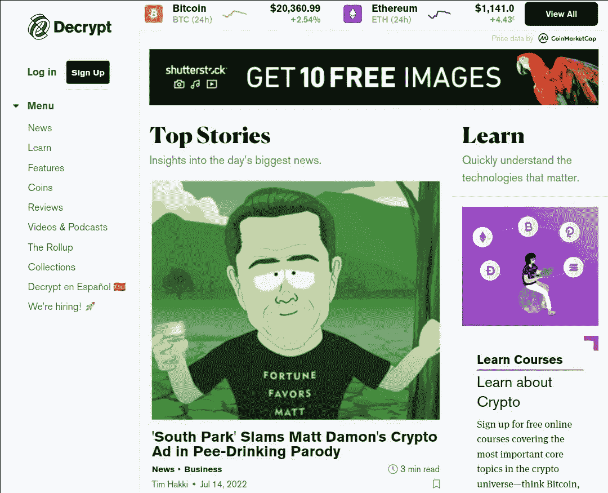

# 查找区块链和加密内容的 7 大平台

> 原文：<https://medium.com/coinmonks/top-7-platforms-to-find-blockchain-and-crypto-content-350b6967dce3?source=collection_archive---------35----------------------->

Image by Shubham Dhage on [Unsplash](http://unsplash.com)

在这篇文章中，您将了解具有深刻内容的平台，这些平台将拓宽您对加密货币和区块链技术的理解。

我相信你必须完成一系列培养兴趣的行动，才能投入到学习更多关于区块链技术和加密货币的知识中。过早行动是罕见的；在做出关于区块链和加密货币的决定之前，有些事情必须让你对其相关概念有一个基本的了解。

我们将探索 7 个平台，在这些平台上您可以找到与区块链和加密货币相关的知识、内容和材料。这些平台对任何区块链/加密货币新手都有帮助，对专业人士也非常有用。如果你打算成为区块链或加密货币社区的一员，你应该熟悉这些平台。

所以，事不宜迟，让我们开始行动吧！

1.  **Coinmarketcap**

Coinmarketcap is a crypto price board

一个结合了这么多东西的平台是[coin market cap](https://coinmarketcap.com/)；简直不可思议。在这个平台上，各种经验水平的密码爱好者都可以获得可靠的信息。

Coinmarketcap 最初是作为一个价格委员会创建的，以获取有关加密货币和相关数字资产的当前市场价格的信息。当你使用历史和现在的价格趋势进行市场分析时，它会派上用场。你还可以使用平台上提供的信息来确定一项数字资产是被高估还是被低估，以及是买入还是卖出。

该平台为您提供了价格模式的图形图像，因此您可以轻松了解价格随时间的变化。

使用该平台，您可以验证项目的真实性，包括其智能合同、市值、交易量和其他信息。

该平台提供了一个观察列表部分，在这里你可以跟踪你想要关注的加密货币项目，并跟踪尚未启动的项目，以便你知道它们何时启动。

该平台的扩展， [Coinmarketcap Alexandria](https://coinmarketcap.com/alexandria) ，是学习和理解区块链和加密货币相关概念的宝贵资源。最近的加密货币事件也在平台上回顾。该平台具有出色的用户界面和用户体验，使导航对每个人来说都很简单。

然而，Coinmarketcap 并不是你在做投资决策时应该使用的唯一资源；你应该把它和其他工具结合起来，进行尽职调查，彻底验证项目的可信度。

**2。硬币壁虎**

Coingecko is the go-to platform for doing crypto reserach

Coingecko 是一个加密货币价格板，详细介绍了各种加密货币项目，很像 Coinmarketcap。

在 Coingecko 上，你可以了解到一个项目的创始人或团队，项目启动的日期，它的历史高点和历史低点，市值，它的流通供应量，甚至它的最大供应量。

为了在投资加密货币项目之前进行更好的尽职调查，您需要将 Coingecko 添加到您的工具包中。

Coingecko 不仅为您提供加密货币的全面价格数据。您还可以将加密资产划分为元宇宙、NFT、DeFi、P2E 等类别。使用这种方法，您可能会从不同的角度来看待改进最多的项目。

使用 Coingecko，你还可以建立一个[投资组合](https://www.coingecko.com/en/portfolio)，让你方便地跟踪价格变动，并在一个地方收集你所有的加密货币。你不一定需要经常检查你的加密货币钱包，或者把你的资产放在一个热钱包里来跟踪它们的情况。甚至在平台上没有实际资产的情况下，该产品组合使您能够毫不费力地在一个视图中检查您的数字资产。

你可以访问平台上展示新加密货币项目的 Coingecko 部分，以找到新项目，进行研究，并选择你可能想要投资的项目。

该平台还连接到一个加密新闻部分，用于在加密货币事件发生时访问它们。

Coingecko 平台上有大量信息可供您用来加深对区块链和加密货币的理解，包括加密货币指南、播客、经过充分研究的文章、分析、报告等等。

**3。硬币电报**

Cointelegraph is a crypto news and price index platform

观察 [Cointelegraph](https://cointelegraph.com/amp) 的一种方式是加密货币新闻和价格指数的平台。

关于加密货币领域的最新消息，Celsius 故事的后续，以及 [web3](https://en.m.wikipedia.org/wiki/Web3#:~:text=Web%203%20(also%20known%20as,%2C%20and%20token-based%20economics) 的最新进展都可以在 Cointelegraph 上找到。

像传统媒体渠道一样，Cointelegraph 寻求成为向公众和密码社区传播有新闻价值的信息的渠道。

该平台还分为几个类别，这样你就可以很容易地找到你感兴趣的内容，如 NFTs，DeFi，区块链等。

这个平台提供的不仅仅是新闻；还有其他部分作为指南，并教用户“如何”的技能。新手可以花很多时间探索这一部分。

> 交易新手？试试[加密交易机器人](/coinmonks/crypto-trading-bot-c2ffce8acb2a)或者[复制交易](/coinmonks/top-10-crypto-copy-trading-platforms-for-beginners-d0c37c7d698c)

Cointelegraph 每年都会编制一份加密货币领域最具影响力的 100 人名单。这可以让你很容易地找到你希望跟踪的人的类型，以获取与加密相关的信息，并保持更新。

**4。新闻 Btc**

NewsBtc is a crypto media outlet

我相信这个平台的名字已经暗示了会发生什么。

尽管你无疑应该关注 [NewsBtc](http://NewsBtc.com) 以获取内容并了解比特币最新消息，但它涵盖了其他加密货币和区块链相关事件。

此外，该平台有一个专门用于分析加密货币项目的部分。你可以从中受益，因为它可以帮助你做出更明智的交易和投资决策。然而，这并不能代替不 DYOR。

使用这个平台，您还可以访问加密货币资源，以帮助了解加密空间。

**5。解密**

Decrypt simplifies crypto content

[Decrypt](http://Decrypt.co) 是一个提供各种内容的平台，包括加密新闻、专题文章、免费加密教育和硬币价格。

该平台的目标是让复杂的加密概念变得简单，让每个人都能理解，因此得名 DECRYPT。如果你问我，我会说这个平台正在这么做。您可以使用该平台简化复杂的区块链相关想法，并获得更好的知识，促进加密货币的稳定和简单的道路。

Decrypt 是一个完全支持去中心化 web 的平台，可以简化 web3 概念。Decrypt 由 [ConsenSys](https://consensys.net/) 资助。

如果你对 web3 及其进步感兴趣，这个平台会很有帮助。

**6。币安学院**

Binance Academy is a knowledge-hub for everything crypto

在简单易用的币安学院平台上，你可以找到所有与区块链技术和加密货币相关的内容类型。

该平台由全球最大的基于交易量的加密货币交易所[币安](https://www.binance.com/en)所有和支持。

该平台为您提供了通过其移动应用程序访问内容的选项。如果你不太喜欢呆在网上，你可以很容易地切换到它的移动应用程序来访问不同的内容。

能够明确请求你想在平台上看到的内容类型，使得学习区块链技术和加密货币变得极其灵活。告诉我一些比选择你消费的内容类型更简单的事情？

它的灵活性扩展到您可以在币安学院访问内容的语言数量；在该平台上，您可以访问多达 21 种不同语言的内容。

你可以在币安学院做很多事情。

**7。比特币杂志**

Bitcoin Magazine is a platform to find Bitcoin related information

关注比特币的印刷出版物并不多，但[比特币杂志](https://bitcoinmagazine.com/)却以某种方式成功地持续完成了这项工作。

《比特币》杂志既有印刷版，也有数字版。

该出版物由 Mihai Alisie、Matthew N. Wright、Vladimir Marchenko、Vicente S 和以太坊的 Vitalik Buterin 于 2012 年推出。

该杂志及其数字平台包括关于比特币及其支持创新的新闻和报道。

这是一个值得信赖的信息和跟上比特币及相关技术发展的重要资源。如果你正在寻找目前接受比特币的组织、国家和企业的信息，或者政府和监管机构对数字货币的使用实施禁令和规则的信息，比特币杂志是你的首选资源。

如果你不想被任何比特币和加密相关的事件弄得措手不及，那么你可能想让这个平台成为你的朋友。

**结论**

我希望您能在我强调的平台中找到价值。你可以充分有效地使用这些平台来增加你对区块链和加密货币的知识基础。

毫无疑问，还有其他平台可以支持你在这个领域的学习过程；我只选择了我使用的前 7 个。

这个领域有太多东西需要学习，你不应该限制自己。继续探索！

see ya!

> 加入 Coinmonks [电报频道](https://t.me/coincodecap)和 [Youtube 频道](https://www.youtube.com/c/coinmonks/videos)了解加密交易和投资

# 另外，阅读

*   [麻雀交换评论](https://coincodecap.com/sparrow-exchange-review) | [纳什交换评论](https://coincodecap.com/nash-exchange-review)
*   [美国最佳加密交易机器人](https://coincodecap.com/crypto-trading-bots-in-the-us) | [经常性回顾](https://coincodecap.com/changelly-review)
*   [在印度利用加密套利赚取被动收入](https://coincodecap.com/crypto-arbitrage-in-india)
*   [Godex.io 审核](/coinmonks/godex-io-review-7366086519fb) | [邀请审核](/coinmonks/invity-review-70f3030c0502) | [BitForex 审核](https://coincodecap.com/bitforex-review)
*   [5 款最佳免费加密货币制图工具](https://coincodecap.com/crypto-charting-tools)