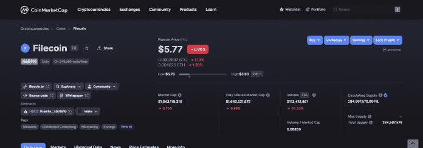

# 现在投资的 7 种最佳 Web 3.0 加密货币

> 原文：<https://medium.com/coinmonks/top-7-web-3-0-cryptocurrencies-to-invest-in-right-now-a14ae756a37b?source=collection_archive---------1----------------------->

Web 3.0 将致力于一个去中心化的协议，这是加密货币的基石。这意味着这将是一个互联网，你将拥有你的内容的所有权，也拥有展示给你的广告的所有权。

随着 web 3.0 的引入，web 技术的发展向前迈进了一大步。互联网通常被称为万维网或 WWW，此前已经经历了 Web 1.0 和 Web 2.0 阶段，今年我们可能会转向新的 Web 3.0。

你一定在每天的网上冲浪中看到过或听说过 Web 3.0 这个术语，并且可能想知道它是什么以及它会如何影响你。总的来说，加密货币、区块链和分散式协议的引入为当今的技术创造了许多可能性。在这篇文章中，我将简要解释什么是 Web 3.0，并向你展示与之相关的[7 大加密货币](https://36crypto.com/top-10-cryptocurrencies-to-invest-in-september-2022/)。

在我们深入讨论之前，让我们先简单了解一下什么是 Web 1.0 和 Web 2.0 技术。

# 什么是 Web 1.0？

Web 1.0，也被称为“只读 Web”，是互联网的第一个版本。这个版本的互联网只允许我们搜索和阅读信息，因此得名“只读”几乎没有内容生成和用户互动。

它主要由网页组成，没有额外的细节和工具，如我们在今天的互联网上看到的视觉效果、控件和表单。它在很多方面都没有互动性。**互联网的第一个版本从 1989 年持续到 2005 年。**

Web 1 时代的一些流行网站是 MySpace 和 LiveJournal。

# 什么是 Web 2.0？

Web 2.0 通常可以被看作是在 Web 1.0 时代互联网的方式和内容的转变。有了 2.0，互联网变得更加互动，联系更加紧密。新的升级允许用户完全参与到体验中，而不仅仅是消费信息。

它允许更多的内容创作，也允许与社交媒体等的引入建立更好的联系。它通常被称为万维网的第二阶段。

它带来了跨不同网站创建账户、发表评论以及分享内容的可能性。这也为网络应用的兴起提供了空间。**互联网的 Web 2.0 版本始于 2005 年。**

# 什么是 Web 3.0？

这是网络或互联网发展的第三个阶段。在这个阶段，网站和应用程序将以更像人类的方式提供和处理信息。这个版本的互联网将在分散协议上运行。

此外，机器学习和人工智能等技术将有助于 Web 3.0 的繁荣。TechTarget 在其文章中写道，“ *Web 3.0 将非常强调分散化应用，并广泛使用基于区块链的技术。*

Web 3.0 应用的典型例子包括 **Wolfram Alpha、苹果的 Siri、Steemit 和 Atlas。工作**等等。

# Web 3.0 什么时候开始？

目前还不能确定第三代互联网何时开始，但是我们已经看到了 Web 3.0 的一个方面。加密货币和区块链技术等方面已经在发挥作用。

尽管 Web 2.0 仍然主导着互联网，但 2022 年可能只是 Web 3.0 开始显现的一年。

以上的简要说明，相信你已经熟悉并了解了我们是如何走到这一步的。在这篇文章的下一部分，我将告诉你**最好的 Web 3.0 数字资产**到[投资](https://36crypto.com/5-steps-to-invest-in-cryptocurrency-a-beginners-guide/)。

# 投资 7 大 Web 3.0 加密货币

排名不分先后:

# 1.氦网络(HNT)

氦网络是一个区块链供电的分散式网络。这是一个无线物联网网络，使用与 HNT 相连的 LoRaWAN 系统。

它允许用户建立大规模的分散式无线基础设施，允许设备通过热点(由节点组成的网络)进行通信和传输数据。

网络的本地令牌是 HNT。购买和/或建设热点、运营网络节点以及挖掘 HNT 令牌的用户。

根据来自 [CoinMarketCap](https://coinmarketcap.com/currencies/helium/) 的数据， **HNT 今天的交易价格为 4.44 美元，在我写这篇文章的时候市值为 561，396，407 美元。**

# 2.Filecoin

Filecoin 希望让网络更加安全和高效。它运行分散的数据存储和协议。用户可以通过向网络出租其计算机硬盘上的空间来获得 FIL 令牌。

Filecoin 有几个好处，但最突出的是通过 NFTs 存储艺术等数字资产的能力。要参与，你只需要一个互联网服务和大量的磁盘空间。

您向 Filecoin 网络提供的空间越多，赢得的 FIL 代币就越多。根据来自 [CoinMarketCap](https://coinmarketcap.com/currencies/filecoin/) 、**的数据，FIL 代币的当前价格为 5.77 美元，** [**市值**](https://36crypto.com/understanding-crypto-market-cap-how-is-it-calculated/) **为 1643107061 美元。**

# 3.链环(链环)

Chainlink 支持创建具有真实世界数据的[智能合约](https://36crypto.com/what-are-smart-contracts-on-blockchain-technology-and-why-are-they-so-important/)。这是一个建立在以太坊上的分散式网络。Chainlink 被列入我们的 [**10 种最受欢迎的加密货币，仅次于比特币**](https://36crypto.com/what-is-an-altcoin-investing-for-beginners/) 。

它成为一个广泛使用的平台，因为它能够与任何区块链技术集成。随着时间的推移，原生硬币链接的受欢迎程度越来越高，是以太持有者持有最多的密码之一。

根据 CoinMarketCap 的数据，Chainlink 的**现价为 7.93 美元，** [**市值**](https://36crypto.com/understanding-crypto-market-cap-how-is-it-calculated/) **为 3，897，590，392 美元**。

# 4.非同质化通证

简称为 NFT 的不可替代令牌是存在于区块链上的加密资产。它们是具有唯一识别码的数字资产。

NFTs 在 2021 年第一季度获得了更多的关注，人们投资并创造了新的项目。它们是独一无二的，这就是为什么很多都很贵。随着对非功能性测试兴趣的增长，也出现了越来越多的骗局。

阅读我们关于常见 NFT 骗局以及如何避免它们的文章。一旦 NFT 被铸造出来，它们就可以在像 Opensea、Rarible 和 Magic Eden 这样的市场上买卖。

从长远来看，NFT 是很好的 Web 3.0 资产，值得投资以获得丰厚的利润。查看我们在[不可替代代币(NFT)](https://36crypto.com/nftnon-fungible-token/)上的帖子以了解更多信息，也可以查看 2022 年[十大最昂贵的 NFT 列表](https://36crypto.com/common-nft-scams-and-8-ways-to-avoid-them/)。

# [在这里继续阅读](https://36crypto.com/7-best-web-3-0-cryptocurrencies-to-invest-in-right-now/)

*免责声明:本文中表达的观点仅代表本文作者，绝不是财务建议。我们总是建议您在投资任何加密资产之前做好研究，因为它们以高波动性而闻名。无论你用以上信息做什么，都由你决定。*

你喜欢阅读我们定期带给你的内容吗？如果是，请点击“**拍手**按钮，增加其他人看到这个帖子并了解它的机会。

你最多可以鼓掌 50 次。你还在等什么？马上按下那个按钮。感谢您的阅读。

*原载于 2022 年 9 月 18 日 https://36crypto.com***。**

> *交易新手？试试[加密交易机器人](/coinmonks/crypto-trading-bot-c2ffce8acb2a)或者[复制交易](/coinmonks/top-10-crypto-copy-trading-platforms-for-beginners-d0c37c7d698c)*