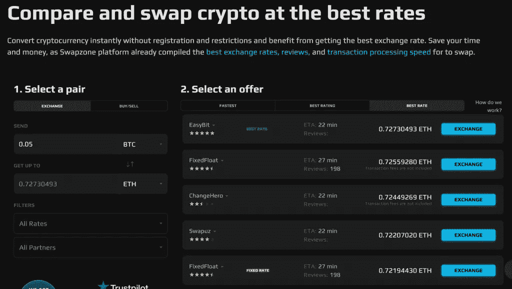
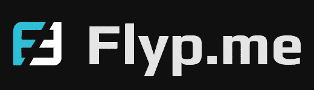

# 不包括 KYC 的 8 大加密交易所

> 原文：<https://medium.com/coinmonks/top-8-crypto-exchanges-without-kyc-d5e1797ff806?source=collection_archive---------5----------------------->

虽然加密空间以完全匿名开始，但近来加密交换变得比以往任何时候都更加集中。这意味着交易所现在在签约前后都有详细的了解客户程序。

现在，KYC 规则有了一席之地，因为这些程序将洗钱等犯罪扼杀在萌芽状态。然而，数以百万计的加密用户希望匿名，对这些弊病没有任何兴趣。此外，这不就是加密货币的意义吗，去中心化？

本文将探讨什么是 KYC，以及没有任何要求的顶级安全加密交换。

# 什么是 KYC？

KYC 是加密货币和金融服务提供商采用的一种系统，旨在审查他们平台上的用户。如前所述，该术语代表“了解你的客户”或“认识你的客户”。

一般来说，KYC 过程包括在获得潜在用户需要的服务之前向他们询问基本的个人信息。此外，一些服务提供商希望用户在授权访问之前经历更详细的验证过程。

这取决于这些服务提供商对其消费者负责的责任。这些服务提供商包括有时需要了解其客户的交易所和平台。

然而，其他一些加密交易所在允许人们使用他们的服务之前不要求任何验证。

他们利用了这样一个事实，即一些客户希望匿名或者不确定他们的数据的用途。这是一个足够好的理由，特别是在密码交易中，交易价值很高。

# 为什么有人想在加密中避免 KYC？

没有 KYC 的加密交换是去中心化生态系统的重要组成部分。他们为众多交易商提供服务，此外还带来一些显著的好处:

*   绝对分权
*   交易匿名
*   数据保密
*   身份的隐藏和保护

有了[没有 KYC 密码交易所](/coinmonks/no-kyc-crypto-exchanges-buy-crypto-without-kyc-3b2eda2b5397)可以提供的基本知识，我们可以继续讨论一些提供无验证服务的主要交易所。

# 不含 KYC 的前 8 大加密交换

以下是不含 KYC 的 8 大加密交易所列表

# [Swapzone](https://coincodecap.com/go/swapzone) —即时加密交换聚合器

Swapzone 凭借其易于使用和快速访问的系统名列榜首。像所有其他非 KYC 加密交易所一样，该平台允许新用户无需验证过程即可进入。不需要创建帐户；除了直接交易什么都没有。

它在移动和桌面上的干净简单的界面也使它成为初学者以及寻求整洁交易的专家的一个非常好的选择。

此外，该交易所还通过提供约 300 种随时可以交换的资产来促进现货交易。Swapzone 强大的聚合功能意味着用户可以获得他们想要交易的令牌的全面价格分析和估计。

虽然许多交易所在一些国家也受到限制，但 Swapzone.io 不受限制。非监禁交换支持在几个国家使用其服务，并且可能是对具有微妙的 KYC 法律的领土的喘息。

总而言之，swapzone.io 是最好的无 KYC 加密交易所之一。它在各方面都达到了平衡，并实现了其承诺的结果。

# 1.阿尔法卡什

Alfacash ，更名前原名 Alfacashier，是另一个不需要验证的平台。该交易所是一个非托管平台，支持 28 种不同的加密资产。非保管的意思是交易所要求你使用自己的钱包地址进行交易。

它所做的只是验证和执行您的交易，而不是为您创建一个钱包。这让您可以完全保管您的钱包，并对您的存款和取款交易有更多的控制权。

该平台与 Simplex 合作提供安全的支付系统。Alfacash 还让用户可以选择使用借记卡或信用卡来购买任何加密货币。

然而，Alfacash 有一个轻微的缺点:它不支持美国投资者，并且与其他交易平台相比收费更高。一些用户还抱怨安全事务缺乏透明度。

# 2.Swapuz

虽然 [Swapuz](https://swapzone.io/reviews/swapuz) 成立于 2018 年，但它在过去四年里已经建立了稳固的声誉。非托管交易所为用户提供了 300 多种代币。它还拥有快速交易时间和对客户的 24/7 支持。

最近，该交易平台还与 Swapzone.io 等其他机构合作，以改善其运营并提供更好的服务。

# 3.让我们交换

[LetsExchange](https://swapzone.io/reviews/letsexchange) 多少被认为是一个加密货币商店，而不是一个实际的交易所。这个平台为用户提供无限制的服务。它促进了两种不同加密货币之间的交易，并且不支持法定货币。

值得注意的是，加密平台没有交易上限。它允许交易任何金额，就像其他非 KYC 平台一样。

此外，它是非托管的，加密用户数据，并拥有一个坚实的安全系统。它还有一个详细的设计系统，利用 SmartRate 技术为用户提供最佳的交易价格。最后，交易所的总部设在塞舌尔、加拿大和立陶宛。

# 4.侧移

[SideShift](https://swapzone.io/reviews/sideshift) 是目前最进步的交易所之一。尽管它只支持大约 50 多个令牌，但它总是最先采用用户友好技术的公司之一。

该平台率先采用 PayJoin，这是一种因比特币交易而普及的支付系统。该方法，或者称为支付到端点(P2EP)，可以简化为用剩余零钱进行的交易支付。

SideShift 整合到其系统中的另一个新方法是流动支付。该系统是从比特币派生出来的 Blockstream 的创新。它通过用更有效的联邦共识模型取代传统的工作证明共识模型来工作。

SideShift 似乎选中了所有复选框。然而，其缓慢的交易时间(估计为 21 分钟)是需要考虑的。最后，这个平台由它的本地令牌$XAI 提供支持，它使用这个令牌来帮助桥接平台上的事务。

# 5. [Godex](https://coincodecap.com/go/Godex)

[Godex](https://swapzone.io/reviews/godex) 是 2017 年推出的另一个非 KYC 交易所。该交易所除了缺乏必要的验证之外，还允许你无限制地交易。

此外，它还提供了一个交易加密货币的大平台。客户可以获得 200 多个代币，此外，用户还可以使用会员计划。值得注意的是，Godex 的一个显著优势是，它可以在交易开始后的大约半小时内保持加密汇率不变。这样，你就可以保证交易时的费用几乎没有波动。

# 6.固定浮动

Fixed float 是一家总部位于塞舌尔的交易所，成立于 2018 年，旨在实现交易操作的完全自动化。该平台也是唯一支持比特币闪电网络的即时交换器。

它的力量取决于它所促进的速度、利率和安全交易。该交换仅支持大约 20 个加密令牌。它还运行一个中央系统，不支持菲亚特交易。

# 7.简单交换

这个基于马绍尔群岛的平台支持 300 多个令牌，以及入口交换。该公司于 2018 年推出，自那以来一直在稳步改善。

就像所有其他非 KYC 加密平台，它允许您使用其服务，无需验证。此外，没有最低存款限制，平台也不收取提现费用。

本机令牌$SWAP 通常为交易所的生态系统提供动力，通常作为对使用该平台的注册客户的返现奖励。然而，该平台不支持美国用户，也不是完全分散的。另一个缺点是它缺乏自动化和一些先进的交易工具。

# 8.Flyp.me

Flyp.me 在其交易所支持约 30 种代币。交易平台是由第一个基于网络的多币种钱包“神圣交易”开发的。

这个平台还有一个本地令牌$FYP，它向用户颁发这个令牌，赋予他们对重大决策进行投票的权力。它还有一些 API，客户端无需任何特殊权限就可以使用。

最后，就像我们讨论的所有其他方法一样，在使用之前不需要任何 KYC 验证。

# 底线:选择最好的非 KYC 加密交换

总之，所有这些非 KYC 平台都可以满足任何加密货币交易者的基本需求。然而，大量的选择可能会导致不可避免的混乱。在选择最适合你的衣服时，你可能想去各方面都不错的交易所看看。像 Swapzone.io 这样的非托管交易所在这方面发展良好。

要在 Swapzone 上开始您的第一笔交易，请点击[此处](https://swapzone.io/)。

> 交易新手？试试[密码交易机器人](/coinmonks/crypto-trading-bot-c2ffce8acb2a)或者[复制交易](/coinmonks/top-10-crypto-copy-trading-platforms-for-beginners-d0c37c7d698c)

*   [网格交易机器人](https://coincodecap.com/grid-trading) | [Cryptohopper 审查](/coinmonks/cryptohopper-review-a388ff5bae88) | [Bexplus 审查](https://coincodecap.com/bexplus-review)
*   [7 个最佳零费用加密交易平台](https://coincodecap.com/zero-fee-crypto-exchanges)
*   [氹欞侊贸易评论](https://coincodecap.com/anny-trade-review) | [霍比保证金交易](/coinmonks/huobi-margin-trading-b3b06cdc1519)
*   [分散交易所](https://coincodecap.com/what-are-decentralized-exchanges) | [比特 FIP](https://coincodecap.com/bitbns-fip) | [Pionex 评论](https://coincodecap.com/pionex-review-exchange-with-crypto-trading-bot)
*   [用信用卡购买密码的 10 个最佳地点](https://coincodecap.com/buy-crypto-with-credit-card)

