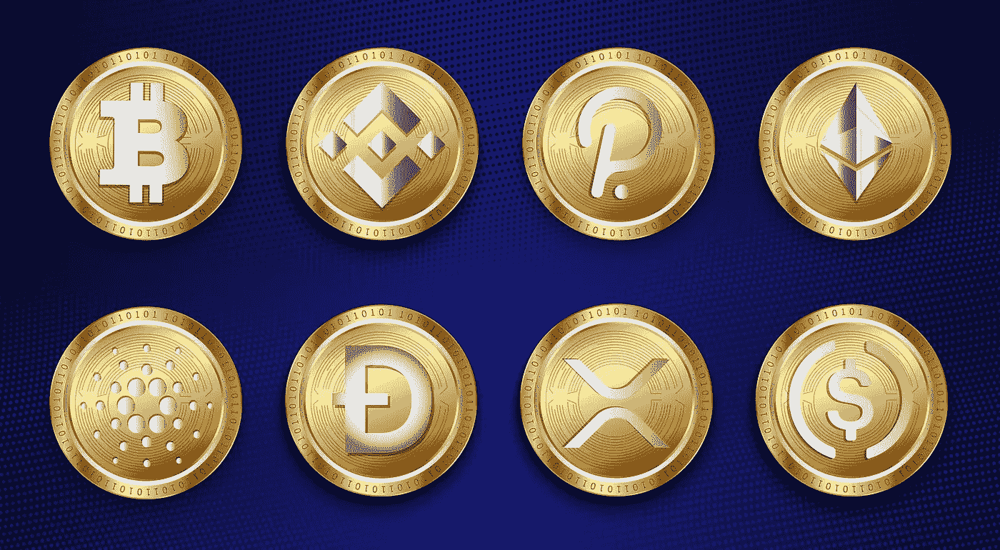

# 2023 年投资组合中必须拥有的 8 种加密货币

> 原文：<https://medium.com/coinmonks/top-8-cryptocurrencies-that-you-must-have-in-portfolio-in-2023-a992e16a0f5c?source=collection_archive---------5----------------------->

Source photo [Cryptocurrency Bitcoin Polkadot — Free image on Pixabay](https://pixabay.com/illustrations/cryptocurrency-bitcoin-polkadot-6928103/)

# 比特币(BTC)

毫无疑问，比特币的市值最大，也是使用最广泛的加密货币。它存在的时间更长，在此期间，它被证明是有弹性的，BTC 货币也显示了它们的价值。因此，我们的研究和许多加密市场分析师指出比特币(BTC)是……