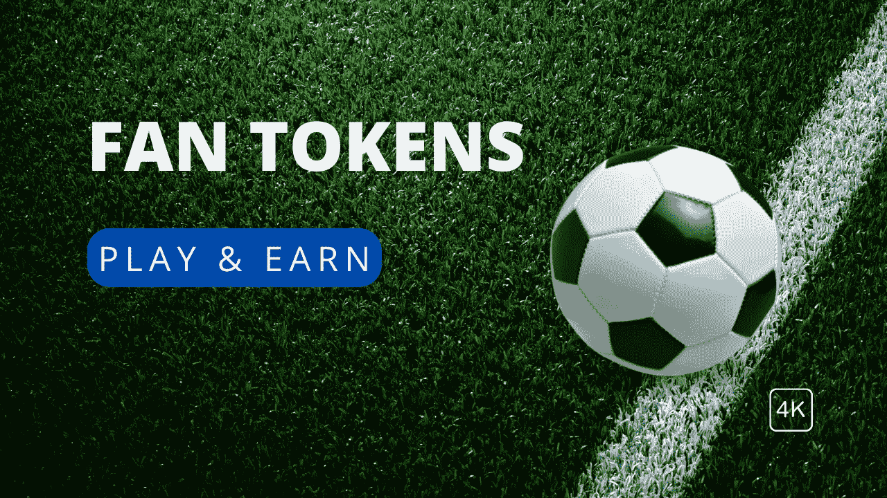

# 前 9 名球迷代币和 2022 年卡塔尔世界杯

> 原文：<https://medium.com/coinmonks/top-9-fan-tokens-and-fifa-world-cup-qatar-2022-4d6ccdfa156c?source=collection_archive---------7----------------------->

随着世界杯的升温，与各个国家足球队相关的球迷代币交易活动大幅增加。连锁数据显示，这些球迷代币的交易量增长了 10 倍。加密货币长期以来吸引了投资者的注意力，但粉丝代币正在占据上风。

## 什么是粉丝代币？

被指定为“粉丝代币”的加密货币使其所有者能够获得与粉丝相关的会员权益，如俱乐部决策投票、奖品、商品设计和专属体验。体育俱乐部、音乐爱好者俱乐部和其他团体可以使用它们来民主化和协调体验、任命俱乐部官员等等。粉丝代币是数字货币，可能支持也可能不支持比特币或以太坊的基本面价值。相反，他们根据支持者对加入团体和获得独特优势的重视程度来获得报酬。

此外，现在最流行的 [MEXC 粉丝代币平台](https://blog.mexc.com/category/hot-projects/fan-token/)，已经列出了超过 15 个粉丝代币。作为一个新手，你需要熟悉拉齐奥、波尔图和桑托斯这几个球迷标志。粉丝可以用这些代币参与有趣的活动，包括游戏化、专属激励、亲笔签名的产品以及非凡的品牌体验。

此外，币安上还有一个发放粉丝代币的平台。球迷支持自己喜爱球队的最佳场所是[币安球迷代币平台](https://www.binance.com/en/fan-token?ref=NO5BA53I&utm_source=fan-token&utm_medium=ft-faq-body&utm_campaign=Introducing-the-Binance-Fan-Token-Platform)！为了让球迷和支持者能够影响他们喜爱的球队并与之互动，该平台不断推出新的币安球迷标志和战略合作。

## 粉丝令牌是如何工作的？

与其他加密货币一样，粉丝代币也可以交易，但价格可能会根据市场状况和对硬币的兴趣程度而波动。此外，如果用户拥有特定数量的球迷代币，他们可以就他们喜欢的俱乐部的不同问题进行投票。

## 粉丝代币的好处

*   在俱乐部投票中投票，如选择问候歌曲、信息或球衣颜色。
*   当俱乐部球员在场时，只允许参加聚会。
*   俱乐部商品折扣和球员签名会。
*   直接现场参加培训课程。
*   这个体育场免费向所有人开放。
*   使用代币购买比赛门票和/或获得比赛门票折扣的能力。
*   获得俱乐部向象征性粉丝发布的任何 NFTs 的可能性。

有了这些好处，支持者可以感到与他们支持的球队更加紧密地联系在一起，并获得巨大的自豪感和威望。此外，如果俱乐部发展，球迷代币的价值可能会上升。此外，粉丝代币建立了一个精选的最忠实的崇拜者群体。他们给支持者一个积极参与俱乐部事务的新机会。拥有更多粉丝令牌的用户对团队更投入，对组织的影响力也更大。

通过币安足球热 2022 推广活动，球迷可以参加锦标赛并通过执行任务获得奖励。Gate.io 赞助 Gate.io 世界杯 NFT 收集赛，奖金池为 1 万美元和额外的奖金，而 MEXC 创建了一个推荐计划，潜在奖金池为 4.5 万美元

# 十大粉丝代币

## **1。******——**全球领先的区块链金融科技体育娱乐提供商&**

**奇利兹网络的一个标志是加密货币奇利兹(CHZ)。粉丝代币里的主角是奇里兹。在它的区块链上，奇利兹作为代币有一个独特的功能:奇利兹可以用来交换 NFT 或者不可替换的粉丝代币。人们可以在 Bitpanda 或比特币基地等交易所的帮助下买卖股票。此外，您可以在各种在线交易平台上购买 Chiliz。例如，在 Socios 应用程序中获取粉丝令牌。在 Bitpanda、比特币基地或币安等交易所，你仍然可以购买 CHZ。**

## **2.[**BFT**](https://www.mexc.com/exchange/BFT_USDT?inviteCode=17Kqs)**——**巴西国家足球队球迷代币价格**

**巴西球迷标志(BFT)是五届世界杯冠军巴西国家足球队的官方球迷标志。它也被认为是足球场上最成功的国家队。除了数以百万计的巴西球迷，过去和现在的球队在全球范围内一直拥有坚实的球迷基础。BFT 于 2021 年 8 月 25 日发布，旨在引发各种忠诚度计划和活动，为全球投资者和体育爱好者提供独特的特权体验。**

**[巴西国家足球队球迷代币](https://www.mexc.com/exchange/BFT_USDT?inviteCode=17Kqs)在过去 24 小时内上涨了 3.15%。它的流通市值为 7，253，784 美元，流通供应量为 29，840，000 BFT 币。此外，它的最大供应量为 100，000，000 BFT 硬币。**

**这种代币在 9 月 28 日达到顶峰，价格为 1.5 美元。自世界杯开始以来，代币一直处于低位。然而，即使在 11 月 25 日战胜塞尔维亚之后，代币的价格也没有上涨。**

## ****3。**[**SNFT**](https://www.mexc.com/exchange/SNFT_USDT?inviteCode=17Kqs)**——**西班牙国家足球队球迷令牌**

**西班牙国家足球队球迷令牌是 BRC-20 智能合同，旨在彻底改变球迷体验。借助 Token，西班牙国家足球队允许球迷参与独家调查和活动，创建数字收藏，购买 NFT，并享受与球迷奖励、任务和精彩体验相关联的游戏化和任务功能。**

**[西班牙国家球迷令牌](https://www.mexc.com/exchange/SNFT_USDT?inviteCode=17Kqs)在过去 24 小时内下跌 4.34%。它的流通市值为 2，905，273 美元，流通供应量为 24，350，000 瑞士法郎。此外，它的最大供应量为 100，000，000 瑞士法郎。**

**西班牙国家球迷币在过去几个月中表现出波动性，并在 11 月 18 日世界杯开始前两天达到 0.53 美元的高点。然而，该代币在 9 月 28 日打破了纪录，当时售价为 0.82 美元。即使在以 7-0 战胜哥斯达黎加之后，SNFT 仍下跌了 6.35%，目前为**

**截至本文撰写时为 0.08692 美元。**

## ****4。**[**ARG**](https://www.mexc.com/exchange/ARG_USDT?inviteCode=17Kqs)**——**阿根廷足协球迷令牌**

**阿根廷足协球迷令牌，简称 ARG，是阿根廷国家足球队的官方令牌。这是一个实用的象征，让阿根廷球迷象征性地对俱乐部施加影响。这是即将到来的世界杯冠军赛最受球迷欢迎的纪念品之一。**

**[阿根廷足协球迷 Token](https://www.mexc.com/exchange/ARG_USDT?inviteCode=17Kqs) 过去 24 小时下跌 4.00%。它的流通市值为 13，444，111 美元，流通供应量为 3，746，912 阿根廷金币。此外，它有一个 20，000，000 ARG 硬币的最大供应量。**

## ****5。[**POR**](https://www.mexc.com/exchange/POR_USDT?inviteCode=17Kqs)**——**葡萄牙国家队范令牌****

**葡萄牙国家队球迷代币是一种在 Chilliz 平台上运行的加密货币。像任何其他球迷代币一样，它赋予代币持有者影响球队决策的权力。这篇文章将讨论你需要的关于 POR 粉丝代币的一切，以及购买 POR 代币的指南。**

**葡萄牙国家队球迷代币目前供应量为 20，000，000 张，发行量为 4，001，877 张。葡萄牙国家队球迷代币的最后已知价格为 3.23425195 美元，在过去 24 小时内下跌了-3.19 美元。它目前在 12 个活跃市场上交易，在过去 24 小时内交易了 2，852，598.22 美元。**

**葡萄牙队的球迷代币在 11 月 18 日达到了 7.22 美元的历史新高。许多人在世界杯开始前购买了葡萄牙国家队球迷代币。炒作似乎已经降温，因为代币下跌超过 30%，目前价值 2.91 美元。值得一提的是，葡萄牙队赢了加纳，但代币价格走低。**

## ****6。**[**ITA**](https://www.mexc.com/exchange/ITA_USDT?inviteCode=17Kqs)**——**意大利国家足球队球迷令牌**

**意大利球迷代币是由卫冕欧洲冠军意大利足球联合会和奇里兹共同创造的。Chiliz 是全球领先的体育和娱乐行业区块链解决方案。去年早些时候，他们宣布在 Socios 上推出 ITA 粉丝代币，从那时起，每个人都急切地等待着意大利代币。**

**意大利国家足球队球迷 Token 在过去 24 小时内上涨了 4.61%。但是，它有一个不可用的活市场上限，流通供应不可用。此外，它的最大供应量为 30，000，000 ITA 硬币。**

**欧洲冠军意大利在巴勒莫的附加赛中被北马其顿击败，因此没有参加 2022 年世界杯。意大利现在已经连续第二次未能获得世界杯参赛资格，受此影响，ITA 球迷 Token 的价格严重下跌。截至本文撰写之时，它目前的定价为 1.16 美元。**

## ****7。** [**S.S 拉齐奥球迷令牌**](https://www.mexc.com/exchange/ITA_USDT?inviteCode=17Kqs)**

**[Lazio Fan Token (LAZIO)](https://www.mexc.com/exchange/ITA_USDT?inviteCode=17Kqs) 是币安的粉丝代币——全球最大、最受欢迎的加密货币交易所。拉齐奥队是意大利最负盛名和历史最悠久的俱乐部之一，拥有悠久的历史和最近参加的冠军联赛。拉齐奥拥有两个意甲冠军，七个意大利杯冠军，三个意大利超级杯冠军，一个欧洲优胜者杯和欧洲超级杯冠军。币安是世界上最大的加密货币交易所，由现任首席执行官赵昌鹏发起。**

**世界杯开始时，代币在最后一周价格下跌了 30%，目前定价为 4.78 美元。**

## ****8。** [**FC 波尔图球迷令牌**](https://www.mexc.com/exchange/PORTO_USDT?inviteCode=17Kqs)**

**[FC 波尔图球迷令牌(PORTO)](https://www.mexc.com/exchange/PORTO_USDT?inviteCode=17Kqs) 是 BEP-20 网络上的一个球迷令牌。作为币安球迷代币公用设施代币，波尔图旨在奖励波尔图足球俱乐部的球迷，这是一支参加葡萄牙超级联赛的知名足球队。波尔图足球俱乐部成立于 1893 年，是葡萄牙第二富有的足球队，以其庞大的球迷群而闻名。PORTO token 于 2021 年 11 月 6 日推出。通过持有波尔图令牌，球迷可以通过投票决定足球俱乐部的活动，并获得独家折扣和俱乐部奖励。**

**代币目前的交易价格为 3.71 美元，但上周有所下跌。世界杯开始前，代币交易价格上涨，11 月 20 日下跌。**

## ****9。** [**桑托斯 FC 球迷令牌**](https://www.mexc.com/exchange/PORTO_USDT?inviteCode=17Kqs)**

**[桑托斯足球俱乐部球迷代币(SANTOS)](https://www.mexc.com/exchange/PORTO_USDT?inviteCode=17Kqs) 是由桑托斯足球俱乐部和币安 Launchpool 合作推出的同名足球队的球迷代币。Santos FC，又名 Santos Futebol Clube，是一家位于圣保罗的巴西体育俱乐部，总部位于 Vila Belmiro。**

**定价为 6.50 美元的令牌在过去七天里也出现了类似的下跌，价格下跌了 21%。**

**期待已久的四年一度的足球赛事终于在 2022 年 11 月 21 日拉开帷幕。作为世界上最大的足球比赛，该锦标赛预计将吸引全球超过 50 亿观众。与以往的比赛不同，今年的足球嘉年华有许多来自 crypto 的赞助。例如，Crypto.com 国家足球队的球衣上印有币安的标志，并且已经成为该赛事的官方赞助商。这不是 crypto 与世界上最重要的体育赛事之间的第一次合作。回到 2018 年，市场看到了与锦标赛相关的 cryptos。**

**在足球的背后，盛宴是巨大的收视率和无价的商机。许多参加比赛的球队和俱乐部今年都发行了球迷代币。随着趋势事件的展开，粉丝代币可能会赶走目前市场的低迷，并开始新的加密投资热潮。**

****