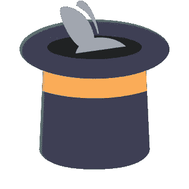
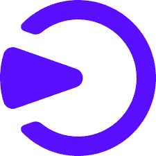

# 开发者学习 Web3 并从中获利的 9 大平台

> 原文：<https://medium.com/coinmonks/top-9-platforms-for-developers-to-learn-web3-and-earn-73baa9c6187c?source=collection_archive---------50----------------------->

Top web 3 platforms

在这篇文章中，我整理了一个 9 大网站的列表，在这些网站上你可以免费了解 Web3，同时还可以赚钱。

互联网正在快速演变为 [Web 3.0，](https://www.nigeriabitcoincommunity.com/web-3-0/)一个去中心化的互联网。

Web3 上有一个巨大的赚钱机会，许多人都在利用它。

那么，你想成为一名 Web3 开发者吗？你有兴趣在学习 Web3 的同时获得奖励吗？

这篇文章是给你的。我建议你读完这篇文章。

[Web3 基金会团队](https://medium.com/u/d6954f1a46d9?source=post_page-----73baa9c6187c--------------------------------)

# 帖子摘要

*   学习 Web3 和赚取利润的 9 大平台

1.  [层叠](#8b45)
2.  [LearnWeb3](#c413)
3.  [拉比托尔](#2684)
4.  [任务书](#d53d)
5.  [Web3 大学](#38f3)
6.  [构建空间](#5fd0)
7.  [指针](#d864)
8.  [蛋糕定义](#390c)
9.  投资组合

*   [结论](#ec62)

我们开始吧！

# 学习 Web3 和赚取利润的 9 大平台

# 1.（飞机等待依次着陆时的）定高分层盘旋

StackUp

我名单上第一个学习 Web3 和 earn 的平台是 Stackup！

Stackup 是一个平台，使 Web3 爱好者能够了解 Web3，并通过参加不同的任务和活动获得奖励。

此外，它允许用户与世界各地的其他开发人员联网和联系。

以下是加入堆叠的步骤:

*   加入 [StackUp 的不和](https://discord.gg/3x3h2z6A63)。
*   在不和谐小组中，进入“规则频道”，阅读并接受规则。
*   接下来，进入“堆叠早期访问代码”并获取您的访问代码。
*   转到 StackUp 网站，使用代码和密码登录。

登录后，您可以通过点击“学习”来访问您的课程。

StackUp 涵盖了 Python、Rust 和 Golang 的课程。每门课程都附有“经验值”。

此外，您还可以通过完成“活动”或“任务”来赚取现实世界中的美元和 USDC 币。

# 2.LearnWeb3

LearnWeb3

这是另一个很棒的网站，你可以在学习 Web3 的同时获得奖励！

LearnWeb3 是一个致力于 Web3 知识的免费在线教育平台。

该平台的目标是将尽可能多的开发者引入 Web3。

平台涵盖了、、道、混合集成开发环境、加密货币、可靠性等课程。

这些课程被设计成赛道。

通过完成课程和回答小测验，您将获得“NFT 知识证明”作为证书。

如果需要帮助，您也可以联系社区中的其他开发人员。

要使用 LearnWeb3，您需要设置您的个人资料并连接到支持的加密钱包。

# 3.兔子洞

RabbitHole

[兔子洞](https://medium.com/u/97c0983a1ace?source=post_page-----73baa9c6187c--------------------------------)

我名单上的第三个平台来了！

RabbitHole 提供了很好的教育资源来指导你的 web3 之旅。

它的使命是让世界上的每个人都能更容易地使用加密技术。

该平台提供两种产品:技能和任务。

在“技能”课程中，你可以参加 NFT、道和 Defi 课程，以加深你对 Web3 的了解并获得“资格证书”。

在“任务”中，您将使用您的凭证解锁任务，通过完成任务获得 NFT 和令牌。

要使用 Rabbithole，请访问网站[此处](https://rabbithole.gg/)并连接您的钱包。

此外，您需要转到“设置”并完成您的“BrightID”验证，然后才能访问平台。

# 4.问题簿

Questbook

排在第四位的是“Questbook ”,这是 Web3 的又一个很棒的学习网站。

Questbook 在 Web3 和区块链技术上开发了内容。

平台上提供的课程包括区块链基础知识和如何在以太坊、[索拉纳](https://www.nigeriabitcoincommunity.com/solana-review/)、Flow、Near 和 [Polygon 上构建。](https://www.nigeriabitcoincommunity.com/polygon-matic/)

令人印象深刻的是，Questbook 与这些项目合作，向用户提供高质量的内容。

每堂课结束时，你必须完成一项任务，在 NFT 领取奖励。

Questbook 已经发展成为一个由超过 15，000 名社区网络开发者组成的社区，所有人都通过网站的 Discord 组联系在一起

# 5.Web3 大学

Web3 University

[Web3 大学](https://medium.com/u/50dfffe434dd?source=post_page-----73baa9c6187c--------------------------------)

Web3 大学是另一个学习 Web3 的好平台。

这是一个由从事 Web3 学习和教学的开发者组成的免费开放社区。

Alchemy 与 Polygon、a16z 和 optimistry 等其他大型加密公司合作锚定该平台。

Web3 大学拥有超过 200，000 名开发人员，旨在为 Web3 爱好者建立最大的加密社区。

您可以获得关于如何编写智能合同、编写 NFT 代码和构建 DApps 的可靠内容和视频教程。

此外，通过注册 Web3 大学，您可以获得一个“为期 10 周的自定进度计划”，完成一个项目可以获得免费的 NFT。

# 6.建筑空间

Buildspace

对于有兴趣学习 Web3 并从中获利的开发人员来说，这里是另一个令人兴奋的空间。

Buildspace 是一个网站，引导你进入 Web3 的成长之旅，无论你是一个初学者还是一个经验丰富的开发者，都希望在 Web3 中开始一个新项目。

这个平台已经有超过 6 万名开发者注册。

一旦你注册了，你就加入了一群志同道合的开发者，你可以和他们分享你的进步。

Buildspace 上的课程有 Solana Pay，，DAO，Solana，Flow，Polygon。

在每门课程结束时，你会被要求根据你所学的知识创建一个项目。

当你完成这个项目时，你的钱包里会有一个 NFT，可以在 OpenSea 上看到。

# 7.指针

Pointer

在 7 号，我们有一个指针！

Pointer 是一个为 Web3 开发者设计的网站。

您可以通过 Pointer 访问以下课程:

*   固态
*   建造一个 NFT 厕所
*   用多边形创建一个 Web3 论坛
*   索拉纳佩
*   在堆栈上创建索引

指针课程被很好地简化了，并且是交互式的。

在每门课程结束时，你会得到帮助，根据你所学的课程建立自己的项目。

此外，你将赢得一个 NFT，并可能完成该项目的一些令牌。

要加入 Pointer 的开发者，点击[登录](https://www.pointer.gg/)，创建一个 GitHub 账户。

此外，要申领您的 NFT，请在您的个人资料中进入“设置”并添加加密钱包。

# 8.蛋糕 DeFi

Cake Defi

接下来是蛋糕 DeFi！

Cake DeFi 是一个集中式平台，提供 DeFi 服务，如赌注、[、流动性挖掘**、**](https://www.nigeriabitcoincommunity.com/yield-farming/) 借贷等。

此外，Cake DeFi 旨在向用户介绍区块链、比特币和 Web 3.0。

说到这里，它提供了上述主题的教育教程。

当用户浏览本教程并回答测验时，他们将获得代币作为奖励。

要访问教程，请访问[网站](https://cakedefi.com/)，注册并点击“学习”开始。

# 9.发展组合

Devfolio

我单子上的最后一个是 Devfolio。

Devfolio 是一个平台，旨在让组织和举办黑客马拉松活动对项目来说没有压力。

黑客马拉松是一个协作性的编码活动，开发者聚集在一起分享想法并构建一个新项目。

此外，开发者还会在黑客马拉松结束时获得奖励。

Devfolio 已经举办了许多 Web3 黑客马拉松，包括 Polygon fellowship、Hackodisha 2.0、ETHIndia 等等。

要获得参加这些黑客马拉松的机会，请在 [Devfolio](https://devfolio.co/) 上创建一个帐户，并定期查看要参加的黑客马拉松。

让我们在下一节见面吧！

# 嘿！

Ctmastery

***如果您想学习如何交易加密货币并从中获利，请前往 www.ctmastery.com******参加我们的加密交易大师课程。*
*还有，加入我们的电报社区***[***https://t.me/ctmastery***](https://t.me/ctmastery)**。**

# 结论

Web3 是一个迷人的空间！

有很多原因可以解释为什么你应该建立在 Web3 上。

这是互联网的未来，为开发者提供了许多优势。

因此，在学习 Web3 的过程中，您可以获得前 9 大平台。

本帖到此结束。是时候收到你的来信了。

你喜欢边学习 Web3 边赚钱的想法吗？

我是否错过了任何学习 web3 并获得收入的顶级平台？

把你的想法写在下面的评论框里。

别忘了点击“SM”按钮，与更多人分享这些知识。干杯！

*原载于*[*https://www.nigeriabitcoincommunity.com*](https://www.nigeriabitcoincommunity.com/learn-web3-and-earn/)

> 交易新手？尝试[加密交易机器人](/coinmonks/crypto-trading-bot-c2ffce8acb2a)或[复制交易](/coinmonks/top-10-crypto-copy-trading-platforms-for-beginners-d0c37c7d698c)