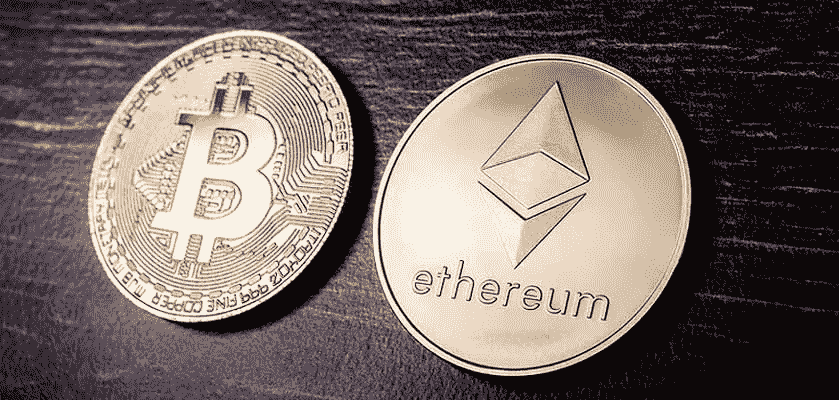
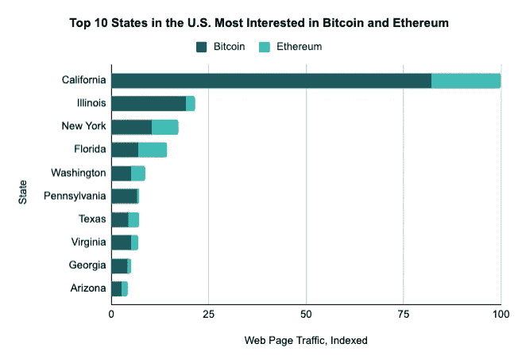
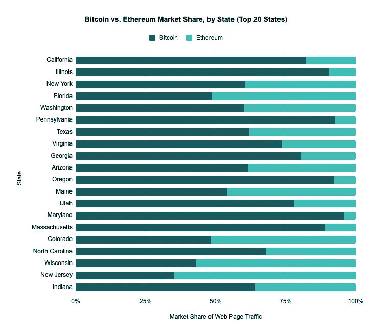

# 最喜爱比特币和以太坊的美国各州

> 原文：<https://medium.com/coinmonks/top-bitcoin-and-ethereum-eth-loving-us-states-8a8d4a82673f?source=collection_archive---------45----------------------->

当谈到比特币和以太坊(ETH)时，并不是美国所有的州都同意这一点。从佛罗里达的醉鬼兄弟到硅谷的不明科技生物，人们的看法可能各不相同。说到观点，最近的一项研究揭示了美国对加密最感兴趣的前 10 个州。具体来说，研究主要集中在比特币和以太坊(ETH)这两种领先的资产。结果和人们预期的差不多。在加州的带领下，纳税的，热爱无家可归者的，当然还有害怕 Covid 的公民们肯定喜欢他们的密码。但是，搬到奥斯汀的前加州人把孤星州放在了前十名的名单上，这与“不要加州，我的德克萨斯”正好相反。让我们仔细看看[研究](https://www.coingecko.com/learn/top-10-states-in-america-most-interested-in-bitcoin-ethereum)。

# 穿过州界

领先的加密货币数据聚合公司 CoinGecko 公布了对比特币和以太坊(ETH)感兴趣的前 10 个美国州。显然，加州遥遥领先于榜首，但其他地方可能会让你吃惊(或不吃惊)。

研究集中在 5 月 2 日到 8 月 21 日之间的比特币和以太坊。据此，该公司测量了这两项资产在其平台上的网络流量，以发现最高的兴趣来自哪个州。除了排名第一的加州，伊利诺伊州和纽约州分别位列第二和第三。

然而，加州在 CoinGecko 上拥有超过三分之一的比特币(BTC)和以太坊(ETH)网络流量。因此，当中央银行系统崩溃时，加州人可能是准备最充分的。

“加利福尼亚州超过所有州，占美国 CoinGecko 上比特币和以太坊网页总流量的 43%，表明对这些加密货币的兴趣最高。

继加州之后，前十名的其他竞争者是伊利诺伊州、纽约州、佛罗里达州、华盛顿、宾夕法尼亚州、德克萨斯州、弗吉尼亚州、乔治亚州和亚利桑那州。"

# 比特币(BTC) Vs 以太坊(ETH)

有趣的是，比特币的统治地位在美国各州都得以延续。然而，在科罗拉多州、威斯康星州、新泽西州和佛罗里达州，以太坊的市值更大。

在总共 20 个州中，BTC 占据了 75%以上的市场份额。这些州包括加利福尼亚、伊利诺斯、宾夕法尼亚、俄勒冈、佐治亚、马里兰、犹他和马萨诸塞州。

当然，这场 BTC 与 ETH 的争论很快会变成一场政治辩论。在很大程度上，光谱的左侧将选择以太坊(ETH)作为使用股权证明的绿色加密货币。另一方面，右翼 w 站在支持 BTC 的对立面。

“[顶级比特币和以太坊(ETH)热爱美国各州](https://blog.hi.exchange/us-states-interested-in-ethereum-eth-and-bitcoin/)”最初发表在 [HiExchange 博客](https://blog.hi.exchange/)上，作者是同一位作者[尼玛·阿斯加里](https://blog.hi.exchange/author/nimaasgari/)。

> 交易新手？尝试[加密交易机器人](/coinmonks/crypto-trading-bot-c2ffce8acb2a)或[复制交易](/coinmonks/top-10-crypto-copy-trading-platforms-for-beginners-d0c37c7d698c)