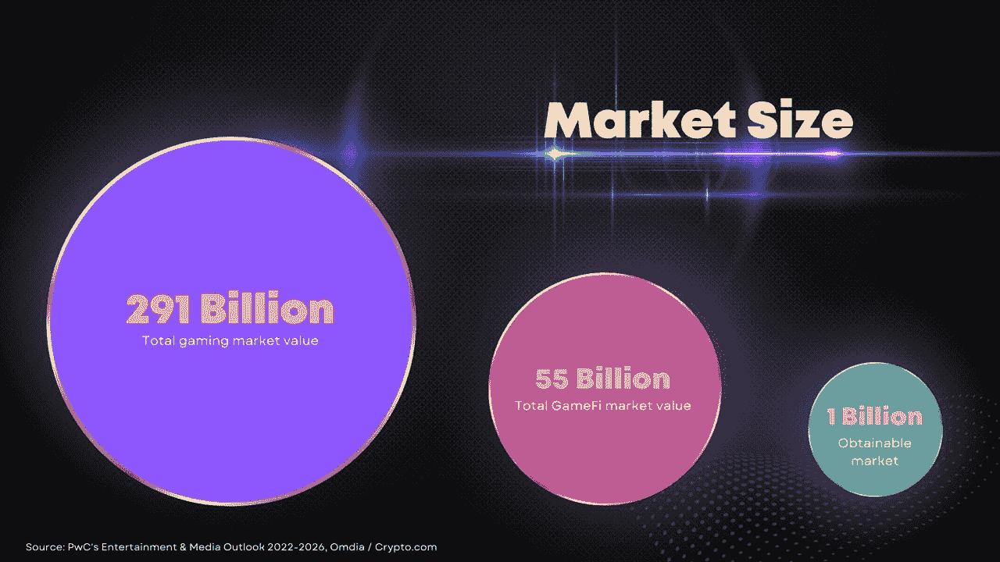
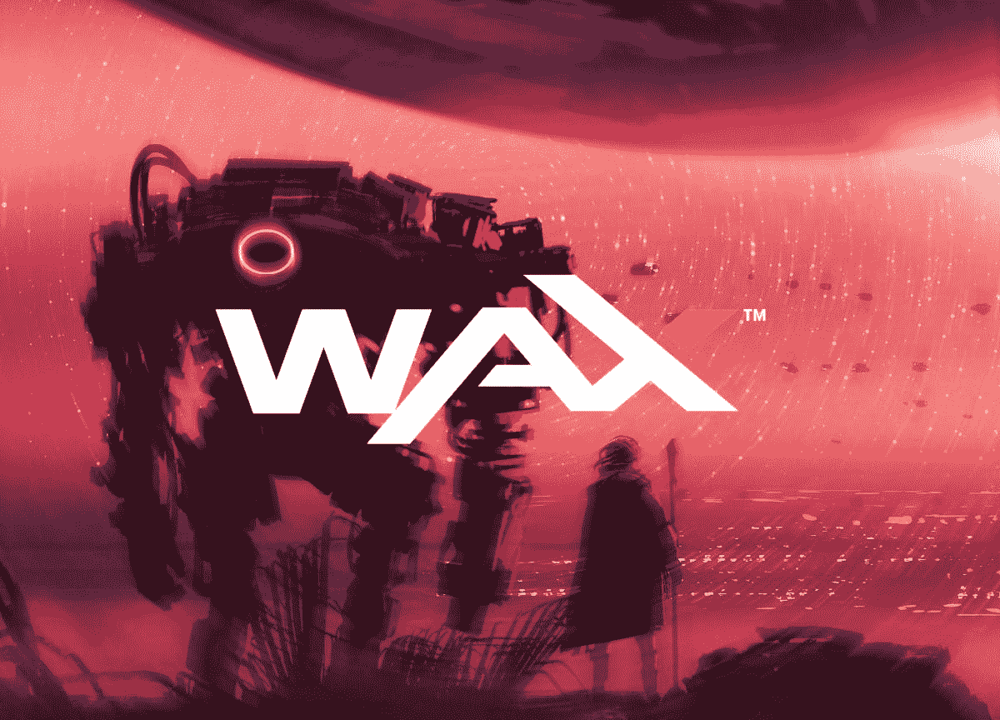
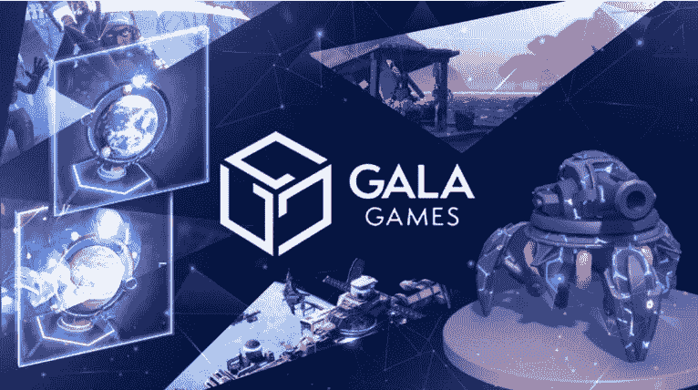
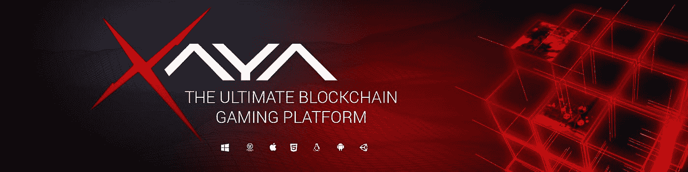
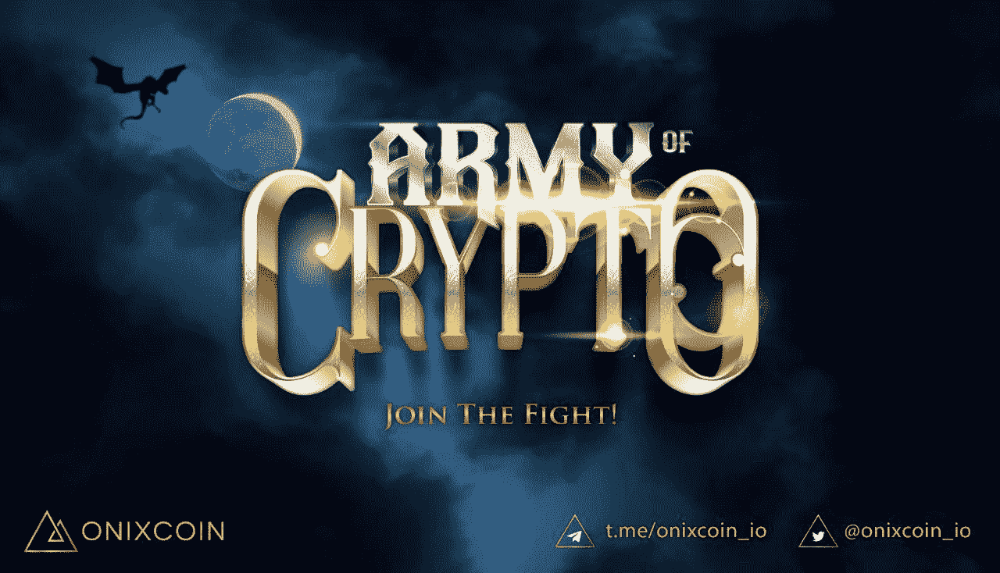
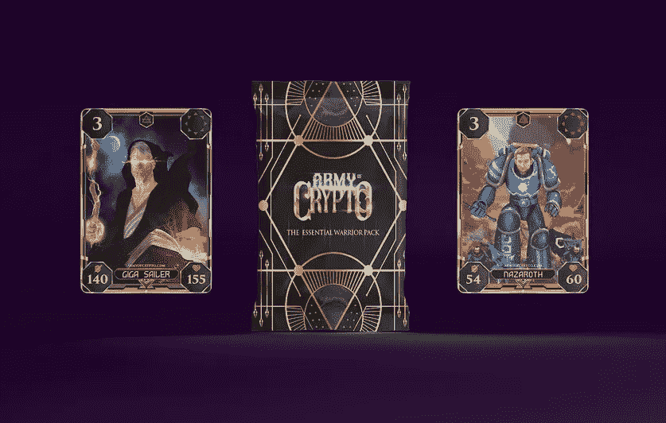

# 面向独立游戏开发者的顶级区块链游戏平台

> 原文：<https://medium.com/coinmonks/top-blockchain-gaming-platforms-for-indie-game-developers-192f4f1e9566?source=collection_archive---------12----------------------->

Web 3 游戏时代

现在，世界已经见证了区块链技术的崛起，我们可以一窥 web 3 游戏的未来以及它对玩家和开发者的潜力。Web 3 游戏市场(Game-Fi)的价值估计约为 550 亿美元，传统游戏市场的价值估计约为 2910 亿美元。

Game-Fi Market

这是对正在进行的开发和正在建立的基础的证明，以引入这种新的游戏方法。传统游戏社区正在缓慢但肯定地更加关注游戏保真市场正在做的工作，更多的怀疑者正在接受这项技术的好处。年轻一代引领着 web 3 游戏的早期采用，并通过参与生态系统和为开发者提供反馈来建立一个可靠的项目，从而促进了这一领域的发展。

这种开发的大部分主要是由大多数人认为的独立开发人员完成的。这些个人或小团队负责我们今天在 web 2 时代看到的创造性想法，并且现在正在引领 web 3 革命。大多数时候，这些人在没有资金或曝光的情况下完成大部分工作，但有了区块链技术，这个问题就成为过去。让我们来看看一些为独立游戏开发者和独立游戏爱好者提供服务的游戏平台。

# 蜡

WAX Blockchain

[WAX 区块链](https://on.wax.io/wax-io/)自 2015 年以来一直存在，近年来开始成为游戏开发者选择合作的平台之一。WAX(全球资产交易所)是世界上使用和交易最多的区块链生态系统之一，用于 NFT、dApps 和视频游戏，为世界上任何地方的任何人提供最安全和最方便的方式来创建、购买、销售和交易虚拟和实物项目。

WAX 是领先的 NFT 网络之一，已经成功地促进了来自合作伙伴的数百万 NFT 的交易，这些合作伙伴包括 Topps(美国职业棒球大联盟)、Capcom(街头霸王)、Funko、Atari、索尼的 Funimation、著名电影(公主新娘和电锯惊魂)、世界知名艺人(Deadmau5、Weezer 和威廉·夏特纳)等等。

WAX 创新了[vIRL NFT](https://twitter.com/wax_io/status/1417242848555057160)，以 Atomic 为基础，Atomic 是最受欢迎的 NFT 蜡标准，与其他区块链上的标准 NFT 不同。它们具有一系列动态功能，包括应用程序/视频游戏集成、营销工具和 V-commerce 功能，将虚拟 NFT 与现实世界的物品联系起来，这样你就可以转移所有权，而无需实际运送任何东西，直到收藏家准备好将其作为自己的财产。每一个维尔 NFT 都是在节能和碳中性蜡区块链上铸造的，将环境放在第一位。

对于游戏开发者来说，WAX 是一个更实惠的解决方案，它可以吸引人们对你的项目的关注。

# 节日游戏

GALA Games

近年来，GALA Games 已经开始建立声誉，发布了一些目前最好的 Web 3 游戏。这个平台已经有 6 个以上的游戏，包括蜘蛛坦克和米兰多斯，它们在很短的时间内建立了相当多的粉丝群。Gala Games 在 2021 年增长了 30，000%以上，成为去年表现最好的公司之一。它的使命是创造人们真正想玩的区块链游戏。

Gala Games platform 可以为独立游戏提供急需的曝光率，并进行大量营销，以占领广阔的市场。该平台建立在以太坊和币安智能链上，是游戏开发者更昂贵的选择之一。

# 夏亚

XAYA Gaming Platform

[XAYA 游戏平台](https://xaya.io/)，为您的游戏创作提供强大、高度可扩展的区块链后端解决方案。创建真正的区块链游戏和高度复杂的分散式应用程序，并为几乎无限的用户进行扩展。XAYA 让你自由地以自己的方式开发你的游戏！全新设计，采用游戏通道技术，实现几乎无限的交易。运行您的游戏完全在区块链没有中央服务器，并选择任何语言，你想。你的游戏。你的方式。

XAYA 平台上的顶级游戏之一是 Taurion，一个真正的区块链 MMO。除了区块链，金牛星是一个非常酷的游戏。4X、RTS 和人类采矿的元素结合在一起，形成了一个前所未有的新游戏。

设定在未来 1000 年，玩家探索行星 Taurion 寻找他们的财富，组成联盟并互相战斗。

XAYA 是另一个为独立游戏开发者提供服务的平台，使得在区块链上部署游戏变得简单。

# 洋葱币

Onixcoin Blockchain

这份名单上的最新平台， [Onixcoin Blockchain](https://onixcoin.io) ，专注于独立游戏开发者，并提供一个负担得起的平台，让他们进入 Web 3 游戏业务。这款游戏区块链于 2021 年 10 月推出，此后一直持续增长。作为游戏开发者的最新区块链平台，它也是最实惠的。

在这个平台上推出的第一款游戏名为“密码大军”(Army of Crypto)，这是一款战术收藏卡牌游戏，以埃隆·马斯克(Elon Musk)、迈克尔·塞勒(Michael Saylor)和查理·李等知名密码人物为基础，与试图控制密码经济的腐败政府进行斗争。

Army of Crypto NFT Game

该游戏使用四种类型的卡，将由 NFTs 表示。士兵，将军，传说和魔法。alpha 将于今年晚些时候发布，你需要加入 Onixcoin 社交平台，成为首批获得游戏测试权限的人之一。

这种混合区块链利用比特币的核心安全功能和 EVM 为游戏平台提供了完美的平衡。作为一个混合体，并具有为每个游戏创建令牌(ORC-20)和 NFT 的能力，它为开发者提供了新的或现有的游戏，以轻松集成到 Onixcoin 区块链中。基于账户抽象层(AAL)强大的可扩展性，Onixcoin 区块链可以在不改变底层架构的情况下实现多个虚拟机并行运行。x86 虚拟机采用冯诺依曼计算机架构，也就是说代码就是数据，符合当代主流编程模式。x86 虚拟机的基本原理确保通过进行简单的修改并使用许多现有的编译器和编程语言，可以编写在 Onixcoin 区块链上运行的智能合约。目前几乎所有的编译器都支持 x86 架构指令集，所以实际的字节码和架构支持非常完整。

Onixcoin 区块链很可能是最容易将你的游戏集成到其中的平台，并且由于其新颖性，它也是目前最实惠的平台。像这样的平台是一个基础工作的例子，为这一革命性技术提供了一个简单的过渡。

革命即将来临

区块链本身带有一系列安全功能，以及利用分散网络的 24/7 服务器正常运行时间。玩家真正拥有自己的资产，可以按照自己的意愿自由交易，当游戏透明且可证明公平时，作弊几乎是不可能的。独立开发者现在正在铺设的砖块将为传统的 AAA 特许经营权铺平道路，如国际足联、马登和 NBA，以利用 NFTs 来整合可以与所有者一起成长的永久化身。能够不断升级您在游戏中使用的 FIFA 头像，并将其带到未来的版本中，这为游戏增添了另一个方面，并使角色和特许经营权更加紧密。这只是游戏行业中值得期待的一个很酷的方面，还会有更多的发展。

> 交易新手？试试[加密交易机器人](/coinmonks/crypto-trading-bot-c2ffce8acb2a)或者[复制交易](/coinmonks/top-10-crypto-copy-trading-platforms-for-beginners-d0c37c7d698c)