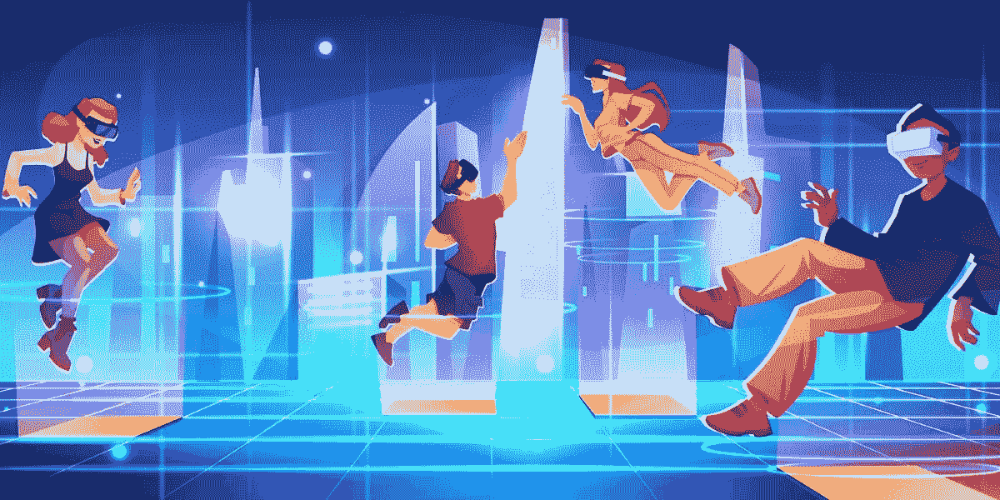

# 元宇宙的顶级消费者使用案例

> 原文：<https://medium.com/coinmonks/top-consumer-use-cases-in-the-metaverse-9a45cc21839e?source=collection_archive---------31----------------------->

元宇宙的进化发展有很多令人兴奋的地方。人们已经越来越意识到它的潜力，这将继续刺激科技和非科技公司每年向该领域投入数十亿美元。

这项投资最令人兴奋的是，消费者同样渴望体验人类互动的下一个阶段，因为它有望超越此前存在的一切。

在这篇文章中，我再次挖掘了最近关于元宇宙经济潜力的[麦肯锡报告](https://www.mckinsey.com/business-functions/growth-marketing-and-sales/our-insights/value-creation-in-the-metaverse)，从中我挖掘出了元宇宙最大的消费者(现在和未来)使用案例。

所以，我们开门见山吧。

# 元宇宙的消费者使用案例

在我之前的文章中，我报道了该报告的两个突出方面:元宇宙投资者的[类别](/coinmonks/the-three-investor-categories-in-the-metaverse-66912d061c7e)和推动元宇宙投资的主要[因素。如果你还没有读完它们，现在是时候了。](/coinmonks/the-top-factors-driving-investment-in-the-metaverse-eb62d61e2bb5)

现在，谈一谈今天的事情。

# 增加人类互动的工具

您会发现有趣的是，迄今为止，消费者围绕元宇宙用例的大多数讨论都围绕着人类交互。尽管这种现象有多种表现形式，但调查显示，最常见的人际交往形式包括虚拟会议、社交(网络和约会)、娱乐和旅行。

人们发现，能够不受物理障碍的限制，与远程位置的同事无缝协作，是大多数企业所期待的最令人愉快的体验。而社会化以及与家人和朋友联系的能力有望进一步创造一种紧密的人际关系。

预计旅行将变得更加多样化，62%的受访者对其表现形式有很高的预期。预计旅行将超越物质世界的界限，出现新的现实，如时间旅行、幻想旅行、太空旅行，并且访问困难和奇异的地方将最终成为可能。

# 经济效益

当元宇宙最终达到商业规模时，预计将创造大量就业机会(它已经创造了几个技术角色)。当这最终发生时，预计我们将能够将数字世界货币化，这是一些受访者希望使用元宇宙的地方。大约 66%的受访者期待这些机会。

该报告进一步显示，用户优先考虑他们更喜欢在元宇宙进行的五项活动，即购物(数字和实物商品)、游戏、健身、娱乐(虚拟音乐会和虚拟放松中心)和教育。

我们已经看到顶级艺人如 Snoop Dog 和 Eminem T1 在元宇宙表演，还有一些人也举办了现场音乐会。从所有迹象来看，随着元宇宙的进一步发展，这是必然的事情。

# 赌博

这可能是目前存在的最广为人知的元宇宙部署。不可否认，早在元宇宙成为焦点之前，游戏行业就已经引领了沉浸式技术的部署。

游戏已经被几个千禧一代视为社交和娱乐的一种方式。虚拟现实技术和元宇宙的引入进一步推动年轻人拥抱虚拟世界。堡垒之夜、Roblox 和《我的世界》等游戏公司已经从这一现实中获利一段时间了，其他科技公司也在接近并抓住这一机会。

预计游戏将继续推动以不可替代的代币形式收购数字资产，如虚拟土地和房地产、虚拟人物皮肤、工具和武器以及虚拟化妆品。

# 最后的话

元宇宙有望渗透到人类交往的方方面面。很明显，它的发展已经在消费者中产生了一种热情，他们渴望参与人类互动的下一次进化。只有时间才能告诉我们，在广阔的未开发的数字世界中，消费者的期望何时会成为现实。

> 交易新手？试试[密码交易机器人](/coinmonks/crypto-trading-bot-c2ffce8acb2a)或者[复制交易](/coinmonks/top-10-crypto-copy-trading-platforms-for-beginners-d0c37c7d698c)