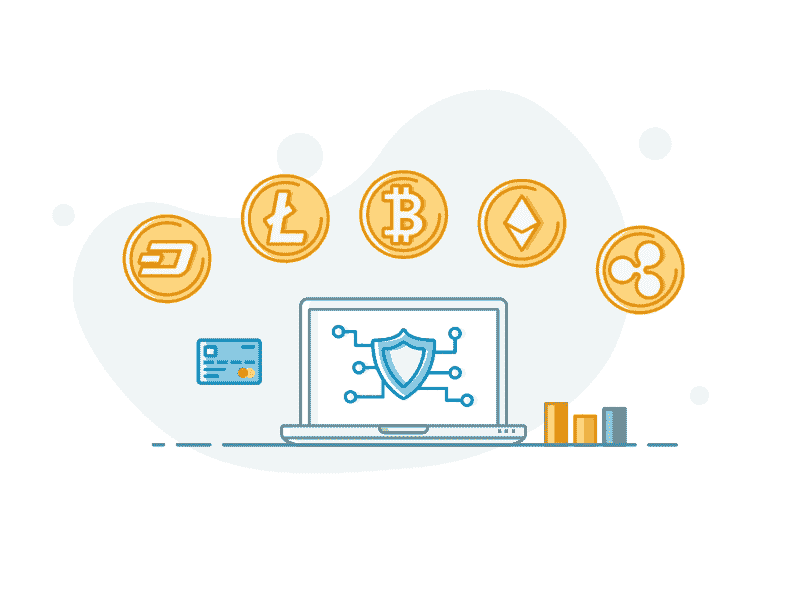

# 顶级加密交易所在印度与菲亚特进行加密货币的买卖

> 原文：<https://medium.com/coinmonks/top-crypto-exchanges-to-buy-sell-cryptocurrency-with-fiat-in-india-1650a39c00dc?source=collection_archive---------8----------------------->

在印度，加密货币变得非常流行。很多交易所都允许用 INR 买卖加密货币，但哪家最好呢？选择 exchange 时首先要考虑的是它的易用性。与任何金融服务一样，易用性是关键，许多事情可以决定你的体验。这篇文章将回答你所有关于在印度用 fiat 买卖加密货币的最佳加密交易所的问题。

交易所允许你将法定货币转换成数字货币，如比特币或以太坊。它们允许您使用借记卡、信用卡或银行账户等传统支付方式进行加密货币的首次购买。

以下是一些交易加密货币的顶级交易所

1.  Bitbns
2.  CoinDCX
3.  俱吠罗硬币开关公司
4.  BuyUcoin
5.  瓦济克斯
6.  泽布埃
7.  氪星
8.  Unocoin

# Bitbns

Bitbns 是一个加密货币交易所，你可以用法定货币买卖加密货币。它是印度最好的之一，有一个非常好的用户界面，非常容易使用。

与其他交易所相比，Bitbns 有很多优势，例如:

*   快速交易速度(几分钟内)
*   在 Bitbns 上交易不需要 KYC 或身份验证

# 最快取款

CoinDCX 是一个新的加密货币交易所，允许您用 INR 买卖比特币、以太坊、Ripple、莱特币、比特币现金和以太坊经典。它易于使用，因为其直观的用户界面。

CoinDCX 是所有想要以低价购买或出售加密货币的加密投资者的一站式目的地。这可以通过使用当今市场上可用的最佳技术来实现，这有助于他们提供安全的交易，并始终保持其客户信息的安全

# 俱吠罗硬币开关公司

CoinSwitch 是一个流行的交易所，已经存在了一段时间。其简单干净的界面为交易者提供了一种简单的方式来购买或出售加密货币，没有任何大惊小怪或混乱。该网站也非常用户友好，对于刚接触加密交易的新手来说是完美的。

CoinSwitch 的平台上有大量的硬币和代币，包括一些最受欢迎的替代硬币，如比特币(BTC)、以太坊(ETH)、Ripple (XRP)以及 EOS 和 Stellar lumen(XLM)。它还提供与其他加密货币(如 Monero XMR/USD 等)的广泛交易对。，使其成为在 USDT/USDT 货币对和 BTC/ZAR 等加密货币对之间提供流动性的最佳平台之一。,

# BuyUCoin

BuyUCoin 是一个加密到加密的交换。它发展迅速，界面简洁，你可以用它来买卖加密货币。存取款系统也很快，所以你不用等很久就能把钱转入你的账户。

BuyUCoin 的客户支持是无可挑剔的——他们将在 24 小时内回答您的所有问题，不管这些问题看起来有多重要！

# 瓦济克斯

WazirX 是印度一家新的加密货币交易所，提供保证金交易、P2P 交易和分散存储。它有一个出色的用户界面和一个移动应用程序，使它很容易在你的手机上使用。

WazirX 还以其大量用户(超过 300 万)而闻名，这些用户经常在这个平台上交易。这种交易所的受欢迎程度表明，许多人希望购买或出售加密货币，但无法进入传统交易所，因为他们所在的国家或地区没有加密货币。

# 泽布埃

Zebpay 是一家比特币交易所、钱包和商户支付处理公司，总部位于新加坡。它是印度历史最悠久、最受信任的比特币公司。

该公司是一家数字货币交易所，用户可以通过手机应用程序或网站用印度卢比购买或出售比特币。

该平台提供了一种简单的方式，只需点击几下鼠标，就能以尽可能好的价格购买比特币。如果你没有银行账户，但想交易加密货币而不是美元或印度卢比(印度卢比)等法定货币，你也可以使用它作为现金存款的替代选择。

# 氪星

印度增长最快的加密货币交易所是 Krypto，它为希望购买 100 多种加密货币的用户提供了最优惠的价格和巨大的流动性。受欢迎的交易对包括印度卢比/BTC、印度卢比/瑞士法郎、印度卢比/瑞士法郎等。可供买方、卖方和交易商交易。Krypto 加密货币交易平台的用户可以访问流行的数字硬币，并利用从一种加密货币到另一种加密货币、从一种加密货币到另一种加密货币以及从一种加密货币到一种加密货币的快速转换，利用即时存款和取款。

对于每种加密货币，Krypto Exchange 都提供了一个简单的费用结构，其中包含最小和最大的区块链接收、发送和成本。交易所不收取交易费、经纪费或保证金。然而，存款和取款分别有 50 印度卢比和 100 印度卢比的限额。

# UnoCoin

印度顶级加密货币交易所之一 Unocoin 越来越知名，拥有约 15 万用户。该平台目前创造了超过 3.5 亿美元的收入。它有一个长远的前景。该交易所于 2013 年开始运营，目标是增加该国十亿人口使用比特币的机会。比特币交易很容易被 Unocoin 的加密交易服务接受。

所有在 Unocoin 的买卖订单都要支付 0.7%的佣金。对于 100 比特币或更多的订单，用户可以将这一成本降至 0.5%。交易所加在交易费用上的政府税是 15%。因此，发送和接收比特币非常昂贵。然而，比特币区块链的拥挤程度也会影响这一成本。Unocoin 收取 0.4%的创建费和 0.6%的收取费。

# 结论

在本文中，我们涵盖了印度所有 10 家使用 INR 买卖加密货币的最佳交易所。该列表包含每个交换的概述、其功能以及如何使用它们。如果你打算在这些交易所交易密码，那么在进行任何交易之前都要仔细阅读，因为这对新手来说可能有风险！交易愉快！

> 加入 Coinmonks [电报频道](https://t.me/coincodecap)和 [Youtube 频道](https://www.youtube.com/c/coinmonks/videos)了解加密交易和投资

# 另外，阅读

*   [加密货币储蓄账户](/coinmonks/cryptocurrency-savings-accounts-be3bc0feffbf) | [YoBit 审核](/coinmonks/yobit-review-175464162c62)
*   [Botsfolio vs nap bots vs Mudrex](/coinmonks/botsfolio-vs-napbots-vs-mudrex-c81344970c02)|[gate . io 交流回顾](/coinmonks/gate-io-exchange-review-61bf87b7078f)
*   [CoinFLEX 评论](https://coincodecap.com/coinflex-review) | [AEX 交易所评论](https://coincodecap.com/aex-exchange-review) | [UPbit 评论](https://coincodecap.com/upbit-review)
*   [AscendEx 保证金交易](https://coincodecap.com/ascendex-margin-trading) | [Bitfinex 赌注](https://coincodecap.com/bitfinex-staking) | [bitFlyer 点评](https://coincodecap.com/bitflyer-review)
*   [Bitget 回顾](https://coincodecap.com/bitget-review)|[Gemini vs block fi](https://coincodecap.com/gemini-vs-blockfi)cmd |[OKEx 期货交易](https://coincodecap.com/okex-futures-trading)