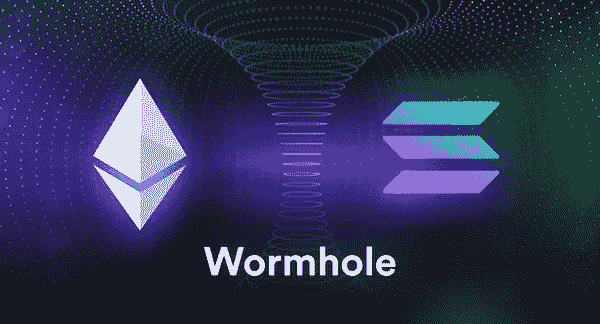

# 到目前为止，2022 年的顶级加密黑客—10 月中旬更新

> 原文：<https://medium.com/coinmonks/top-crypto-hacks-in-2022-so-far-mid-october-update-1c0ed4f5e69b?source=collection_archive---------12----------------------->

仅今年一年，加密领域的大部分估值就化为乌有，与此同时，在网络攻击方面，加密领域也达到了顶点。

自 2022 年初以来，在新的生态系统中，已有超过 20 亿美元的记录被黑客攻击，这已经成为黑客攻击的主要目标。

> Chainalysis 的调查副总裁艾琳·普朗泰解释说:“DeFi 为黑客进入平台提供了一个全新的平台。

大多数都是通过“跨链桥”发生的，这是理解本文的一个重要概念。

桥旨在消除用户在将资产从一个区块链转移到另一个时可能遇到的挫折。

这种便利是以牺牲安全性为代价的，因为资产并没有完全转移，而是锁定在区块链 A 上的智能合同中，以便在区块链 b 的兼容版本中生成等量的资产。

在本文中，我们将讨论今年的主要黑客攻击，以及它们是如何发生的。

## 虫洞——3.25 亿美元

虫洞允许以太坊和 Solana 之间的互操作性，以及其他协议，如 Polygon 或 Oasis。你可能已经猜到了，它是我们上面提到的跨链桥之一。

发生了什么事？
2 月 2 日，一名黑客利用一个软件漏洞，设法在一份智能合同上签署了一项欺诈交易。

这导致了 120，000 wet(包装以太坊，可以跨协议移动)的免费造币厂，相当于当时的 3.25 亿美元——这是 Solana 最初作为抵押品持有的金额。

**然后呢？有人悬赏 1000 万美元让黑客归还资金，但他没有这么做。按照虫洞的说法，这个协议是从 4 . 2 亿美元的紧急救助中拯救出来的。**

## 币安的 BNB 连锁店——5.6 亿美元

上周，10 月 7 日，世界头号加密交易所币安 BNB 链的网络遭到黑客攻击。

发生了什么事？这次黑客攻击源于一个被称为 BSC 令牌中心的跨链桥的漏洞，它连接了币安的 BNB 信标链和 BNB 智能链(都构成了 BNB 链)。

仅在两次交易中，黑客就能够以类似于虫洞的方式，人工批准凭空提取资金:价值约 5.6 亿美元的 200 万 BNB，然后在不同的平台上交换资金。

这是黑客钱包的快照:

然后呢？黑客攻击后不久，币安首席执行官赵昌鹏在推特上写道“问题已经得到控制。你的资金是安全的”，因为币安能够冻结该链的活动，这削弱了其链的集中程度。

由于该团队的快速干预，黑客似乎“只”带走了 1 亿美元，而没有任何用户经历资金损失。

## **Axie Infinity 的浪人链——6.25 亿美元**

这款名为 Axie Infinity 的游戏在 3 月 23 日遭遇黑客攻击，这将成为 DeFi 历史上最大的一次抢劫。有趣的是，游戏开发商过了几天才注意到资金被盗。

发生了什么事？
黑客设法通过一个欺诈交易，从浪人链中取出自己的钱包，特别是负责处理游戏的交易。

要在 Ronin 的链上得到验证，一项交易需要得到 9 名亲自挑选的验证者中大多数人的批准。

黑客是如何获得 5 次验证的？事后看来，这一切据称都来自 LinkedIn 上一个吸引人但虚假的职位，游戏母公司 Sky Mavis 的一名高级开发人员上钩了。

不幸的是，对于 Sky Mavis 来说，高级网络钓鱼导致同一公司的其他 3 个验证器也受到威胁。

*“但是 Serge，黑客需要第五个验证器来带走钱，对吗？”*

很高兴你问了，是的。

事实上，2021 年对 Axie Infinity 来说是一个紧张活动的时期——该公司在这一年的 NFT 销售额达到了 35 亿美元的历史纪录。因此，在 11 月，他们授权第三方 Axie DAO 代表其签署交易协议。

这是第五次了。

**然后呢？该公司筹集了资金，并退还了系统中每个受影响的玩家，同时还将验证者的人数增加到了 15 人。**

据美国政府称，此次攻击的幕后黑手可能是朝鲜黑客组织“Lazarus”和“APT38”。

有趣的是，一个 PeckShield 报告说，黑客只成功地清洗了 6.25 亿美元中的 4200 万美元，很难在不被注意的情况下找回这么多钱。

## 游牧桥——1.9 亿美元

黑客攻击的目标是一座跨链桥。仅仅几个小时，Nomad protocol 的 1.9 亿美元资金中的绝大部分就消失了。

**发生了什么？在某些情况下，黑客会积极寻找系统中的漏洞，从协议中骗取钱财。**

对于 Nomad 来说，攻击是不必要的，因为 8 月 2 日当天的每日更新包含代码错误。这使得几乎任何用户都可以利用桥梁的智能合约，从平台中窃取资金。

你可以找到一个有趣的 [Twitter 视频帖子](https://twitter.com/HsakaTrades/status/1554254701994156033?s=20&t=764zFEk5FjgQVZjnuOh13w)总结了这一错误的后果，锁定的价值在几个小时内暴跌。

然后呢？
黑客入侵后不久，8 月 5 日，Nomad 允许抢劫者返还被盗资金，并保留被盗资产的 10%免于承担后果，给他们贴上“白帽子”的标签。

这最终导致超过 3600 万美元返还给了 Nomad，该公司至今仍在苦苦挣扎。

## 豆茎——182 米

黑客之所以能够得逞，是因为使用了一种名为“闪贷”的专用应用程序:一种针对特定交易的无抵押(无锁定资产支持)贷款。钱通常会在几秒钟内退回，否则交易会自动撤销。

记住这一点，让我们深入研究 Beanstalk hack。

发生了什么事？
Beanstalk 是一个基于以太坊的分布式 stablecoin 协议。像大多数 DeFi 协议一样，有一个政府机制和一个投票系统。Beanstalk 允许用户提交对协议代码的修改，这被称为 BIP(区块链改进提案)。

Beanstalk 的治理包括紧急执行，前提是它收集 66%的投票权。

这就是闪贷的用途所在:一名黑客设法从 DeFi 协议中借了近 10 亿美元，积累了大量的协议令牌。

当时 Beanstalk 大约有 70%的令牌供应，黑客提交并验证了自己的投票，窃取了该协议的资金，高达 1.82 亿美元。

**然后呢？** 据称，这名黑客利用龙卷风现金(Tornado Cash)掩盖自己的行踪，成功套现 8000 万美元，这是一种加密混合器，能够进行匿名交易。

这引发了许多对此类应用的批评，并最终导致美国政府禁止 Tornado Cash 及其互动的地址。

如果你喜欢这篇文章，我会很感激*掌声*和*跟随*:)

你也可以找到我写的关于可伸缩性的类似文章。

作为一名文案，我也可以写与 Web3 相关的内容——请随时与我联系！

> 交易新手？尝试[加密交易机器人](/coinmonks/crypto-trading-bot-c2ffce8acb2a)或[复制交易](/coinmonks/top-10-crypto-copy-trading-platforms-for-beginners-d0c37c7d698c)