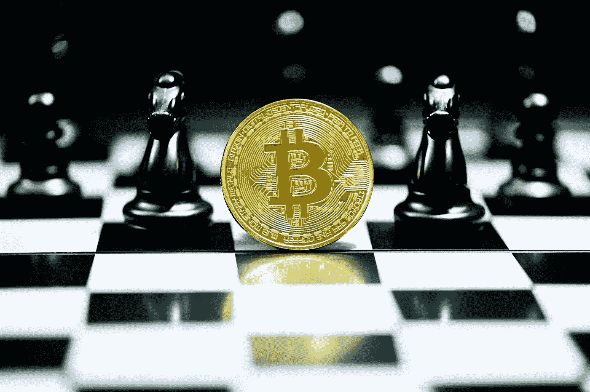

# 在经济低迷时期要避免的顶级加密投资错误

> 原文：<https://medium.com/coinmonks/top-crypto-investing-mistakes-to-avoid-during-this-economic-downturn-56b2b47b927a?source=collection_archive---------48----------------------->

**加密货币**──由于全球经济体在全球范围内实施紧缩的货币和财政政策，全球金融市场继续经历下行趋势。此外，地缘政治因素，如全球供应链的中断、封锁的影响以及正在进行的乌克兰战争，增加了未来的压力和不确定性，无意中营造了一种经济前景黯淡的氛围。

尤其是加密货币市场，出现了自不到十年前成为主流以来的最大亏损之一。在今年整个加密市场遭受巨大损失之前，这个领域因成为极端投机和通过投资趋势硬币和代币快速致富的中心而闻名。对一些人来说，加密让他们最疯狂的梦想成真，但对许多人来说，它成了他们最可怕的噩梦，尤其是对那些在今年大规模崩溃中措手不及的人来说。

因此，让我们来探讨一下在这个被许多人认为是“秘密冬天”的新时代，你应该避免的一些代价最大的错误。

**可能毁掉你财务的错误**

**1。** **尽职调查前投资**

不做研究就投资某样东西是一场迟早会发生的灾难。对于加密来说尤其如此，因为它目前还不是一个受监管的市场。因此，大多数硬币和代币都是高度投机的。你辛辛苦苦赚来的钱可能会在几秒钟内消失得无影无踪，让你处于财务破产的边缘，因为许多投资者已经尝到了惨痛的教训。

**2。** **过度杠杆化超过自己的风险承受能力**

许多投资者，尤其是对加密技术不熟悉的人，容易受此影响。不要忽视风险，只看“如果”,当许多人看到他们可以购买更多/更多的特定硬币和代币，是他们当前购买力的数倍时，他们会盲目。永远记住，可能的回报越高，随之而来的风险也就越高。

**3。** **不打算退出**

不要在没有确定退出条件的情况下投资硬币或代币。当你的投资没有实现时，最重要的是你要减少损失。记住“希望”不是一种策略；因此，如果一枚硬币到达了你的止损点，一定要卖出。反之亦然；如果硬币或代币达到你的目标价格，不要太贪婪，不要被你持有的额外可能的上涨所蒙蔽。相反，至少卖掉一部分来确保你的一些利润。

**4。** **继炒作和 FOMO**

认识到“害怕错过”可能会导致冲动和情绪驱动的投资决策，从而导致灾难性的后果。永远不要把你的投资决定建立在当前的市场炒作和什么是“酷”和“时尚”的代币和硬币上。相反，退居二线，从大局着眼，评估它是否值得大肆宣传，或者它是否是一种浪费时间，你最好忽略它。要记住的一个重要因素是，这些“炒作”的硬币和代币非常不稳定，价格可能在短时间内大幅波动。

**5。** **将收入的很大一部分用于加密**

最后，始终保持谨慎，并意识到您必须将投资分散到其他资产类别，以最大限度地降低一组投资(如加密货币)的市场风险。这将防止你在整个市场对你不利的情况下清空你的账户。

**最后一个音符**

避免这五个代价高昂的错误不仅会在事情失去控制时为你省钱，还会让你成为一个更明智、更谨慎的投资者，通过更客观的视角来看待加密硬币和代币，过滤掉给你最低回报的东西，同时让你面临彻底破产的风险。

> 交易新手？尝试[加密交易机器人](/coinmonks/crypto-trading-bot-c2ffce8acb2a)或[复制交易](/coinmonks/top-10-crypto-copy-trading-platforms-for-beginners-d0c37c7d698c)