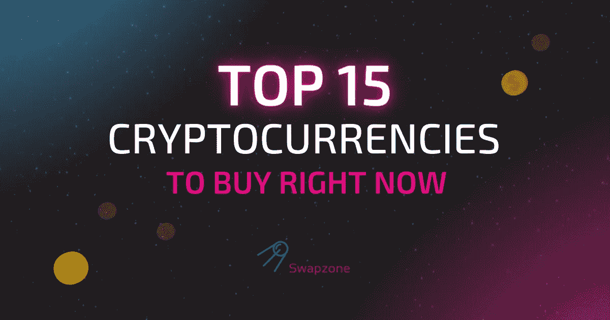
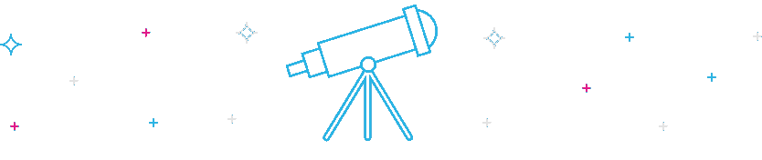

# 2022 年投资的顶级加密货币:Swapzone 的选择

> 原文：<https://medium.com/coinmonks/top-cryptocurrencies-to-invest-in-2022-swapzones-pick-6e54b9d4d14?source=collection_archive---------4----------------------->

加密波动可能令人困惑，但在任何特定的市场时刻，有些加密货币比其他货币更有优势。这篇文章将揭示加密投资的内幕，并向你推荐 15 种最值得购买的加密货币。享受，但不要忘记总是做自己的研究。

# 什么是加密货币？

加密货币是建立在[区块链科技](https://www.investopedia.com/terms/b/blockchain.asp)之上的数字货币——一个由节点(一个分布式计算机网络)执行的分布式账本系统。它们是数十亿全球用户的交流媒介。

在撰写本文时，加密市场的资本总额为[10.6 亿美元](https://coinmarketcap.com/charts/)，你可以交易加密货币，并使用它们像法定货币一样完成日常交易。然而，这些特殊的数字货币不同于像中国日元或美元这样的法定货币，因为没有中央当局，如联邦储备银行或政府，发行它们。

这一特性使得加密货币能够抵御政府操纵或干预。这也使它们非常诱人和有价值。这篇文章对密码市场的前景和现在可以购买的 15 个最好的密码给出了见解。

# 你为什么应该投资加密？

像[比特币](https://swapzone.io/currencies/bitcoin)、[以太坊](https://swapzone.io/currencies/ethereum)等加密货币被认为是非常不稳定的资产，这些类型的资产的价格可以在几分钟内从历史高点跌至历史低点。

尽管存在这种不利因素，加密市场仍有数百万投资者积累数字代币，希望获得高收益。以下是让加密投资吸引许多人的几个原因:

*   虽然这并不适用于所有的加密货币，但比特币等一些加密货币让人们投资数十亿美元，因为它们可以作为通胀对冲。在通货膨胀和其他经济不确定时期，它们是稳定的价值储存手段。
*   它们是保证交易自由的抗审查资产——这是传统银行所不具备的。当您需要进行交易时，交易所和一些最好的加密钱包很容易获得。
*   加密货币是一种很好的赚取被动收入的方式，当你交易、借贷和以它们产生的利息为赌注时。
*   你也可以投资于加密技术，因为有些硬币或代币具有潜在的价值，有些可以保证你的投资有高回报的机会。

# 现在购买的最佳加密货币

当今世界有超过 [1 万种有效密码货币](https://explodingtopics.com/blog/number-of-cryptocurrencies#:~:text=As%20of%20July%202022%2C%20there,cryptocurrency%20users%20across%20the%20globe.)。这 15 种密码货币是市场目前的热门选择:

# 1.币安币(BNB)

[币安币](https://swapzone.io/currencies/binance-coin)是流行的密码交换平台币安的本地密码货币，持有者可以使用它进行交易或支付费用。币安在 2017 年发行了这枚硬币，从那时起，它已经从仅仅为币安的交易提供便利发展到用于支付处理、交易等等。

持有人可以用 BNB 元交易或交换其他有价值的密码货币，如比特币或以太币。得到最好的密码交易所之一的支持，使得$BNB 成为 2022 年购买的最好的密码之一。BNB 从 2017 年的 0.10 美元增至 2022 年 8 月的 284 美元，增幅约为 283，900%。

它也在 2021 年 5 月创下了 690 美元的历史新高(ATH)。从当前熊市的阵痛来看，当一轮大牛市开始时，BNB 有很大的希望回到它的 ATH

# 2.Solana (SOL)

[索拉纳](https://swapzone.io/currencies/solana)是一个密码货币项目，旨在为 DeFi 用例、智能应用和 DApps 提供动力。这个功能性的开源项目利用了区块链理工大学的无权限功能来提供 DeFi 解决方案，同时提供了令人印象深刻的快速处理时间。

区块链网络运行在一种罕见的混合[历史证明](https://solana.com/news/proof-of-history)和[股权证明机制](https://ethereum.org/en/developers/docs/consensus-mechanisms/pos/)上，以安全快速地处理交易。索拉纳的混合协议鼓励减少智能合同执行和交易的验证时间。

$SOL 是网络的本地令牌，也为平台提供动力。它于 2020 年推出，价格为 0.77 美元，但截至 2022 年 8 月，已设法以 42.38 美元的价格上涨了近 5，300%。这与其在 2021 年 11 月创下的 260 美元 ATH 纪录相去甚远。

# 3.波尔卡多(dot)

[$DOT](https://swapzone.io/currencies/polkadot) 是波尔卡多生态系统的本地货币，也绝对是当今投资的最佳隐货币之一。波尔卡多旨在提高区块链之间的互操作性，它通过允许区块链向他们自己转移资产或数据来做到这一点。

这个显著的特点使得波尔卡多特成为顶级平台，甚至被比作以太坊区块链。不同的是，你可以在波尔卡多特上建造自定义的区块链，并允许使用副链。Polkadot 的用例已经帮助$DOT 从 2020 年的不到 1 美分上涨到 2022 年 8 月初的 8.37 美元，获得了 837%的投资回报率(ROI)。

# 4.多边形(MATIC)

[Polygon](https://swapzone.io/currencies/polygon) 是一个有组织的、易于使用的平台，用于以太坊基础设施的开发和扩展。用户可以使用多边形构建乐观汇总链、独立链、ZK 汇总链等。

它结合了以太坊的安全性和开放性的优势，是继币安连锁、以太坊和索拉纳之后迅速崛起的区块链之一。Polygon 有点像 Polkadot、Avalanche 和 Cosmos，目前拥有 19，000 个 DApps。

这些坚实的用例以及 Polygon 平台承诺的潜力帮助$MATIC 实现了治理，保护了系统，并从 2017 年首次发布时的 0.00263 美元增长到截至发稿时的 0.939862 美元。

# 5.UNI WAP(UNI)

[Uniswap](https://swapzone.io/currencies/uniswap) 是一个基于以太坊的代币交易平台。它是 Vitalik buter in 2016 年[分散式交易所理念](https://www.reddit.com/r/ethereum/comments/55m04x/lets_run_onchain_decentralized_exchanges_the_way/)的产物，能够雇佣一个链上自动做市商(AMM)。截至记者发稿时，Uniswap 的本币 UNI 的价值为 8.97 美元，自 2020 年推出以来已增长超过 2135.7%。

# 6.以太坊名称服务(ENS)

以太坊命名服务是一个基于以太坊区块链的开放、分布式、可扩展的命名系统。这项越来越受欢迎的服务将人类可以读取的以太坊地址(如 kate.eth)转换成熟悉的机器可读代码，一些最好的加密钱包(如 Trust Wallet)可以使用这些代码。

有了$ENS，你所有的钱包地址、网站等都有了一个名字。它的目标是让访问和理解基于以太坊的网络更容易，就像互联网域名服务让互联网更容易访问一样。自从他们在 2021 年成功进行追溯空投以来，ENS 在 2022 年的价值为 17.21 美元。

# 7.阿尔格兰德(ALGO)

分散式自给自足的区块链网络[algrand](https://swapzone.io/currencies/algorand)在加密领域以其与以太坊的兼容性和对各种应用的支持而闻名。相比比特币和其他区块链缓慢的交易时间，发明 Algorand 是为了提高交易速度和效率。

阿尔格兰德是用例与技术方面最有前途的区块链之一。一些现实世界的项目，如 Glitter Finance，依赖于 Algorand，有助于其价值。与名单上的一些名字相比，ALGO 的价值相对较低，交易价为每枚 0.3484 美元。

# 8.系绳(USDT)

与我们最佳购买加密货币名单中的其他加密货币不同， [Tether](https://swapzone.io/currencies/tether) 是唯一稳定的货币。Stablecoins 反映了主要法定货币的价格，Tether 的$USDT 反映了美元的价格。

这家总部位于香港的加密公司将代币与美元挂钩，因此一个 USDT 单位几乎总是等于一个美元单位。由于$USDT 的稳定性，与其他价格波动的加密项目相比，它是一个很好的价值储存手段。

虽然它可能不会给你带来任何投资回报，但来自不稳定国家的人们会用它来规避通货膨胀的痛苦。对于那些希望在机会出现时随时准备购买加密产品的人来说，这也是首选。

# 9.比特格特(布里斯)

[Bitgert](https://swapzone.io/currencies/bitgert) 是一个独特的加密工程项目，专注于审计解决方案和区块链产品。区块链还为用户提供每笔交易 0.0000000000001 美元的近乎零的汽油费，以及超快的跨链交易。

虽然它最初建立在[币安智能链](https://academy.binance.com/en/articles/an-introduction-to-binance-smart-chain-bsc)上，并依赖 BNB 作为本地令牌，但 BRC20 区块链的到来改变了这一切。$BRISE 是 Bitgert 链的本机令牌；被认为是世界上最快的区块链。

Solana 曾经是最快的网络，但 Bitgert BRC20 每秒管理 10 万个事务(TPS)。通过$BRISE Wallet DApp，您可以访问 Bitgert 生态系统，并购买、发送、交换、接收和存储加密资产。截至发稿时，您可以用 0.0000004041 美元购买一个单位的$BRISE。

# 10.分散土地(法力)

虽然元宇宙还没有成为主流，但 NFT 和类似[decorated land](https://swapzone.io/currencies/decentraland)这样的密码相关项目最终会成为主流。[分散王国](http://decentraland.org/)是以太坊区块链上领先的虚拟现实平台。

用户可以从他们的内容和应用中制作、体验和赚钱。分散土地反映了现实世界，因为你可以购买土地，导航，建设和货币化土地。

该平台使用两种代币，土地和法力——一种 ERC-20 代币，你必须燃烧它才能获得不可替换的 ERC-721 土地代币。$MANA 还可以购买可穿戴设备、头像、名字等。价值 1.03 美元的法力令牌有几个使用案例，使其具有长期价值。

# 11.涟漪(XRP)

[涟漪](https://swapzone.io/currencies/ripple)最近一直在新闻里进进出出[因为争议的原因](https://www.reuters.com/article/legal-us-otc-ripple-idUSKBN2AG2MJ)。从被指控由一家私人公司管理，到因通过$XRP 出售 13 亿美元未注册证券而被 SEC 起诉。

尽管 Ripple 否认了这些指控，但它也因此遭受了损失。然而，当你删除这些指控，你得到一个有价值的低费用的加密项目值得投资。Ripple 的未决诉讼的成功可能会看到支付协议的本地加密$XRP 获得更广泛的采用和价格再次飙升。

几家金融机构使用 Ripple 的支付网络，而小企业主和客户可以利用 XRP 进行安全的资金转移。这些至关重要的用例以及 Ripple 未决诉讼的成功可能会看到支付协议的原生加密$XRP 获得更广泛的采用，价格再次飙升至当前价格 0.374 美元以上。

# 12.沙箱(沙子)

像分散的土地一样，[沙盒](https://swapzone.io/currencies/the-sandbox)是另一个与密码相关的项目，当元宇宙成为主流时，它可能会做数字。沙盒巧妙地结合了 NFTs 和[分散自治组织(DAOs)](https://cointelegraph.com/decentralized-automated-organizations-daos-guide-for-beginners/what-is-decentralized-autonomous-organization-and-how-does-a-dao-work) 的优势，为热情的全球游戏社区运行一个分散平台。

这个位于区块链的虚拟世界允许用户建造、创造、出售和购买土地等数字资产。你可以投资加密货币，也可以赚更多的沙子。截至发稿时，一个单位的$SAND token 的价格为 1.31 美元，在元宇宙成为主流之前，它的价值可能会长期增长。

# 13.煎饼交换(蛋糕)

PancakeSwap 享有领先的去中心化交易所的声誉，专家认为这给了它的象征“蛋糕”强劲的增长潜力。该平台也是交易[币安智能链代币](https://coinmarketcap.com/view/bnb-chain/)的主要 DEX，拥有最高的市场交易量之一。

相对于竞争对手，低费用和流动性是一个优势。互换薄饼允许持有者在蛋糕上下注 100 美元，以赚取被动收入.该平台还具有令人印象深刻的钱包集成，因为它支持其他流行的钱包。$CAKE 单价 4.11 美元。

# 14.金恩硬币(ENJ)

元宇宙正在崛起，专注于游戏的元宇宙项目和代币也是如此。金恩就是这些项目中的一个。它的代币$ENJ 是用来交换物品的数字货币。与具有巨大潜力和目标的项目相关联的代币和硬币有更好的机会变得有价值。

金恩正努力成为互联网上最大的游戏社区平台。到目前为止，金恩拥有 1870 万游戏玩家和 25 万个游戏社区。

# 15.克罗诺斯(CRO)

[$CRO](https://swapzone.io/currencies/cronos) 或 Cronos 是 Crypto.com 的实用原生令牌——最好的加密交换平台之一。持有人可以持有$CRO 股票，以获得一些丰厚的利益，并使用$CRO 支付 Crypto.com 的费用。

Crypto.com 是加密货币领域的顶级玩家，它已经通过马特·达蒙等明星的[名人代言成功赢得了知名度。它最近还购买了洛杉矶斯台普斯中心的冠名权。像这样的宣传策略引起了人们对$CRO 的极大兴趣。](https://www.washingtonpost.com/arts-entertainment/2022/02/04/celebrities-cryptocurrency-nfts/)

作为一个主要交易平台的原生标志，$CRO 为持有者提供了稳定性。去年，该货币大幅增长，从 2018 年的历史低点 0.012119 美元升至 2022 年 8 月初的 0.1453 美元。但就像大多数加密市场一样，它在 2022 年有点挣扎。

# 最终拍摄

所以你有它；这些是现在可以买到的最好的密码。毫无疑问，随着人们在更多情况下采用加密货币，加密货币在互联网内外都变得越来越重要。

尽管数字货币的首要目标是解决传统货币的问题，但我们现在已经有了实用加密技术，这都要归功于区块链技术。因此，无论你的需求是投机，作为价值储存，还是仅仅出于交易目的，这个列表都有一些数字货币最好的投资和购买数字货币。

尽管如此，我们不认为我们对这些代币的意见是一条财务建议。在购买任何加密资产之前，努力做自己的研究。此外，请记住，密码是导致资金损失的投机性资产。