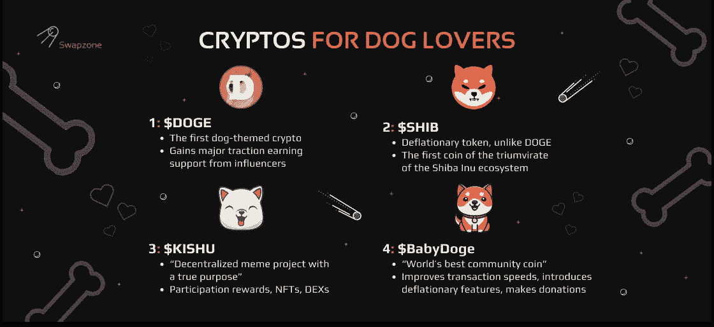
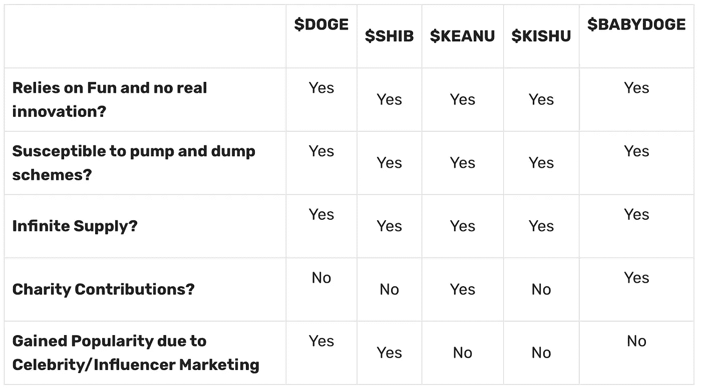

# 爱狗人士的首选密码:$DOGE，$SHIB，$基努，$KISHU，$BabyDoge

> 原文：<https://medium.com/coinmonks/top-cryptos-for-dog-lovers-doge-shib-keanu-kishu-babydoge-29a14cdfa06c?source=collection_archive---------32----------------------->

最近，围绕着以狗为主题的加密货币的出现，人们议论纷纷。多亏了埃隆·马斯克(Elon Musk)关于狗主题密码的推文，它们似乎突然冒出来，也聚集了相当多的投资者。围绕这些密码的讨论是如此疯狂，以至于一个流行的迷因密码 [Dogecoin](https://swapzone.io/currencies/dogecoin) 在大约 4 周内上涨了 350%。最终，这一惊人的价格上涨导致了以狗为主题的密码的反弹，而且这种炒作似乎不会很快平息。

毫无疑问，目前以狗为主题的加密货币的流行源于人们对宠物和迷因的热爱。尽管它们原本只是一时的笑料，但 Dogecoin 的巨大成功已经形成了一个与狗相关的硬币和代币的完整生态系统，这些硬币和代币具有与最初 DOGE 相似的特征。也就是说，让我们来看看在过去的几个月里获得大量关注的爱狗人士的五大密码。

# 这些狗密码是哪里来的？

我们都同意，狗密码大量涌入这个行业是埃隆·马斯克的推文和狗密码价值疯狂增长的结合。此外，Gamestop 事件也对 Dogecoin 的高采用率起到了一定作用。看到 Dogecoin 的巨大成功，其他以狗为主题的 cryptos 想通过提供类似 Dogecoin 的东西来复制同样的成功。

话虽如此，今天让我们来深入探究一下五大狗狗主题的密码吧。它们包括:

*   $DOGE

[Dogecoin](https://swapzone.io/blog/the-best-dogecoin-price) 是他们所有人的祖师爷。这是第一个以狗为主题的密码，也可能是迄今为止最受欢迎的一个。它是由杰克逊·帕尔默和比利·马库斯创造的，目的是成为一枚迷因硬币。据杰克森说， [Dogecoin](https://dogecoin.com/) 背后的想法是受网络上流行的柴犬迷因的启发。这本来是一个笑话，但随着事情的发展，它已经获得了许多有影响力的人物的支持。一些值得注意的名字包括埃隆马斯克，史努比道格，马克·库班等。

*   $SHIB

[柴犬令牌，](https://swapzone.io/blog/what-is-shiba-inu-and-how-to-exchange-btc-to-shib)通常被称为$SHIB，是 2020 年 8 月作为 Dogecoin 的竞争对手创建的另一个狗密码，它赢得了“Dogecoin 杀手”的称号就像比特币一样，$SHIB 的创造者仍然是匿名的，只使用了 Ryoshi 这个名字。此外，就像 Dogecoin 一样，crypto [柴犬币](https://shibatoken.com/)在加密社区中获得了相当多的追随者，关于硬币是否能够超过 1 美元的门槛有很多争论。

*   $基努

根据[基努犬的官方网站](https://keanuinu.finance/),$基努是“犬类世界中最牛逼的狗”。基努犬也是一个迷因币，类似于柴犬，但有一点不同；它渴望步山谬·里维的后尘，定期进行慈善捐赠。此外，你会很高兴地听到，作为一个基努硬币持有人，你将获得奖励，把它放在你的钱包里。对于基努网络上发生的每一笔交易，基努硬币持有者将获得交易价值的 2%。

*   $KISHU

[Kishu Inu](https://swapzone.io/blog/exchange-kishu) (KISHU)，是另一种新的狗加密货币，于 2021 年 4 月推出。根据 [Kishu coin 官网](https://kishu.com/)的说法，Kishu 是一个“去中心化的 meme 项目，有真实的目的”。或许 KISHU 的亮点在于，其平台上的每一笔交易，持有人都从交易中赚取 2%的收益。KISHU coin 背后的开发商透露，他们计划用 KISHU crate 扩展到 NFT 市场。此外，他们打算推出一个名为 Kishu Swag 的商品商店。

*   $BabyDoge

Baby Doge 官方网站[称$BabyDoge 为“世界上最好的社区硬币”。“小道格”的诞生是为了改进它的前身“多戈因”的缺点。它通过提高交易速度和引入奖励小 Doge 硬币用户的通货紧缩功能来做到这一点。也许小 Doge Coin 最独特的特征之一就是它会将部分收入专门捐赠给拯救狗狗的非营利组织。](https://babydogecoin.com/)

# $总督、$SHIB、$基努、$基舒和$婴儿总督的好处

上述狗密码的一些好处包括:

*这些密码中的大多数在网上都有很多追随者。他们都很友好，积极向上，有些人倾向于慈善事业。他们收集捐款，并实际上把捐款投入一些旨在帮助狗和人的良好的非营利组织。*

*   ****非常适合新手投资者****

*大多数新手投资者通常没有足够的资金来投资一些更成熟的加密货币。然而，随着这些狗密码远低于 1 美元的价格，新投资者有可能进入市场，购买密码，并在价格上涨时出售它们以获利。*

*   ****高可扩展性****

*这些狗密码的大部分是建立在基本的加密技术上的。这意味着与比特币和以太坊等更大的密码相比，它们相对更快。因此，它们可以在未来作为潜在的交易货币被采用和整合。*

*   ****审查抵制****

*所有这些密码都有一个共同点，它们的网络是安全的。黑客必须控制超过 50%的网络散列能力才能获得控制权。*

# *这类硬币的阴暗面*

**

# *这些硬币是好的投资吗？*

*自从 DogeCoin 成为主流以来，其他受狗启发的密码已经进入市场，旨在乘着狗密码热的浪潮。这是完全可以理解的，为什么他们获得了这么多的牵引力。他们有可爱的设计，他们确实给已经很严肃的加密行业带来了一股新鲜空气。然而，这些硬币中的大部分只是迷因硬币。他们背后没有真正的价值，也没有真正的目的去做任何事情，只是为了好玩。虽然当价格飙升时，你有可能获利，但我们建议你在投资这些狗密码之前进行尽职调查。*

# *如何在 Swapzone 上兑换这些硬币？*

*如果你想知道在哪里可以执行你的 [BTC 到狗儿兑换](https://swapzone.io/exchange/btc/doge)、[柴犬币兑换](https://swapzone.io/currencies/shiba-inu)、[基舒犬币兑换](https://swapzone.io/currencies/kishu-inu)、[基努犬币兑换](https://swapzone.io/currencies/keanu-inu)和[小狗儿币兑换](https://swapzone.io/currencies/baby-doge-coin)，那么 Swapzone 就是你的网站。以下是如何做到这一点的逐步步骤:*

1.  *打开 [Swapzone](https://swapzone.io/) 网站*
2.  *寻找“选择对”标签，输入你想要的狗密码以及你想要兑换的金额。*
3.  *在**“起床到”**区，选择你喜欢的狗加密。*
4.  *在随后的选项卡中输入正确的详细信息。Swapzone 将为您提供各个交易所的不同汇率列表。*
5.  *选择你想要的，点击**【兑换】**。*
6.  *输入您的钱包详细信息。完成后，点击**“继续交换”**。这将触发事务开始。*
7.  *等待事务完成。一旦完成，请对交换伙伴进行评级和评估。*

> *交易新手？尝试[加密交易机器人](/coinmonks/crypto-trading-bot-c2ffce8acb2a)或[复制交易](/coinmonks/top-10-crypto-copy-trading-platforms-for-beginners-d0c37c7d698c)*