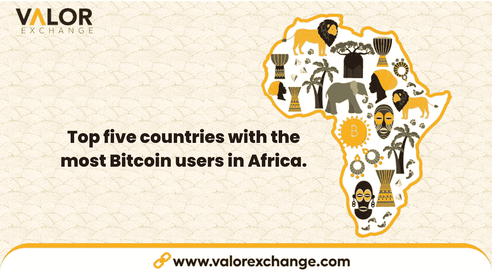
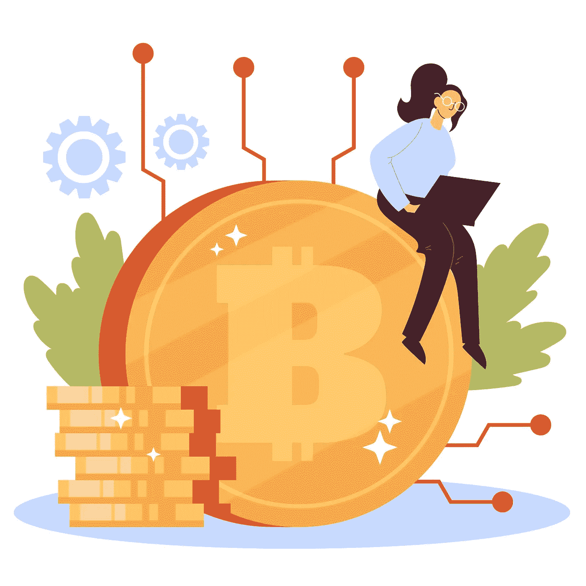

# 非洲比特币用户最多的前五个国家。

> 原文：<https://medium.com/coinmonks/top-five-countries-with-the-most-bitcoin-users-in-africa-9d2b7c77d2ce?source=collection_archive---------51----------------------->

Top five countries with the most Bitcoin users in Africa by ValorExchange.

加密市场最近出现了正面和负面的消息。尽管如此，在过去的一年里，全球比特币用户数量飙升了 880%以上。人们每天都用加密货币交换商品。不出所料，比特币用户数量最多的一些国家位于非洲。

许多非洲人普遍使用比特币或加密货币，以避免传统银行系统的常见麻烦。

在 [ValorExchange](https://account.valorexchange.com/) 上，你可以购买产品、进行无边界转账、缴纳税款等。，所有这些都有加密，因为我们让您可以访问世界上最公开交易的加密货币。

那么，非洲有哪些顶级加密国家，为什么加密货币(即比特币)用户增长如此之快？让我们深入了解一下。

# 南非

南非是这个名单上的第一名，也是世界上比特币用户比例最高的国家之一。

根据 Bitcoin.com 的数据，超过 56%的南非人声称拥有比特币。该国加密用户总数约为 11.3%，约为 420 万南非人。

# 尼日利亚

2021 年，尼日利亚中央银行颁布了一项禁令，禁止该国的加密相关活动。

对于许多人来说，这应该是加密货币之旅的结束，但尼日利亚是顶级加密国家之一。

尼日利亚人每天都交换密码，根据 Business Insider，尼日利亚有超过 1300 万密码用户。您可以将您的货币兑换成比特币，并开始在 ValorExchange 上进行国内和国际支付。此外，当您使用 [ValorExchange 时，](https://account.valorexchange.com/)您可以对自己的账户进行无限制的操作。你可以在你的账户上存多少钱，取多少钱。

Top five countries with the most Bitcoin users in Africa by ValorExchange. Photo credits: JM Sole.

# 肯尼亚

根据 Quartz Africa 的数据，肯尼亚的比特币拥有率高于全球平均水平，超过 54.7%的肯尼亚人表示他们拥有比特币。

这相当于约有 480 万人在商业和个人生活中交换密码或使用比特币。这也是为什么肯尼亚是比特币用户数量最多的国家之一。

# 加纳

加纳是该榜单上第四大加密国家，拥有超过 310 万加密用户，相当于该国 17.3%的人口拥有加密货币，即比特币、以太等。加纳的加密用户比大多数城市的人口加起来还多。

# 多哥

虽然多哥有近 900 万人口，但它仍然是大量采用加密技术的领先国家之一。在 Chainalysis 的一项调查中，在点对点交流方面，全球加密采用指数将多哥列为世界第九。超过 154 个国家被纳入调查。

比特币是该国普遍使用的加密货币。

# 为什么全球比特币用户数量越来越多？

加密货币从一开始就给人们提供了更多的灵活性。中本聪创造比特币是为了给人们一个选择，更好地了解他们的财务状况以及他们可以用这些钱做什么。如果比特币用户最多的一些国家在非洲，这让你感到惊讶，那也不应该。

像比特币这样的加密货币是一种全球工具，许多顶级加密国家都是越来越多的社区的一部分，这些社区将会引起注意。你可以在 [ValorExchange 上使用比特币或交换密码来交换任何有价值的东西。](https://account.valorexchange.com/)加入全球不断增长的比特币用户社区，享受更便捷的交易、支付等。你只需要 1 美元就可以开始你的旅程。

# 最后

每天都有更多的国家采用和使用加密货币。全球比特币用户总数每天都在增长。

许多人在 ValorExchange 上使用比特币和其他加密货币进行汇款、储值、支付等。

这是一个更加分散化的未来的开始，在这个未来里，人们将对自己的资源有更多的控制权、使用权和便利性。如果你想知道在哪里使用你的比特币，你可以看看我们关于接受加密支付的[地方的文章](https://valorexchange.com/blog/post?slug=10-companies-that-accept-cryptocurrencies-for-payment)。

我们邀请您来到[，加入我们的 Telegram](https://t.me/valorexchangecommunity) ，成为致力于帮助您轻松驾驭行业的社区的一员。加入我们，分享您如何在我们的社区中用加密换取价值。

> 交易新手？尝试[加密交易机器人](/coinmonks/crypto-trading-bot-c2ffce8acb2a)或[复制交易](/coinmonks/top-10-crypto-copy-trading-platforms-for-beginners-d0c37c7d698c)