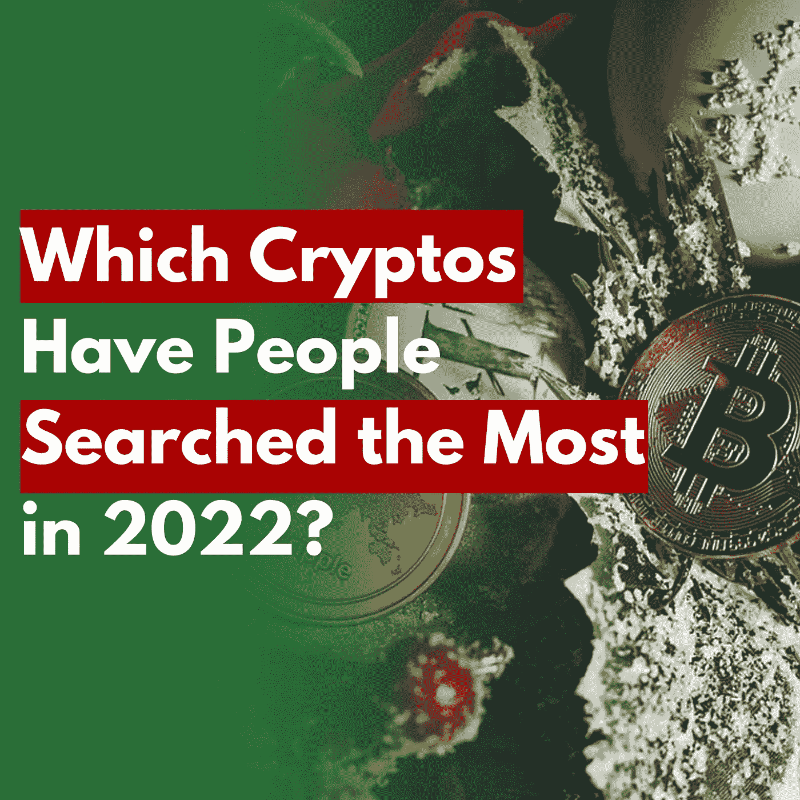
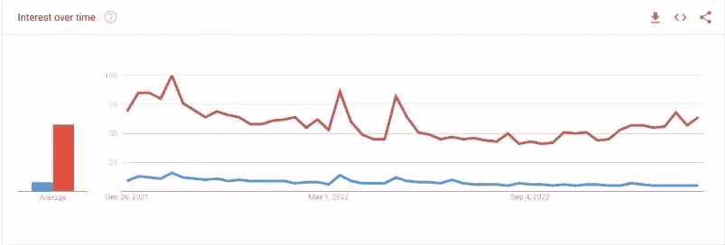
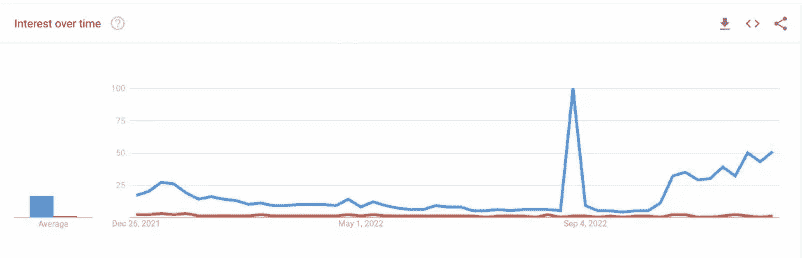
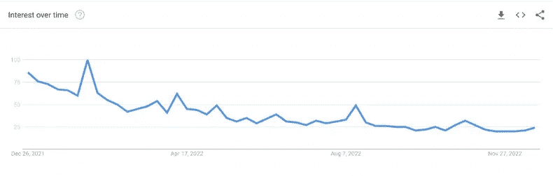
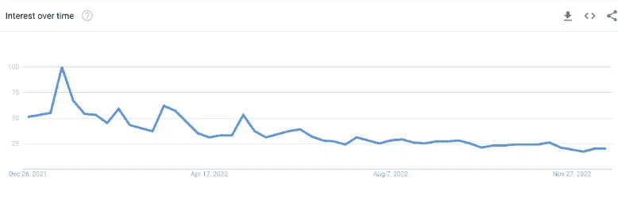

# 2022 年搜索次数最多的五种密码

> 原文：<https://medium.com/coinmonks/top-five-most-searched-cryptos-in-2022-c3dd29c369ff?source=collection_archive---------21----------------------->

Top Five Mostly Googled Cryptos in 2022

> 从顶级交易者那里复制交易机器人。免费试用。

比特币似乎很老派，但它仍然是 2022 年谷歌搜索最多的加密技术，并在去中心化联盟中保持领先地位。

加密货币在过去的一年里发生了许多事件，有些是好的，但大多数是鹰派美联储的攻击和许多超级明星的崩溃——[山姆·班克曼-弗里德& FTX](/coinmonks/the-ftx-disaster-why-does-it-profoundly-impact-the-crypto-market-f738a1cc7735) ，道权&露娜，Celcius Network 等。

确实有些人相信 cryptos 不会有未来的理论。然而，仍有一些空间来解决问题，甚至促进增长。加密货币仍然受到公众的关注。

*The search interest of “buy cryptocurrency” over the past five years — Source: Google Trends*

根据 Google Trends 的数据，“购买加密货币”这个关键词在 2020 年 2 月达到了最低点。然而，当埃森哲的 2022 年全球消费者支付报告指出加密仍然很高时，事情在 2022 年变得更好。有一些原因，如长期投资(28%)，好奇心(22%)，短期投机(21%)，以及其他。

 [## 在加密的不确定性中塞翁失马，焉知非福&比特币的替代品

### FTX 的余波不仅仅是报纸上点击诱饵标题背后的灵感。它产生了…

medium.com](/coinmonks/blessings-in-disguise-amid-the-crypto-uncertainty-altcoins-backing-up-for-bitcoin-9db3d825a478) 

这篇文章将带你了解今年在谷歌上搜索次数最多的五种加密货币。统计数据显示了这些硬币在加密投资者中的力量和吸引力。此外，它还可以帮助你根据搜索需求洞察 2023 年加密的潜力。

# 比特币(BTC)依然高居榜首

*The drop in “sell bitcoin” (blue) and the rise in “buy bitcoin” (red) over the last 12 months — Source: Google Trends*

根据 DollarGeek 的研究，比特币(BTC)在吸引全球 2842 万次月度搜索的同时，仍然获得了大众的关注。这可能是由于专家将比特币与业内其他加密资产进行了比较。风险投资人蒂姆·德雷珀认为，在[的加密寒冬](/@libraryoftrader/how-to-get-through-the-tough-cryptos-winter-4b047aba4196)中，弱势硬币会崩溃，这对比特币的增长是一个极好的举措。

 [## 如何度过难熬的密码寒冬？

### 加密市场就像过山车。它用许多巨大的胜利吸引和愉悦人们，尽管他们可能会遭受…

medium.com](/@libraryoftrader/how-to-get-through-the-tough-cryptos-winter-4b047aba4196) 

年初至今，BTC 价格下跌了近 65%，一些分析师预测价格将进一步跌至 10，000 美元。然而，人们仍然对这枚硬币感兴趣，并打算购买 BTC，而不是出售它。

# Dogecoin (DOGE)是亚军

*The drop in “sell doge” (red) and the rise in “buy doge” (blue) over the last 12 months — Source: Google Trends*

2022 年，Dogecoin 每月吸引全球约 585 万次搜索。它可能会成为焦点，因为埃隆·马斯克收购了 Twitter，并取笑他的粉丝说他将把 DOGE payments 集成到应用内支付中。

然而，这并不是故事的全部。在总部位于美国的免佣金交易平台 Robinhood 上市，给 DOGE 带来了公众的关注。

虽然 Dogecoin 的价格年初至今下降了约 55%，但互联网搜索数据显示，其潜在买家数量可能高于卖家数量。

# 柴犬(SHIB)冲刺第三

*The global search of SHIB over the last 12 months — Source: Google Trends*

柴犬在全球每月吸引了 443 万次互联网搜索，但它以近 130 万次的每月搜索量击败了美国的 meme-coin DOGE，DOGE 的月搜索量为 72.9 万次。

年初至今，SHIB 的失业率下降到 75%，这可能不会让它从新闻中消失。作为对元宇宙的进军和柴犬馆的潜在推出——柴犬的以太坊 2 层区块链保持了这枚硬币上的光。此外，截至 2022 年 11 月拥有最大 SHIB 头寸的加密交易所 Crypto.com 可能会破产。这种潜力可能会让人们继续关注柴犬币的下一步动向。

 [## 2023 年的 NFT 市场会发生什么？

### 密码市场今年经历了一场真正的混乱。许多大公司灾难性的倒闭和破产…

medium.com](/coinmonks/what-will-happen-in-the-nft-market-in-2023-38fa1382a772) 

# 以太坊(ETH)来到第四

*Ethereum (ETH) and its monthly searches worldwide over the last 12 months — Source: Google Trends*

以太坊今年的月搜索量为 384 万次，尽管其价格下跌了 67%。由于通过[合并](/p/de76c5b54277)从工作证明(PoW)转换到股权证明(PoS ),它仍然受到投资者和交易者的关注。

 [## 以太坊与比特币:哪个是更好的投资？

### 投资以太坊还是比特币可能是许多有抱负的加密交易者关心的问题。这两种硬币都被誉为…

medium.com](/@libraryoftrader/ethereum-vs-bitcoin-which-is-a-better-investment-668b59d411a7) 

此外，牵引力来自对 PoS 升级后硬币安全性的担忧。最近，加密平台 Paxful 以同样的理由取消了对 ETH 的支持。

# 卡尔达诺(ADA)名列前五

*Cardano and its monthly Google searches over the last 12 months — Source: Google Trends*

凭借 2022 年每月 147 万次的谷歌搜索，Cardano 成为世界上搜索次数第五多的密码。随着 ADA 在价格方面击败比特币和以太坊，它在 2022 年 1 月获得了牵引力。然而，由于 9 月份的 Vasil hard fork 未能引发兴趣，搜索量下降了。

 [## 密码 2023: FTX 辐射的连锁反应和加强法律和教育的迫切需要

### FTX 不仅自身崩溃，其他国家也崩溃了

medium.com](/coinmonks/crypto-2023-ftx-fallouts-ripple-effects-and-the-urge-for-law-enhancement-and-education-25849589869c) 

**你也能找到我们👇**

*   [库的交易员](http://bit.ly/3GQsIiY)
*   [脸书](http://bit.ly/3XyoeTY)
*   [推特](http://bit.ly/3XHQRhK)
*   [领英](http://bit.ly/3ihv3cu)
*   [Reddit](http://bit.ly/3imq76f)
*   [Quora](http://bit.ly/3VcaEUK)
*   [Tiktok](http://bit.ly/3VibUpx)

> 加入 Coinmonks [电报频道](https://t.me/coincodecap)和 [Youtube 频道](https://www.youtube.com/c/coinmonks/videos)了解加密交易和投资

# 另外，阅读

*   [CoinDCX 评论](/coinmonks/coindcx-review-8444db3621a2) | [加密保证金交易交易所](https://coincodecap.com/crypto-margin-trading-exchanges)
*   [红狗赌场评论](https://coincodecap.com/red-dog-casino-review) | [Swyftx 评论](https://coincodecap.com/swyftx-review) | [CoinGate 评论](https://coincodecap.com/coingate-review)
*   [Bookmap 评论](https://coincodecap.com/bookmap-review-2021-best-trading-software) | [美国 5 大最佳加密交易所](https://coincodecap.com/crypto-exchange-usa)
*   [如何在 FTX 交易所交易期货](https://coincodecap.com/ftx-futures-trading) | [OKEx vs 币安](https://coincodecap.com/okex-vs-binance)